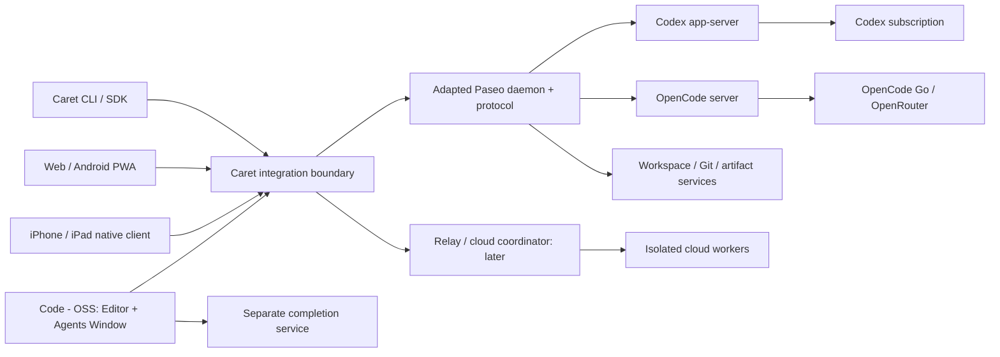

# Caret — สถาปัตยกรรมที่เลือกสำหรับแผน

สถานะ: planning decision; ไม่ได้สร้าง source directories หรือ runtime ตามภาพนี้

## โครงระบบ

ภาพเป็น architecture ของ Caret ไม่ใช่ภาพระบบภายใน Cursor ข้อแตกต่างที่ตั้งใจ: ใน local-first phase engine ของ Caret อยู่บนเครื่องส่วนตัว ส่วน Cursor Remote Control ตาม [เอกสาร](https://cursor.com/docs/cloud-agent/mobile) ย้าย agent loop ไป cloud และรัน tools บนเครื่องผู้ใช้ เราเทียบผลลัพธ์/UX โดยไม่ทำให้การใช้ส่วนตัวพึ่ง Cursor backend

## ขอบเขตและเจ้าของข้อมูล

| ส่วน | เจ้าของ | หน้าที่ / สิ่งที่ไม่ควรซ้ำ |
|---|---|---|
| Editor documents | Code - OSS text models | dirty buffers, undo stack, tabs, selections, LSP diagnostics; filesystem watcher ไม่แทน dirty-buffer sync |
| Agent conversation | engine ที่เลือกต่อ run | model context, tool loop, native approvals, compaction; ไม่สร้าง loop ซ้อนควบคุมทุก token |
| Host/run directory | adapted daemon | host/workspace/run IDs, lifecycle, event subscriptions; ไม่ผูก IDs กับชื่อ path ที่เปลี่ยนได้ |
| Caret view state | Caret client store | pinned tasks, selected tabs, panel widths, scroll state, drafts; เก็บแยกจาก provider transcript |
| Review/checkpoint | Caret workspace service ร่วมกับ engine checkpoint | revisioned patch set; ระบุเจ้าของ checkpoint ไม่ย้อนซ้ำสองระบบ |
| Model capabilities | provider/engine adapter | model list, context, tools, image, reasoning, limits; ไม่ hardcode ตาม marketing model names |
| Device pairing | transport/auth service | key/device identity, revoke, expiry; provider login ไม่ถูกส่งให้มือถือ |
| Artifact | worker + artifact catalog | content hash, MIME, source run/revision, retention/access; raw HTML เปิดใน isolated viewer |

## Repo layout ที่เสนอสำหรับการลงมือภายหลัง

เลือก workspace root นี้เป็น planning/control repository; source trees ในอนาคตแยก desktop upstream fork และ Caret-owned packages เพื่อไม่เอา mobile/backend ไปปนกับ upstream merge

| พื้นที่ในอนาคต | เนื้อหา |
|---|---|
| `desktop/` | Git submodule หรือ checkout ของ Caret Code - OSS fork ที่ pin SHA; patches อยู่ใน fork history |
| `upstream/paseo/` | pinned source dependency/fork สำหรับ daemon/protocol; license และ patch manifest |
| `packages/contracts/` | Caret capability envelope และ additional events; ไม่ copy protocol สองชุดที่ drift |
| `packages/desktop-bridge/` | text models, workspace edits, progress/approval, browser host |
| `packages/daemon-adapter/` | facade สำหรับ Paseo + Caret-specific persistence/Git review |
| `apps/ios/` | Swift native client; shared contract จาก schema ไม่ share React UI |
| `apps/web/` | agent/review/dashboard และ Android PWA |
| `services/cloud/` | scheduler/worker lifecycle/relay/artifacts เมื่อถึง cloud phase |
| `tests/fixtures/` | deterministic repositories, transcript streams และ visual states |

ไม่มีการเลือก dependency version จากความจำ: เมื่อได้รับคำสั่งเริ่ม implementation ให้ pin upstream stable และ ecosystem revisions ใน lock manifest แล้วเก็บ component license/version compatibility matrix

## Interface contracts ที่ต้องมี

Handshake ประกาศ protocol version, engine version, supported capabilities และ host OS ก่อน client แสดง actions เช่น steer, pause, approve, fork, migrate, media ไม่ใช้ปุ่มที่กดแล้วไม่ทำอะไร

Entity หลัก: Host, Project, Workspace, AgentSession, Run, Turn, ToolCall, Approval, PatchSet, Checkpoint, Artifact, Automation, ProviderAccount, RepositoryConnection, PullRequest มี ID แยกกัน ไม่ใช้คำว่า thread แทนทุกอย่าง

Command มี request ID/idempotency key, target identity, expected revision และ permission scope Event มี sequence per stream, causal run/tool IDs, timestamp และ schema version ใช้ durable cursor + snapshot resync เมื่อ event ถูก compacted แล้ว

Store กลางไม่จำลอง hidden model reasoning เก็บเฉพาะข้อมูลที่ engine ส่งให้จริง Tool output ขนาดใหญ่ paginate/truncate พร้อม full artifact; transcript ไม่กลายเป็น unbounded in-memory list

## Lifecycle และ concurrency

Run: created → queued → preparing → running → waiting_input/waiting_approval → running → completed/failed/cancelled; interrupted และ recovering เป็น recovery states ชัดเจน `idle` ของ engine แปลว่า turn เสร็จ ไม่ใช่ goal ทั้งหมดสำเร็จ

UI connection: connecting/online/reconnecting/offline/unauthorized/incompatible; host state: awake/asleep/unreachable/draining; แยกสองสิ่งนี้จาก run outcome

หนึ่ง run มี engine owner เดียว เปลี่ยน engine กลางงานเป็น explicit handoff พร้อม portable summary, tool results และ patch snapshot ไม่สัญญาว่า internal context/token cache โอนข้าม engine ได้ครบทุกบิต

Multi-agent ใช้ worktree แยกตาม task; job lease/ownership ป้องกันสองเครื่อง apply patch พร้อมกัน การเปลี่ยนงานระหว่าง local/worktree/cloud ต้อง pause at safe boundary, transfer Git state, validate destination แล้วเปลี่ยน lease มี rollback ถ้าย้ายไม่ครบ

## Editor correctness

ทุก edit ผูก path, base content hash และ text-model version Dirty buffer ต้องผ่าน editor bridge; background engine ที่แก้ disk ขณะมี unsaved buffer ต้องตรวจ conflict ก่อน sync ห้ามปล่อย watcher reload ทำลายงาน

Checkpoint เป็น patch/snapshot เฉพาะไฟล์ที่ run แตะ รวม untracked ที่สร้างใหม่ ไม่ใช้ whole-repo hard reset การ reject hunk หลังผู้ใช้แก้ซ้อนต้อง three-way reconcile หรือเปิด conflict UI; CRLF, encoding, symlink, rename, binary และ case sensitivity อยู่ใน acceptance suite

## Provider strategy

Codex → official app-server auth สำหรับสมาชิก; OpenCode → Go/OpenRouter ผ่าน provider config ตามเอกสาร เป็น baseline ที่ลด custom integration และรักษา engine-native semantics ส่วน direct Go/OpenRouter adapter เป็น fallback เฉพาะ capability ที่ engine ไม่ตอบโจทย์

Model routing เลือกต่อ task/class: agent, completion, embedding, speech, image; ค่าใช้จ่ายและ retention แสดงตามเส้นทางจริง Go headers ระบุตัว Caret และ stable session เมื่อ Caret เป็น HTTP caller; ไม่ปลอม identity ของ client อื่น

Quota เต็มต้องหยุด/รอ reset หรือให้เลือก provider ห้ามเงียบ ๆ เปลี่ยนจาก subscription ไป billed API Capability ไม่รองรับต้องมีเหตุผลและทางเลือก ไม่ยืนยันว่าใช้ model ทุกชื่อของ Cursor ได้จากบัญชีสามตัวนี้

## Context/search/customization

เริ่ม engine search + Code - OSS symbols/diagnostics แล้วเพิ่ม Caret index เฉพาะช่องว่าง มี file hash/branch/root ใน index key และ invalidate เมื่อ rename/delete/checkout/revoke permission ignore policy กับ sandbox policy เป็นคนละระบบ

เปิดอ่าน `.agents`, `.caret` และ import `.cursor` โดยมี preview/provenance; primary writes เป็น `.caret` ถ้า import config มี key/path conflict ให้แสดง effective settings ห้ามรัน hooks ที่ค้นพบเพียงเพราะ import เสร็จ

Precedence ที่ Caret เลือก: mandatory org policy → explicit run restrictions → project rules → user defaults; engine adapter ต้องรายงาน effective result หาก engine ไม่สามารถ enforce restriction ห้ามโฆษณาว่ารองรับ policy นั้น

MCP stdio ทำงานบน host ที่มี workspace; remote HTTP OAuth อยู่ใน trusted service/host ตามการตั้งค่า Elicitation และ app views ผ่าน interaction UI; MCP transport ไม่ใช่ agent-control protocol

## Mobile/local connectivity

Desktop จัดการ daemon ให้เปิดอยู่หลังปิดหน้าต่างตาม user setting Pair ด้วย QR/short-lived invite แล้วใช้ device-bound credential; remote path ใช้ encrypted relay หรือ private connection ที่ adapter รองรับ ไม่บังคับเปิด public port

Network switch ต้อง reconnect/resubscribe; commands ที่ไม่ยืนยันการรับไม่ถูกรันซ้ำ blindly cached transcript แสดง freshness; offline drafts เก็บได้ แต่ approve/merge/action ต้องตรวจ revision และสิทธิ์ใหม่เมื่อ online

APNs/Live Activities จำเป็นต้องมี signing/entitlement และ push sender ที่เปิดอยู่ ส่งข้อมูลขั้นต่ำตาม notification policy Relay ไม่ได้ทำให้เครื่องที่ sleep รันงานต่อ และ background iOS socket ไม่ใช่กลไกรับ push ที่เชื่อถือได้

## Cloud และ ecosystem

Cloud coordinator ใช้ run contracts เดิม เพิ่ม provisioning, lease/heartbeat, cancellation, TTL, build images, logs และ costs โดย worker แยกต่อ job; credential injection มีขอบเขต/expiry และ cleanup เมื่อจบ

Build snapshot แยกจาก source checkout ล่าสุด; failed build ไม่แทน last-known-good; รองรับ no-repo scratch project และ promote เป็น repo ภายหลัง Artifact storage เก็บ preview/video/log ไม่ใส่ secrets ใน snapshot โดยอัตโนมัติ

Origin equivalent ใช้ Gitea เป็น Git/PR service แล้วทำ Caret UI + SCM facade ให้ GitHub/GitLab/Bitbucket/Azure มี event/review mapping ที่ระบุ supported feature จริง Mirror ต้องแยก source-of-truth และ PR sync ไม่ใช่แค่ sync Git refs

Automation เก็บ trigger ID/timezone/deduplication/watermark มี bounded retry/backoff; PR autopilot ตรวจ current HEAD และ stop conditions ทุก cycle ไม่สัญญาว่า engine goal mode เท่ากับ scheduler ที่ survive shutdown

## Release และ data lifecycle

Install identity, profiles, update channel และ URL scheme เป็น Caret แยกจาก VS Code/Paseo Authentication stays engine-managed, metadata/secrets redacted from support export; portable export ไม่ฝัง tokens

รักษา upstream license/NOTICE, update signature และ rollback compatibility ทั้ง desktop/daemon/mobile ข้อมูลมี migration version และ backup ก่อน destructive schema migration ต้องทดสอบ downgrade boundary แยกจาก app rollback
