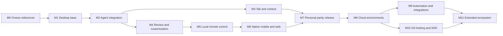

# Caret — ลำดับ implementation และเกณฑ์ตรวจรับ

**Planning only:** ขั้นตอน build/spike/test ทั้งหมดด้านล่างเป็นงานในอนาคต ไม่ได้เริ่มในรอบนี้ และแผนนี้ไม่สั่ง automation ให้ทำต่อเอง

เป้าหมายรวมคงไว้ครบ แม้ส่งมอบเป็นระยะ ไม่มี deadline ที่ผู้ใช้กำหนด จึงใช้ exit criteria แทนวันที่สมมติ Full parity ต้องครบทุก requirement ที่ทำได้ พร้อมข้อจำกัดภายนอกที่เปิดเผย ไม่ใช่จบแค่ mobile chat

## Dependency และลำดับ

ลูกศรหมายถึง engineering dependency ไม่ใช่อนุญาตให้เริ่ม code ขณะ planning M3/M4 มีงานที่จัดลำดับอิสระได้เมื่อเริ่มจริง แต่รอบนี้ไม่ได้ใช้ subagents หรือสร้างงานเบื้องหลัง

## Milestones

| Phase | ขอบเขต / UI | ผลส่งมอบที่ต้องมี | Exit gate |
|---|---|---|---|
| M0 | baseline/OSS/visual/contracts | requirement IDs, source/revision ledger, screenshot state set, chosen component boundaries, license manifest plan | ไม่มี unanswered product question ที่ทำให้เลือกคนละ app; G-VIS measurement และ version gaps มี evidence ก่อน pixel freeze |
| M1 | IDE-01…12 / D01,D02 | branded Code - OSS build, extension source, settings/profile, installer CI; upstream patch inventory | clean install/editor/Git/terminal/debugger ผ่าน macOS/Windows/Linux; release matrix explicitly lists exceptions |
| M2 | AG/CTX/MOD/REV/SAFE foundations / A01…A07,A11 | adapted daemon + Codex engine + OpenCode Go/OpenRouter paths, rich composer, stream, edit/review/checkpoint | fixture bug → edit → test → review → undo สำเร็จ; cancellation/dirty buffer/permission/reconnect tests ผ่าน |
| M3 | TAB/EDIT/SEARCH / D03…D05,S03,S04 | inline edit, FIM, next-location/cross-file portal, indexing/exclusions | typing replay quality/latency/stale response gates; completion ไม่ทำ edit ที่ไม่รับ |
| M4 | WT/CUS/VIS / A08…A13,S05…S11 | worktrees/subagents/hooks/MCP/apps/plugins/browser/design/canvas/voice | isolated tasks ไม่ชน; config/permission conformance; resource render และ source linkage honest |
| M5 | LOC / S10,N01 | daemon ownership, pair/revoke/remote commands/cache/resync, relay/private access | local machine stays awake → control from second client; network loss/retry no duplicate tool effects |
| M6 | MOB / N01…N10,W01 | native iPhone/iPad, web agent/review + Android PWA; push/Live Activities/native annotation | real-device keyboard/gesture/voice/Pencil/notifications; offline draft + action revalidation |
| M7 | personal full workflow / S01…S12 | stable desktop+local-mobile release, PR integration, usable docs/import/export, signing/update | all M1–M6 requirements pass per supported platform; no critical data-loss/security defect; measured visual critical states pass |
| M8 | CLOUD / W02,W04…W06 | compute coordinator, isolated VMs/builds/secrets/artifacts/preview/handoff/pools | laptop off แล้ว cloud run ทำต่อ; failed build fallback; lease recovery; destroy cleans resources |
| M9 | AUTO/INT / W07…W09,W11 | scheduler/webhooks/PR autopilot/review/security/routing; per-SCM/chat/issue connectors | duplicate/late/out-of-order webhook ไม่ทำงานซ้ำ; HEAD-aware reviews; loop stop/backoff; cross-provider semantics verified |
| M10 | SCM/API / W03,W10,W12 | Gitea-backed Origin equivalent + own UI, GitHub sync, CLI/ACP/APIs/TS+Python SDK | Git refs และ PR metadata sync ทดสอบแยก; source-of-truth/errors/permissions; SDK contract suite |
| M11 | BOT/ADM/remaining scopes / B01…B04,W13 | persistent assistant workflows, team policies/SSO/SCIM/budgets/audit/AI attribution และ gaps ที่เหลือ | requirements complete หรือ tracked external-impossibility ที่ระบุชัด; ไม่มีฟีเจอร์หายจาก denominator |

M7 เป็น personal-use release milestone ไม่เรียกว่า Cursor ecosystem parity ส่วน M8–M11 ยังอยู่ในแผนเต็มตามคำขอ การไม่มี deadline ไม่ลดความจำเป็นของ regression suite และ upstream maintenance

## งานตรวจ feasibility ที่ต้องทำก่อน commit implementation ใหญ่

| Spike ในอนาคต | สมมติฐาน | หลักฐานที่ต้องได้ | ทางออกถ้าไม่ผ่าน |
|---|---|---|---|
| F01 Code - OSS build | upstream ใช้ toolchain ของเครื่อง/CI ได้ | pinned SHA, clean build logs, launched editor on each OS | แก้ toolchain/runner ไม่เปลี่ยน desktop เป็น web mock |
| F02 Paseo boundary | server/client/protocol แยกจาก UI ได้และครบ lifecycle ที่ต้องใช้ | schema mapping, resume/approval/cancel/steer demo, patch inventory | ใช้ direct engine adapters + minimal coordinator เฉพาะช่องว่าง |
| F03 Provider contract | Codex subscription + Go/OpenRouter ผ่าน engines ที่เลือก | structured events, real tool call, timeout/rate limit, auth isolation | เปลี่ยน adapter/path ภายใน supported interfaces; ไม่ย้าย subscription token ไป API ที่เดาเอง |
| F04 Dirty-buffer edits | external engine กับ editor buffer reconcile ได้ | unsaved edit + tool edit + undo fixture ไม่มี data loss | route writes ผ่าน editor bridge หรือบังคับ conflict review ก่อน disk apply |
| F05 Completion/next-edit | selected model/serving ตอบ latency/quality ได้ | typing traces, percentile latency, acceptance/edit validity/cost | local FIM/Tabby candidate หรือ dedicated model; ถ้ายังไม่ถึง benchmark ให้คง quality gap |
| F06 Native client protocol | Swift client ใช้ protocol/event resync ได้ครบ | offline/relay switch/approval/attachment on device | add thin facade หรือ native bridge; ไม่ทิ้ง protocol correctness เพื่อ share UI |
| F07 Native visual fidelity | full-screen states match reference | capture/overlay + gesture/keyboard tests | ปรับ component/native API; ไม่ถือว่า screenshot thumbnail เพียงพอ |
| F08 Cloud/handoff | workload portable และ recoverable | transfer conflict/restart/lease expiry/build freshness | semantic handoff และ explicit incompatible environment state |
| F09 Git hosting sync | Git mirror และ PR two-way equivalent ทำได้ | event mapping matrix and round-trip fixtures | ทำ custom sync layer; ไม่อ้าง Gitea mirror ครบ Origin โดยอัตโนมัติ |

## Global acceptance suites

| Suite | ทดสอบอะไร | ตัวอย่าง failure ที่ต้องจับ |
|---|---|---|
| Q01 Editor integrity | dirty buffer, encoding, line endings, rename/symlink/binary, checkpoints | reject patch แล้วลบ user work ที่เกิดหลัง checkpoint |
| Q02 Runtime lifecycle | concurrent clients, cancel, restart, lease, child sessions | engine idle ถูกแสดงว่า goal สำเร็จ หรือ replay ทำ tool ซ้ำ |
| Q03 Provider/auth | auth flow, revocation, capability discovery, schema versions, quota | fallback ไป billed model โดยไม่แจ้ง หรือ token หลุดใน log |
| Q04 Git/workspaces | branch/worktree/detached/submodules/multi-root, conflicts | ส่งงาน repo A ไป checkout repo B หรือ cleanup worktree ที่ยัง dirty |
| Q05 UI reference | screenshots/typography/layout/states, keyboard/focus/IME/gesture | matching screenshot แต่ modal focus escape หรือ keyboard บัง composer |
| Q06 Mobile/network | offline, app background, device revoke, Wi-Fi/cellular, push | approve/merge จาก stale HEAD, notification ซ้ำ, live activity ไม่จบ |
| Q07 Tools/customization | scopes, precedence, hooks/MCP/app isolation | disabled hook ยังรัน หรือ remote tool ใช้ credential ผิด host |
| Q08 Cloud/services | startup/cancel/recovery/TTL/builds/artifact/secret boundaries | snapshot พก secrets โดยไม่ได้ตั้งใจ, VM orphan หลัง cancel |
| Q09 Integrations | webhook replay/order/identity/rate limits/source outage | PR comment loops, duplicated publish/merge, revoked account ยังทำงาน |
| Q10 Release/data | signatures/install/update/rollback/export/import/delete/restore | daemon schema ใหม่ทำให้ rollback เปิด history ไม่ได้ |
| Q11 Agent quality | stable task suite + model/provider/hardware/cost recorded | demo งานเดียวถูกใช้สรุปว่าเก่งเท่า Cursor |

## ตัวชี้วัดที่กำหนดล่วงหน้า

ค่าต่อไปนี้เป็น **Caret acceptance targets ที่เสนอ** ไม่ใช่ผล benchmark หรือค่าที่ Cursor รับประกัน ต้องปรับจาก baseline measurements แบบมีเหตุผล ไม่ลดหลัง test fail เพียงเพื่อให้ผ่าน

- UI input ไม่รอ network; target input-to-paint p95 ≤ 50 ms บน reference hardware
- หลังรับ event แล้ว UI แสดง delta p95 ≤ 100 ms ภายใต้ normal fixture stream
- Cached mobile inbox เปิด target ≤ 500 ms หลัง app shell พร้อม; cold app launch วัดแยก
- Completion warm request target p50 ≤ 300 ms / p95 ≤ 800 ms รวม network บน selected model; ไม่ผ่านให้คง gap แม้ agent chat ใช้งานได้
- Context search target กำหนดแยก repo sizes 1k/10k/100k text files; บันทึก warm/cold/index duration ไม่อ้าง latency เดียวสำหรับทุกเครื่อง
- Integrity/permissions/idempotency acceptance fixtures ต้องผ่านทั้งหมด ไม่มีการเฉลี่ย data loss ให้ผ่าน quality threshold
- Visual gates ตาม UI-SPEC; same-platform comparisons และ manual keyboard/touch review จำเป็น
- Agent quality เทียบชุดอย่างน้อย 30 งานหลายชนิดในอนาคต แสดง sample size/variance/interventions/cost ไม่ประกาศเท่ากันจากค่าเฉลี่ยที่ไม่ควบคุม model

## Definition of Done ต่อ requirement

ทุก ID ต้องมี source/reference version, selected implementation component, scenario, platform coverage, happy/failure paths, evidence artifact, limitations และ status เป็น planned/implemented/verified/blocked-external แยกกัน

`verified` ต้องมี observed result ล่าสุดบน release candidate จริง การเขียน test case หรืออ้าง upstream feature ไม่ทำให้ verified โดยอัตโนมัติ Rows ที่ bundle หลาย integrations มี child checklist ครบทุกบริการก่อนปิด parent

บันทึก UI completeness, behavior correctness, provider quality และ operational readiness แยกสี่แกน ถ้าฟีเจอร์ถูก provider จำกัดต้องแสดงช่องว่างโดยไม่หลอกด้วยปุ่ม disabled ว่าครบแล้ว

## งบและการดูแลระยะยาว

ยังไม่ประเมินเป็นจำนวนวัน เพราะไม่มี measured integration cost หรือ team capacity ใช้ช่วง effort S/M/L/XL เฉพาะจัดลำดับ: branding/discovery S–M; engine/daemon adapters L; buffer-safe edit/Tab/native review L–XL; cloud lifecycle/two-way PR sync/enterprise XL

ค่าใช้จ่ายแยก: subscription ที่มีอยู่, OpenRouter billed usage, completion/media/speech ถ้าต้องเพิ่ม, signing/device distribution, relay/push/artifact storage และ VM time อย่ารวมค่าใช้จ่ายเหล่านี้เป็น “open source จึงฟรีทั้งหมด”

Upstream maintenance: track Code - OSS security updates, daemon protocol, engines และ mobile OS; ทำ compatibility gate ก่อนอัปเดต; แยก user worktree จาก release test checkout เมื่อเริ่ม coding ภายหลัง
