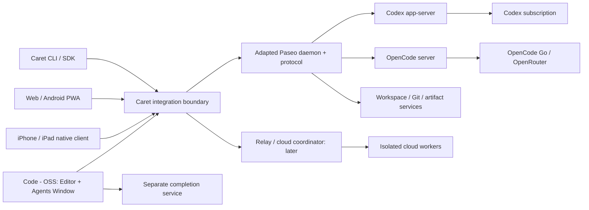
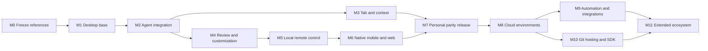

<a id="plan-top"></a>

# Caret — แผนเดียวสำหรับสร้าง Cursor clone

> Archived 9 September 2026. Living rules: [AGENTS.md](../../../AGENTS.md). This file does not win conflicts.

**ฉบับ 5 · 9 กันยายน 2026 · เอกสารสำหรับส่งต่อการดำเนินงาน · ยังไม่เริ่มเขียนโค้ด**

เป้าหมายคือผลิตภัณฑ์ชื่อ Caret ที่ fork Code - OSS ตั้งแต่ต้น มี Editor, Agents Window, mobile companion และบริการประกอบให้เทียบเคียง Cursor ตาม baseline ที่ล็อกไว้ ใช้ส่วนตัว ไม่มี deadline รองรับ desktop macOS/Windows/Linux เริ่มจากคอมพิวเตอร์ส่วนตัวที่เปิดอยู่ก่อนเพิ่ม cloud ใช้ Codex, OpenCode Go และ OpenRouter ที่ผู้ใช้มี

ไฟล์นี้รวมข้อกำหนด หน้าตา สถาปัตยกรรม การเลือก OSS การเชื่อมบัญชี แพลตฟอร์ม แผนงาน การปิดช่องว่าง และหลักฐานไว้ทั้งหมด **เป็นแผนหลักที่มีอำนาจตัดสินเมื่อไฟล์สรุปเก่าต่างกัน** ไม่ต้องประกอบแผนจากหลายไฟล์ การเริ่ม implementation ยังรอคำสั่งผู้ใช้ตามขอบเขต planning-only เดิม

**ผลตรวจฉบับ 4:** แผนก่อนยังขาดรายละเอียด docs/help รอบนี้เพิ่ม 40 ข้อกำหนด (รวม 198), 18 UI families (รวม 75), tools 29 กลุ่ม และงานส่งต่อ H01–H16 อ่าน [รายละเอียด handoff](#handoff-v4), [source inventory เพิ่มเติม](#coverage-v4) และ [ผล scrutinize](#scrutinize-v4) ก่อนลงมือ ส่วน A–I เป็น baseline เดิม; J/K เป็นข้อแก้ไขล่าสุด ไม่ใช่การรับรอง private engine หรือ pixel parity ว่าพิสูจน์แล้ว


**ข้อเลือกใหม่จากผู้ใช้:** ใช้ Synara UI เป็นฐานเริ่มต้น อ่าน [ส่วน L: Synara adoption](#synara-v5) ก่อนส่วนอื่น ส่วน L แทนข้อเลือก UI/backend ที่ขัดกัน: Code - OSS ยังเป็นฐาน editor; Synara backend เป็น candidate แรกและ Paseo เป็น fallback; ไม่รันสอง orchestration owners ซ้อนกัน Cursor visual 1:1 เป็น refinement track ภายหลัง ยังไม่ถือว่าผ่านจากการใช้ Synara UI

## 1. เทียบกับ “fork VS Code ตั้งแต่ต้น” อย่างไร

ทั้งสองทางเริ่มจาก fork **Code - OSS** เหมือนกัน จุดเลือกอยู่ที่ชั้น AI/remote orchestration ที่เพิ่มเข้าไป การ fork editor อย่างเดียวไม่ได้เพิ่ม agent loop, mobile sessions, relay, cloud worker หรือ Cursor Tab ให้โดยอัตโนมัติ

| ประเด็น | Fork Code - OSS แล้วเขียนส่วนเพิ่มเองทั้งหมด | Fork Code - OSS + reuse แบบเลือกส่วน: แผนนี้ |
|---|---|---|
| Editor/terminal/Git/debugger | ได้ upstream foundation | ได้ upstream foundation เท่ากัน |
| หน้าตาและ interaction | Caret ทำเอง | Caret ทำเองเหมือนกัน ไม่ผูกกับ UI ของ Paseo |
| Agent engine | เขียน tool loop/auth/session เอง หรือเชื่อมภายหลัง | เชื่อม official Codex/OpenCode engines |
| Desktop ↔ mobile | เขียน lifecycle/transport/resync ใหม่ | ประเมินและ adapt Paseo backend/protocol ผ่าน facade |
| ภาระระยะยาว | ดูแล code เองมาก แต่ dependency semantics น้อยกว่า | code ที่ต้องสร้างลดลง แต่ต้องดูแล adapter/schema/upstream compatibility |
| ความเสี่ยงหลัก | ใช้เวลามากกับ infrastructure ก่อนถึง fidelity | backend มีพฤติกรรมไม่ตรงหรือ coupling สูงจนแก้แพง |
| ข้อสรุป | ใช้เป็น fallback ของส่วนที่ reuse ไม่คุ้ม | เลือกเป็นเส้นทางแรกแบบมี exit gate ไม่ถือว่าคุ้มแน่นอนก่อน spike |

จึงไม่ได้ “ดีกว่า fork” แต่เป็น **วิธีทำ fork ให้ไม่ต้องสร้างทุกชั้นใหม่** ยังไม่มีผล benchmark หรือต้นทุนจริงที่รองรับตัวเลขเวลาที่ประหยัดได้ การเลือก Paseo เป็นการเลือกที่ย้อนกลับได้: Caret contracts และ UI ต้องไม่อ้าง package internals กระจายทั่วโครงการ

## 2. นิยามเส้นชัย Cursor clone

คำว่า clone ในแผนนี้หมายถึง **behavioral และ visual clone ของ public product baseline ที่ตรวจได้ ภายใต้แบรนด์ Caret** ไม่หมายถึงได้ source code, private model weights, บัญชีบริการ หรือการรับรองเชิงพาณิชย์ของ Cursor มาเหมือนกัน

การรับรองปลายทางต้องระบุ `Caret release + Cursor reference build ต่อ surface + supported platform matrix + evidence bundle` ไม่ใช้คำว่าเหมือน “Cursor ล่าสุดทุกอย่าง” ที่เปลี่ยนตลอดโดยไม่ล็อกเวอร์ชัน

| มิติ | เงื่อนไขก่อนใช้สถานะ clone-verified |
|---|---|
| Feature | 198 requirements (158 เดิม + PX เพิ่ม 40) และ child cases ผ่านจริงครบในขอบเขต reference; ไม่มี stub, mock response หรือ disabled control มานับว่าทำแล้ว |
| Visual | 75 screen families (57 เดิม + 18 เพิ่ม) แตกเป็น state captures ครบ; measured tokens/layout/text wrapping/icon roles ผ่าน same-platform comparison ตามเกณฑ์ในแผน |
| Interaction | keyboard/focus/IME/gesture/scroll/queue/approval/recovery เหมือน reference ที่ล็อก หรือมี intentional delta ที่เปิดเผย |
| AI outcome | agent/completion benchmarks ผ่านเกณฑ์ที่ล็อกก่อนวัด; ไม่อ้าง internal reasoning หรือคำตอบเหมือนทุก token |
| Operations | install/update/rollback, device reconnect, permissions, cloud cleanup และ data integrity ผ่าน target matrix |
| Evidence | requirements → cases → implementation revision → test results → reference/captures trace ได้ทุกข้อ |

`blocked-external` **ไม่นับเป็นผ่าน** และไม่ตัดออกจาก denominator เพื่อให้ได้ 100% ถ้ามี behavioral feature ของ baseline ที่ยังทำไม่ได้ ให้ใช้สถานะ “clone candidate — remaining gaps” แม้หน้าตาผ่านแล้ว ส่วน private weights/ตรารับรอง/สัญญาบริษัทเป็น non-clonable identity/service properties ที่ประกาศตั้งแต่ต้น ต้องแยกจาก functional equivalent ที่ Caret ยังต้องทำ

จะเสร็จครบ M1–M6 แล้วเรียกได้เพียง personal-workflow release; เป้าหมาย clone ทั้งชุดยังต้อง M8–M11 และ final certification gate ไม่จบโครงการที่ M7

## 3. แผนปิดช่องว่าง: งานที่กำหนดครบแล้ว แต่หลักฐานยังต้องสร้าง

ใช้ชื่อ role เป็นความรับผิดชอบ ไม่ใช่สมมติว่ามีทีมหลายคน ผู้ลงมือคนเดียวทำแต่ละ role ตามลำดับได้ artifacts ด้านล่างเป็นไฟล์ที่ต้องสร้างตอนดำเนินงาน **ยังไม่ได้สร้างหรือวัดผลในรอบนี้**

| Gap / เจ้าของ | ขั้นตอนและ artifact ที่ต้องได้ | Gate / dependency | ทางออกเมื่อไม่ผ่าน |
|---|---|---|---|
| G-VIS-01 / UI | เปิด Cursor reference ที่เข้าถึงได้ บันทึก desktop About/build และ iOS version; จับภาพและ interaction ของทุก screen/state; สร้าง reference-manifest, measured-tokens, state-catalog, discrepancy-log | M0 ก่อน freeze UI แต่ละ surface; ทุก token ที่ส่งเข้า visual implementation ต้องมี provenance | ถ้าเข้าถึง runtime/account state ไม่ได้ ทำ foundation ต่อได้ แต่ freeze/รับรอง exact surface นั้นไม่ได้; เก็บเป็น reference-blocked ห้ามแทนด้วย marketing geometry |
| G-VIS-02 / UI | ทำ command/menu/shortcut map จาก build เดียว; ตรวจ settings paths, review trigger, contextual keybindings และ defaults; บันทึก event trace | ก่อน implement controls/defaults ของ surface นั้น | reference build ที่ตรวจจริงชนะภาพเก่า; ไม่มีข้อมูลให้คง pending ไม่รวมเมนูคนละรุ่น |
| G-OSS-01 / runtime | pin Paseo server/client/protocol จาก revision compatible ชุดเดียว; ทำ lifecycle/approval/reconnect/schema mapping และ dependency/patch inventory | F02 ก่อนผูก mobile/desktop กับ backend; mandatory contract cases ผ่านทุกข้อ | จำกัดการ adapt ที่ facade/extensions; หากต้องเปลี่ยน engine ownership/auth internals หรือ UI import เข้า server ให้เลือก direct Codex/OpenCode adapters แทน; บันทึก ADR ไม่มีทางตัน |
| G-AUTH-01 / integration | official login/status บน execution host; ทดสอบ bounded task หนึ่งชุดต่อ provider พร้อม stream/tools/cancel/limit/error และ secret-redaction evidence | F03 ก่อนประกาศ provider ready; ไม่ใช้ key ในบทสนทนา | แก้ supported adapter/auth path; บัญชีไม่พร้อมไม่ปลอม success และไม่เปลี่ยนเส้นทางคิดเงินเอง |
| G-MODEL-01 / quality | สร้าง task corpus, rubric, paired runs, model/engine/config/cost ledger; เลือก best accessible model ต่อ task class | ก่อน M7 quality claim และ final clone gate | ปรับ context/tools/model/engine ภายในเส้นทางที่มีสิทธิ์; ยังด้อยกว่าเกณฑ์ให้คง quality gap ไม่ลดเกณฑ์ตามผล |
| G-TAB-01 / completion | เทียบ dedicated API ที่รองรับ workload กับ Tabby/local FIM; ทำ replay ghost text, edit prediction, cross-file portal, stale-response rejection | F05 ก่อน M3 exit; latency และ edit validity ต้องผ่านแยก | เพิ่ม separate next-edit proposal engine/context ranking; FIM อย่างเดียวไม่ปิด next-edit requirements; model/hardware เพิ่มต้องแจ้งค่าใช้จ่ายก่อนใช้ |
| G-EXT-01 / desktop | ต่อ workflow เลือก exact extension/server/debug-adapter artifact พร้อม license/version/CPU/fixture; ทดสอบ remote host แยก | M1 และ full compatibility gate ก่อน M7 | ใช้ permitted replacement หรือ Caret implementation; ถ้ายังแทน workflow ไม่ได้ requirement ยังค้าง |
| G-BUF-01 / editor | version/hash-aware edit bridge; บังคับ controlled worktree หรือ intercept/reconcile writes; fixtures unsaved edit+agent edit+undo/reject/rename/CRLF | F04 เป็น hard gate ก่อนให้ engine แก้ workspace หลัก | ย้าย engine ไป isolated worktree แล้ว import patch ผ่าน editor transaction; ห้าม fallback เป็น disk watcher overwrite |
| G-PUSH-01 / mobile | เลือก signed native distribution, pair/revoke design, APNs sender และ entitlement; real-device foreground/background/terminated/expired tests | ก่อน N08 และ M6 exit | simulator/local polling ใช้พัฒนาได้แต่ไม่ปิด native push/Live Activities; account/signing setup เป็น explicit prerequisite |
| G-CLOUD-01 / cloud | default architecture: isolated Linux VM ต่อ job + coordinator/object artifacts + lease/TTL; เลือก provider/region/size จาก estimate และ portability fixture | ก่อน M8 provisioning; ต้องมี budget cap และ credentials ที่ผู้ใช้อนุญาต | local VM/fake service ใช้ contract tests ได้แต่ไม่ปิด laptop-off acceptance; รอ authorized compute setup ไม่มีแอบเช่าเครื่อง |
| G-SCM-01 / SCM | Gitea service + Caret facade; map refs/PR/comments/reviews/checks/permissions/events, source-of-truth และ conflict handling; round-trip fixtures | F09 ก่อน M10 exit | mirror เฉพาะ refs ไม่ผ่าน PR sync; เขียน missing adapter หรือคง scoped incompatibility เปิดอยู่ |
| G-BOT-01 / runtime | persistent identity/memory store แยก run, isolated computer session, tool policy และ event lifecycle; ทดสอบ restart/stop/revoke/retention | ก่อน M11; ใช้ daemon contracts ที่ผ่านแล้ว | reusable tools ไม่พอให้ทำ missing persistent service; ห้ามเอา ordinary chat เปลี่ยนชื่อว่า bot แล้วปิด requirement |
| G-COM-01 / product | แยกทุก external row เป็น functional behavior / provider-specific identity / commercial assurance; map equivalent และ evidence | M0 scope freeze และ final release review | ทำ equivalent ที่เป็น behavior; ไม่รับรอง private models/certificates หรืออ้างว่า external gap ผ่านแล้ว |

เส้นทางจึงพร้อมให้เริ่ม **M0 reference capture และ feasibility work** เมื่อมีคำสั่งลงมือ ไม่ได้หมายความว่าทุก uncertainty ถูกพิสูจน์แล้ว การวางแผนให้ครบทำได้ตอนนี้ แต่ไม่สามารถแทน runtime measurements, hardware tests หรือสิทธิ์บัญชีด้วยข้อความในแผนได้

## 4. Reference capture ที่นำไปทำ UI ได้จริง

สร้าง catalog หนึ่งรายการต่อ `screen-id/state-id/platform/theme/viewport/reference-build` แต่ละรายการมี fixture, preconditions, actions, visible result, focus target, keyboard/gesture behavior, screenshot/video path, measured tokens, requirement IDs และ evidence status สถานะที่ใช้ไม่ได้ต้องมีเหตุผล N/A ไม่สร้างภาพ state สมมติของ Cursor

ทำตามลำดับ:

1. **Reference access:** ตรวจแอป/เวอร์ชันที่ติดตั้งและบัญชีที่เข้าถึงได้แบบ read-only; หากไม่มี ขอสิ่งที่จำเป็นเฉพาะตอนเริ่ม M0 ไม่ติดตั้งหรือซื้อเองในงาน planning นี้
2. **Freeze fixture:** ใช้ test repository ที่ไม่มี secrets และไฟล์/ข้อความคงที่; บันทึก theme/fonts/locale/OS/display scale; แยก Editor, Agents Window, native mobile และ web reference versions
3. **Capture states:** empty/new task → editing draft/pickers → submitting/running/tool/approval → follow-up/queue → diff/reject/commit/PR → cancel/failure/reconnect; settings ทุกหมวดและ native keyboard/rotation/voice/notification แยกตาม screen catalog
4. **Measure:** geometry เป็น logical pixels/points, typography และ line wrapping, flat-region colors, border/radius/shadow, icon bounds, animation timing จาก video; ติด provenance ให้ทุกค่า ไม่เอา screenshot compression เป็น color truth
5. **Implement later:** ผูก component กับ tokens ที่วัดแล้วและ state contracts; ใช้ deterministic event fixtures สำหรับ UI regression ไม่เรียก model ทุก screenshot
6. **Compare:** overlay/diff บน content/OS/scale เดียวกันและ manual interaction review; mask เฉพาะ dynamic areas ที่ประกาศก่อน run เช่น cursor blink, timestamps, Caret branding; mismatch ของข้อความ/layout/action ห้าม mask

Visual thresholds เป็น acceptance policy ของ Caret ไม่ใช่ค่าที่วัดว่า Cursor รับรอง: geometry ไม่เกิน 2 logical px, text baseline ไม่เกิน 1 px, text wrap/order ตรง; สี flat region ตั้งเป้า ΔE00 ≤ 2 หลัง normalize color profile; motion duration ต่างไม่เกิน max(1 frame, 10% ของ reference duration) บน refresh rate ที่บันทึก Easing/focus/scroll ต้องตรวจด้วย trace และสายตา ไม่ใช่รวมคะแนนภาพเดียว

ข้อยกเว้นต้องเจาะจง region/platform/reason/reviewer และห้ามครอบทั้ง screen เพียงเพื่อให้ผ่าน สี antialiasing/OS chrome ต่างกันเทียบตาม platform เดียวกัน Accessibility adaptations และ Caret identity เป็น intentional deltas ที่บันทึก ไม่อ้างว่า identical pixels ทั้งเฟรม

## 5. Quality gate ที่ไม่อ้างว่าโมเดลเหมือนกันเอง

Agent corpus เริ่มอย่างน้อย 30 งาน แบ่ง bug fix, feature, refactor, tests, repo investigation และ multi-file/worktree tasks อย่างละ 5 งาน บันทึก reference prompts/repos/tests และทำ paired Cursor/Caret runs ภายใต้ tool/network permissions เดียวกัน; เก็บ model/engine versions ถ้า reference เปิดเผย รันซ้ำอย่างน้อย 3 ครั้งต่องานเพื่อเห็น variance

Gate ที่เสนอสำหรับล็อกก่อน benchmark: critical integrity/permission fixtures ต้องผ่านทั้งหมด; task completion rate ของ Caret ต่างจาก reference ไม่เกิน 5 percentage points โดยใช้ one-sided 95% confidence bound ของ paired comparison; หาก sample ยังสรุปไม่ได้เพิ่ม sample ไม่ตีความ “ไม่พบความต่าง” ว่าเท่ากัน แจกแจงผลรายกลุ่มไม่ใช้ค่าเฉลี่ยซ่อนกลุ่มที่ล้มเหลว รายงาน human interventions, wall time และ cost แยก ไม่รับรอง model quality บนงานทุกชนิดจาก corpus นี้

Completion corpus อย่างน้อย 200 eligible edit opportunities ครอบคลุม single/multiline FIM, next-edit และ cross-file proposal ในหลายภาษา; ตรวจ accepted edit validity, unwanted/stale edits และ latency ตาม roadmap รายงาน suggestion coverage กับ useful suggestion rate แยกเพื่อไม่ให้ระบบที่แทบไม่เสนอผ่านเพราะเสนอเฉพาะงานง่าย Benchmarks ต้องบันทึก warm/cold/network/hardware ให้ทำซ้ำได้

หากไม่มีสิทธิ์ใช้ Cursor reference inference ให้ใช้ deterministic correctness corpus ตรวจ Caret ได้ แต่ comparative-quality claim ยัง reference-blocked จนมีผลเปรียบเทียบจริง Subscription ที่มีไม่ใช่หลักฐานว่าเข้าถึง Composer/Tab รุ่นเดียวกับ Cursor

## 6. Runbook จากเริ่มต้นถึงเสร็จ

| ลำดับ | งานและสิ่งที่ปลดล็อก | ถือว่าจบเมื่อ |
|---|---|---|
| R01 | Freeze scope/reference; แตก 198 parent requirements เป็น executable child cases และ 75 screen families เป็น applicable states | ทุก child เชื่อม requirement/screen/source/phase; no orphan; reference unavailable แสดง explicit block |
| R02 | Pin Code - OSS และ compatible engine/Paseo revisions; toolchain/license/platform inventory | lock manifest และ dependency graph พร้อม; snapshots จากการวิจัยไม่ถูกใช้เป็น production lock โดยอัตโนมัติ |
| R03 | F01–F04: build, lifecycle, provider, safe editing feasibility | เลือก reuse/fallback จาก evidence; dirty-buffer gate ผ่านก่อน write-enabled integration |
| R04 | Vertical slice: open repo → prompt → tool approval → edit → review/reject → restart/resume | real engine บน real editor ผ่านครบ; mocked UI ใช้แค่ทดสอบ states |
| R05 | M3/M4 completion/context/customization และ desktop reference implementation | requirements/UI states ของระยะผ่าน พร้อม extension/OS fixtures |
| R06 | M5/M6 pairing/remote/native/PWA | awake host + real phone + network switch + background notifications + stale-action rejection ผ่าน |
| R07 | M7 personal release | platform matrix/signing/update/backup และ Q suites ที่เกี่ยวข้องผ่าน; remaining cloud/ecosystem ยังค้างชัด |
| R08 | M8 cloud/compute/builds/handoff | laptop-off end-to-end run และ failure cleanup ผ่าน; billing/TTL limits enforced |
| R09 | M9/M10 integrations/automation/hosting/SDK | real integration fixtures, webhook dedup, HEAD-aware review และ two-way metadata sync ผ่าน |
| R10 | M11 bots/admin/remaining scope | child requirements ครบ; externals แยกและไม่มีการลด denominator |
| R11 | Freeze release candidate และ final parity audit | full evidence chain, visual/behavior/quality/ops gates ผ่านทั้งหมดตาม baseline จึงเป็น clone-verified |

ทุกระยะทำคู่ไปกับ regression ของ upstream ที่เปลี่ยน หลังได้ evidence ผ่านแล้วไม่ rerun งานราคาแพงซ้ำโดยไม่มี code/provider/reference change ที่เกี่ยวข้อง No deadline ไม่แปลว่าเปิด scope “Cursor latest” ตลอด: baseline updates เข้า delta backlog และเลือก release ที่จะรับอย่างชัดเจน

Final evidence bundle ประกอบด้วย requirement-results, screen-state-results, reference/build manifest, protocol/provider conformance, quality report, platform/release matrix, license/NOTICE inventory, known deltas และ recovery guide ผู้ตรวจสามารถเริ่มจาก requirement ID แล้วเปิดหลักฐานจริงได้ ไม่ใช้ข้อความ “ทดสอบแล้ว” ที่ไม่มี run/revision

## 7. ข้อมูลที่ต้องมีเมื่อถึงขั้น setup

ไม่บังคับผู้ใช้เลือก implementation details เพิ่มตอนวางแผน ค่าเริ่มต้นทางเทคนิคกำหนดแล้ว แต่มีข้อมูลที่อนุมานแทนไม่ได้: reference app/account access, signing/devices, actual provider entitlement และ budget/provider สำหรับ cloud หรือ additional model usage ผู้ลงมือต้องขอเฉพาะรายการที่ขาดเมื่อถึง gate นั้น งานอิสระทำต่อได้ การไม่มีข้อมูลเหล่านี้ไม่อนุญาตให้ซื้อบริการหรือสร้างค่าที่เดาเอง

## 8. ข้อกำหนดฉบับเต็มในไฟล์เดียว

ส่วนต่อไปนี้รวม specification ฉบับเต็ม ไม่ใช่เพียงลิงก์ไปอ่านไฟล์อื่น ตาราง status ยังคง planned และ token ที่ไม่มีหลักฐานยัง UNMEASURED ข้อกำหนดปิดช่องว่างในส่วน 1–7 เพิ่มความเข้มให้รายละเอียดเดิม หากพบถ้อยคำเก่าว่า external gap ทำให้จบ milestone ได้ ให้ตีความว่า milestone delivery เท่านั้น **ไม่ใช่ clone-verified**


- [A. ข้อกำหนด 158 รายการ](#spec-parity)
- [B. หน้าตาและ interaction 57 screen families](#spec-ui)
- [C. สถาปัตยกรรมและ data contracts](#spec-architecture)
- [D. การเลือก open source](#spec-oss)
- [E. Provider connectivity](#spec-providers)
- [F. แพลตฟอร์มและ compatibility](#spec-platforms)
- [G. Milestones และ acceptance suites](#spec-roadmap)
- [H. Wayfinder decisions และ evidence register](#spec-decisions)
- [I. Source coverage และ revisions](#spec-sources)


---

<a id="spec-parity"></a>

## A. ข้อกำหนด 158 รายการ

## Caret — Feature parity baseline

Baseline: public Cursor docs/help/changelog ที่ตรวจ 9 กันยายน 2026; iOS App Store แสดง 1.8.0 ในวันที่ตรวจ Desktop release number ของภาพอ้างอิงยังไม่ยืนยัน ห้ามผสมการเห็นภาพกับการพิสูจน์ behavior จริง

ทุกแถวมีสถานะ implementation = **planned** ไม่มีแถวใดผ่านทดสอบแล้ว Source links ของแต่ละหมวดบอกหลักฐานต้นแบบ; acceptance เป็นข้อกำหนดของ Caret ที่เสนอเพิ่มเติม ไม่ใช่คำอ้างว่า Cursor ผ่าน test เหล่านี้ทั้งหมด

UI IDs ดู [UI specification](#spec-ui); phase M ดู [roadmap](#spec-roadmap) ส่วน engine/provider/license limits ดู [gap register](#spec-decisions)

### IDE — ฐาน editor

ฐาน: [Code - OSS](https://github.com/microsoft/vscode), [Cursor Quickstart](https://cursor.com/docs/get-started/quickstart) • UI D01–D05 • M1

| ID | ความสามารถ | เกณฑ์ตรวจรับ / ขอบเขต |
|---|---|---|
| IDE-01 | เปิด folder/repo/recent/workspace | path มี space/Unicode; restore workspace หลัง restart |
| IDE-02 | Editor tabs/splits/preview tabs | dirty state, pin, close, reopen และ drag split ไม่ทำ buffer หาย |
| IDE-03 | Explorer/file operations | create/rename/move/delete พร้อม conflict/undo ที่ upstream รองรับ |
| IDE-04 | Search/replace/navigation | regex, multi-file preview, symbols, definition/references ถูกต้อง |
| IDE-05 | Terminal/tasks | interactive PTY, shell profiles, background process, exit status บนสาม OS |
| IDE-06 | Git/source control | stage/unstage/hunk/commit/branch/merge conflict/status ใช้ repo จริง |
| IDE-07 | LSP/debugger/test tooling | language matrix, breakpoints, diagnostics และ test adapters ที่มีสิทธิ์ใช้ |
| IDE-08 | Settings/themes/keybindings/profiles | import แบบมี preview; แยก Caret profile; sync explicit |
| IDE-09 | Extensions lifecycle | discover/install/update/disable/uninstall/VSIX; license/registry/error state |
| IDE-10 | Remote SSH/WSL/dev environment | แยก editor remote และ agent remote; ทดสอบ permitted extension alternatives |
| IDE-11 | Accessibility/zoom/localization | keyboard/screen reader/IME ไทย/Unicode/bidi ไม่แตก; English UI baseline |
| IDE-12 | Installer/update/recovery | install/upgrade/rollback/signatures/protocol handlers บน OS matrix |

### TAB / EDIT — Predictive editing

ต้นแบบ: [Tab](https://cursor.com/help/ai-features/tab), [Inline edit](https://cursor.com/help/ai-features/inline-edit) • UI D03–D05 • M3

| ID | ความสามารถ | เกณฑ์ตรวจรับ / ขอบเขต |
|---|---|---|
| TAB-01 | Ghost text/FIM completion | recent edits + surrounding code; stale response ไม่แทรกทับ buffer รุ่นใหม่ |
| TAB-02 | Accept/reject/partial accept | Tab/Escape/word accept และการพิมพ์ต่อทำงานตาม keybinding ที่ตั้ง |
| TAB-03 | Multiline replacement/imports | diff/undo หนึ่ง logical edit; syntax/diagnostics ตรวจได้ |
| TAB-04 | Jump-in-file | แสดง destination และ Tab เพื่อไปตำแหน่งต่อไป; ไม่ jump เอง |
| TAB-05 | Cross-file next edit/portal | แสดงไฟล์ปลายทางและ preview ก่อนนำทาง; context hash สอดคล้อง |
| TAB-06 | Snooze/global/filetype controls | statusbar state สะท้อน effective settings; timeout snooze คืนค่าถูก |
| TAB-07 | Quality/latency | replay typing suite; cancellation, request rate, cost และ acceptance rate |
| EDIT-01 | Selection inline edit | selection/prompt → diff → accept/reject; preserve selection/undo |
| EDIT-02 | Generate at cursor / follow-up | no-selection insertion; refine proposal ก่อน apply ได้ |
| EDIT-03 | Inline-to-agent handoff | ส่ง context และ prompt ไป task โดยไม่ apply ซ้ำ |
| EDIT-04 | Terminal command generation | อธิบาย/เสนอคำสั่ง; execute เป็น action แยก; shell quoting ตาม OS |

### AG — Agent และ session

ต้นแบบ: [Agent](https://cursor.com/docs/agent/overview), [Agents Window](https://cursor.com/docs/agent/agents-window) • UI A01–A11 • M2/M4

| ID | ความสามารถ | เกณฑ์ตรวจรับ / ขอบเขต |
|---|---|---|
| AG-01 | Editor sidepane + Agents Window | เปิดทั้งสอง surface; session เดิม ไม่ duplicate run |
| AG-02 | Multi-project/task list | grouped/pinned/search/filter/rename/archive/delete; workspace identity ถูก |
| AG-03 | Streaming transcript/tool cards | text/code/tool/result/error render; paginate ย้อนประวัติได้ |
| AG-04 | Prompt queue | reorder/edit/remove queued prompt; ส่งตามลำดับที่แสดง |
| AG-05 | Steer/send now/cancel | steering เข้าที่ safe boundary; cancel ไม่แปลว่า rollback |
| AG-06 | Resume/fork/history | fork อ้าง base turn; resumable engine state ไม่สูญ metadata |
| AG-07 | File edit/shell/web/question tools | schema, approval, result และ failures ไม่ตกหล่น |
| AG-08 | Goals / long-running task | goal state แยก turn idle; pause/resume/budget/stop reason แสดงจริง |
| AG-09 | Task todo/progress | todos update ตาม events ไม่แต่ง completion status |
| AG-10 | Artifacts/demos | image/video/log/file links ผูก run/revision และเปิด viewer ถูกชนิด |
| AG-11 | Worktree/branch/PR handoff | lease + revision; failed move กลับต้นทางได้โดยไม่เสียงาน |

### CTX / MOD — Prompt, context และ modes

ต้นแบบ: [Prompting](https://cursor.com/docs/agent/prompting), [Plan](https://cursor.com/docs/agent/plan-mode), [Debug](https://cursor.com/docs/agent/debug-mode), [Models](https://cursor.com/docs/models-and-pricing) • UI A03–A06 • M2/M4

| ID | ความสามารถ | เกณฑ์ตรวจรับ / ขอบเขต |
|---|---|---|
| CTX-01 | @Files/Folders และ nested picker | resolve path/context budget; renamed/deleted file เป็น error ที่แก้ได้ |
| CTX-02 | @Terminal/Chat/Git/Browser | snapshot provenance และ revision; trim large content พร้อมบอกขอบเขต |
| CTX-03 | Image/clipboard/drop/attachments | MIME/size validation, upload failure/retry และ remove ก่อนส่ง |
| CTX-04 | Context ring/breakdown | categories ตาม engine ส่งจริง; unknown ไม่แสดงเป็นศูนย์ |
| CTX-05 | Compaction/summarization | retain decisions/pending approvals/workspace pointers; timeline แสดง boundary |
| CTX-06 | Model/reasoning/context picker | ค้นหา/filter/default/per-run; supported capability และ quota ชัดเจน |
| CTX-07 | Mid-session model switch | engine-supported switch หรือ explicit new-engine handoff; ไม่แอบ reset |
| MOD-01 | Ask/read-only | explore/answer โดยไม่แก้ workspace หรือใช้ write tools |
| MOD-02 | Plan mode | ask → research → editable plan → explicit Build; planning ไม่เปิด write execution |
| MOD-03 | Debug mode | hypothesis → runtime evidence → fix → verify → clean instrumentation |
| MOD-04 | Custom skill mode | persistent skill badge/context จนออก mode; precedence ชัดเจน |
| MOD-05 | Auto/model routing | policy โปร่งใส; ไม่ใช้ชื่อ Auto เพื่อซ่อน provider/cost เปลี่ยน |

### SEARCH — Codebase context

ต้นแบบ: [Search](https://cursor.com/docs/agent/tools/search), [Ignore files](https://cursor.com/docs/reference/ignore-file) • UI D02/S04 • M3/M4

| ID | ความสามารถ | เกณฑ์ตรวจรับ / ขอบเขต |
|---|---|---|
| SEARCH-01 | Exact/regex/word search | results มี path/line/snippet และ cancellation; ไม่อ้าง proprietary speed |
| SEARCH-02 | Symbol/semantic retrieval | sources/dedup/ranking; incremental update; benchmark แยก lexical |
| SEARCH-03 | Index progress/rebuild/pause | status/per-root failures/estimated scope; no endless spinner |
| SEARCH-04 | Ignore hierarchy/import | project/user/parent patterns; effective explanation และ negation tests |
| SEARCH-05 | Permission/ignore distinction | excluded context ไม่ถูกแนบอัตโนมัติ; sandbox ยังบังคับ tools แยก |
| SEARCH-06 | Branch/multi-root/large repo | cache invalidation, symlink/path identity; documented unsupported combinations |
| SEARCH-07 | Documentation sources | explicit URL/context fetch/cache/refresh; mark legacy @Docs behavior needing reference verification |

### REV / WT — ตรวจและจัดการการเปลี่ยนแปลง

ต้นแบบ: [Agent Review](https://cursor.com/docs/agent/agent-review), [Worktrees](https://cursor.com/docs/configuration/worktrees), [Origin PR](https://cursor.com/docs/origin/pull-requests) • UI A07–A09/D05/W03 • M2/M4/M7

| ID | ความสามารถ | เกณฑ์ตรวจรับ / ขอบเขต |
|---|---|---|
| REV-01 | File/hunk review inline/split | add/delete/rename/binary/large diff; line numbers และ changed counts ตรง Git |
| REV-02 | Accept/reject/keep-all | per-hunk/whole task; dirty buffer conflict ไม่ overwrite |
| REV-03 | Checkpoint/restore | เฉพาะ agent changes; user edits/untracked data ไม่หาย |
| REV-04 | Agent Review quick/deep | explicit base/current HEAD; dedup findings; linked file/line |
| REV-05 | Review trigger configuration | manual/after-task/commit options ผูก event ชัด; docs ต้นแบบมีคำอธิบาย trigger ไม่สอดคล้อง ต้องยืนยันก่อน copy default |
| REV-06 | Commit/PR lifecycle | draft/ready/comment/review/checks/update/close/merge; permissions/HEAD revalidate |
| WT-01 | Create/discover/select worktree | external worktree discovery; logical repo/root mapping |
| WT-02 | OS-specific setup hooks | unix/windows/fallback; setup failure logs และ retry |
| WT-03 | Move task and bring changes back | branch collision, existing modifications, detached HEAD handled |
| WT-04 | Best-of-N/parallel runs | worktrees isolated; compare results และเลือก patch ไม่รวมทับเอง |
| WT-05 | Cleanup/retention | pinned/running/dirty worktrees ต้องไม่สูญงาน; expiry preview และ recovery |

### CUS — Rules, skills, plugins, MCP, hooks

ต้นแบบ: [Rules](https://cursor.com/docs/rules), [Skills](https://cursor.com/docs/skills), [Subagents](https://cursor.com/docs/subagents), [Hooks](https://cursor.com/docs/hooks), [MCP](https://cursor.com/docs/mcp), [Plugins](https://cursor.com/docs/plugins), [Plugin reference](https://cursor.com/docs/reference/plugins) • UI S05–S09/A11 • M4

| ID | ความสามารถ | เกณฑ์ตรวจรับ / ขอบเขต |
|---|---|---|
| CUS-01 | Rules scopes/activation | always/glob/description/manual; project/user/team; effective provenance |
| CUS-02 | AGENTS.md and imported configs | nested discovery; `.cursor` import preview; primary Caret writes ไม่แก้ต้นฉบับ |
| CUS-03 | Skills discovery/frontmatter/assets | progressive context, explicit invocation, modes และ invalid manifest errors |
| CUS-04 | Skill creation/import/sync | local/Git source/version; sync and revoke ไม่ลบไฟล์ผู้ใช้ผิดตัว |
| CUS-05 | Built-in workflow skills | equivalents สำหรับ create-rule/skill/hook/subagent, review, loop, automate, canvas, split-to-PRs, blame, SDK/config |
| CUS-06 | Subagent foreground/background | independent context/model/tools; result/timeout/cancel/resume chain |
| CUS-07 | Cloud subagent / autopilot | isolated workspace/VM; parent/child provenance และ cost accounting |
| CUS-08 | Hooks lifecycle | per-event/schema/timeout/exit handling; ไม่อ้าง cloud support ทุก hook เท่ากัน |
| CUS-09 | Hooks command/prompt types | trust, input/output contracts; approval policy และ failure mode ทดสอบได้ |
| CUS-10 | MCP stdio/SSE/Streamable HTTP | discovery/reconnect/cancel/auth; root/scopes ต่อ host ถูก |
| CUS-11 | MCP tools/resources/prompts/elicitation | typed results, images, user questions และ consent state |
| CUS-12 | MCP Apps | isolated interactive view, tool calls checked; CSP/navigation boundary |
| CUS-13 | Plugin manifest lifecycle | install/enable/update/disable/remove/version mismatch; local/Git/marketplace |
| CUS-14 | Team marketplace/publishing | install modes, refresh, publish/unpublish and visibility; late track ไม่ลบทิ้ง |
| CUS-15 | Configuration editor / validation | explain conflict, unknown field, secret reference และ effective values |

### VIS — Browser, Design Mode, canvas, voice

ต้นแบบ: [Browser](https://cursor.com/docs/agent/tools/browser), [Design Mode](https://cursor.com/docs/agent/design-mode), [Canvases](https://cursor.com/docs/agent/tools/canvas), [Prompting](https://cursor.com/docs/agent/prompting) • UI A10–A13/N05–N07 • M4/M6

| ID | ความสามารถ | เกณฑ์ตรวจรับ / ขอบเขต |
|---|---|---|
| VIS-01 | Embedded browser/navigation | isolated sessions, history, URL, loading/error, local preview |
| VIS-02 | Browser tools | click/type/scroll/screenshot/console/network; action target ได้จาก state ปัจจุบัน |
| VIS-03 | Element and multiselect | node attributes/styles/component context; unsupported framework แสดง confidence |
| VIS-04 | Annotation/drawing/frozen frame | annotations ผูก screenshot coordinates/viewport ไม่ลอยเมื่อ scroll |
| VIS-05 | Visual prompt/source linkage | precise selection + image + instruction; source-map absence ไม่แต่ง filename |
| VIS-06 | Image generation/input/output | provider capability/usage; artifact saved/opened; unavailable มีทางเลือก |
| VIS-07 | Canvas create/list/source/iterate | sandbox rendering, persist/reopen/source revision, edit/revert |
| VIS-08 | Canvas share/refresh/revoke | explicit publish, access/expiry และ snapshot identity |
| VIS-09 | Dictation | start/stop/transcript/edit/send; denied mic/network/Thai-English handled |
| VIS-10 | Conversational voice | turn-taking/cancel/text fallback; selected engine tools และ permissions คงเดิม |

### LOC / MOB — ใช้งานข้ามอุปกรณ์

ต้นแบบ: [Mobile](https://cursor.com/docs/cloud-agent/mobile), [My Machines](https://cursor.com/docs/cloud-agent/self-hosted/my-machines), [App Store](https://apps.apple.com/us/app/cursor/id6767085653) • UI N01–N10/S10 • M5/M6

| ID | ความสามารถ | เกณฑ์ตรวจรับ / ขอบเขต |
|---|---|---|
| LOC-01 | Pair/local worker registration | device identity, repo mapping, QR expiry/revoke; correct owner only |
| LOC-02 | Remote control existing run | preserved task state; tools อยู่ host ที่เลือก; no duplicate execution |
| LOC-03 | Host lifecycle | offline/sleep/keep-awake settings; no silent cloud fallback |
| LOC-04 | LAN/private/relay connection | encrypted transport, network changes, session resync และ incompatible version |
| LOC-05 | Multiple hosts/repositories | local/SSH/devbox identity; same filename ต่าง repo ไม่สับสน |
| MOB-01 | Inbox/tasks/search/filter/pin | cache-first, status/diff count/freshness; tap opens correct session |
| MOB-02 | New task/repo/branch/worker/model | selections persisted per intent; unavailable host/model clear |
| MOB-03 | Chat/steering/subagent details | stream, tool expansion, follow-up/cancel/approve; compact layouts |
| MOB-04 | PR review and lifecycle | changed files/commits/checks/comments/reviewers/deployments/merge พร้อม stale revision guard |
| MOB-05 | Image/file/camera/annotation | picker permissions, previews, point/draw coordinates และ retry |
| MOB-06 | Voice | dictation/conversation state และ keyboard transitions; no accidental double send |
| MOB-07 | Notifications/Live Activities | completion/attention, deep link, dedup; lock-screen privacy and stale activity cleanup |
| MOB-08 | iPad layout/Pencil | sidebar/chat/review panes; rotation/multitasking/keyboard/Pencil |
| MOB-09 | Offline/reconnect/background | cached read/draft; action revalidation; phone offline ไม่หยุด host run |
| MOB-10 | Mobile/web boundary | mobile จัดการ agent/review; secrets, integration setup/admin ไป dashboard ตาม baseline |
| MOB-11 | Android PWA | installability, responsive agent/review flow; native Android ไม่อ้างว่ามีใน Cursor baseline |

### CLOUD — เครื่องรันงานและ environments

ต้นแบบ: [Cloud](https://cursor.com/docs/cloud-agent), [Builds](https://cursor.com/docs/cloud-agent/builds), [Capabilities](https://cursor.com/docs/cloud-agent/capabilities), [Self-hosted](https://cursor.com/docs/cloud-agent/self-hosted), [Choose runtime](https://cursor.com/docs/cloud-agent/self-hosted/choose-runtime), [Changelog](https://cursor.com/changelog) • UI W02/W04–W06 • M8

| ID | ความสามารถ | เกณฑ์ตรวจรับ / ขอบเขต |
|---|---|---|
| CLOUD-01 | Provision/stop/recover isolated worker | lease/heartbeat, TTL/cost, cancel during startup, cleanup |
| CLOUD-02 | Repo/branch/multi-repo/no-repo | checkout ownership; scratch → named repo; explicit unsupported combos |
| CLOUD-03 | Environment setup | install/start commands, dependencies, secrets/network, setup-agent proposal |
| CLOUD-04 | Builds/snapshots/history | last-good activation, freshness/source SHA/logs และ failed-build fallback |
| CLOUD-05 | Artifact/demo/desktop stream | screenshots/videos/logs, remote preview และ access control |
| CLOUD-06 | Computer use Mac/Linux | helper permissions/platform backend; take-control arbitration; Windows status explicit |
| CLOUD-07 | My Machines / Team Pools | worker registration, routing labels, queue/claim/release, drain/hibernate |
| CLOUD-08 | Local↔cloud handoff | environment compatibility, pending changes/history/attachments, rollback |
| CLOUD-09 | OIDC/metadata/private connectivity | audience/scoped identity, host boundary, token expiry และ audit |
| CLOUD-10 | Sharing/retention/deletion | viewer/controller scopes, revoke, delete artifacts/snapshots according policy |
| CLOUD-11 | Port forwarding/publish | authenticated preview; publish needs selected deployment provider; no accidental public exposure |

### AUTO / BOT — Automation, review services และ persistent assistants

ต้นแบบ: [Automations](https://cursor.com/docs/cloud-agent/automations), [Bugbot](https://cursor.com/docs/bugbot), [Security agents](https://cursor.com/docs/security-agents), [PR routing](https://cursor.com/docs/approval-agents), [Grok Bot](https://cursor.com/docs/grok-bot), [Bot work](https://cursor.com/docs/grok-bot/work) • UI W07–W09/B01–B04 • M9/M11

| ID | ความสามารถ | เกณฑ์ตรวจรับ / ขอบเขต |
|---|---|---|
| AUTO-01 | Schedule/loop/event subscriptions | timezone/DST/restart/missed runs/dedup/no-op notification policy |
| AUTO-02 | Webhook/SCM/chat/issue triggers | signature, identity, routing, retry และ duplicate payload handling |
| AUTO-03 | Run history/prompts/tools/config | immutable run inputs, logs, costs, enable/disable/manual test |
| AUTO-04 | PR autopilot / fix CI | new HEAD invalidation, bounded retry, bot loops prevented, stop conditions |
| AUTO-05 | Bugbot equivalent | incremental review/depth/rules/dedup/CI status/findings/feedback analytics |
| AUTO-06 | Security review equivalent | finding evidence/severity/repro/fix verification; no guarantee of complete vulnerability detection |
| AUTO-07 | Reviewer routing/risk approval | explicit policy precedence/identity; audit decision and allow human override |
| AUTO-08 | Memories and action tools | provenance/edit/delete memory; send/comment/publish effects scoped |
| BOT-01 | Persistent assistant roster | create/edit/name/pin/share/delete; persistent memory distinct from coding task |
| BOT-02 | Personal computer/browser identity | isolated user boundary; browser account lifecycle and retained sessions |
| BOT-03 | Long-lived work/attention | recurring work, notifications, clarify/review states, artifact delivery |
| BOT-04 | Team setup/network/security | provisioning policy, proxies, private access; claim parity only after late-track verification |

### SCM / INT / API — Ecosystem completeness

ต้นแบบ: [Origin](https://cursor.com/docs/origin), [Mirror](https://cursor.com/docs/origin/mirror-github), [Integrations](https://cursor.com/docs/origin/integrations), [CLI](https://cursor.com/docs/cli/overview), [ACP](https://cursor.com/docs/cli/acp), [API](https://cursor.com/docs/api), [SDK](https://cursor.com/docs/sdk/typescript) • UI W01/W03/W10–W12 • M7/M9/M10

| ID | ความสามารถ | เกณฑ์ตรวจรับ / ขอบเขต |
|---|---|---|
| SCM-01 | Own Git hosting | create/visibility/access/clone/push/pull/branches/tags/history |
| SCM-02 | GitHub mirror | source-of-truth, resync/disconnect, forge-local branches, source outage |
| SCM-03 | Two-way PR collaboration | comments/reviews/checks/reactions/state; dedup and permission reconcile |
| SCM-04 | Codebase browse/search/settings | branch/file/line link, protections/apps/access; no wrong-revision context |
| SCM-05 | Provider abstraction | GitHub/GitLab/Bitbucket/Azure: supported/unsupported actions explicit; self-hosted variants tracked |
| INT-01 | Slack and Teams | thread context, mentions/options/routing/status/follow-up; bot identity |
| INT-02 | Linear/Jira/Notion | assignment/mention triggers, repo mapping, comments/status และ access revocation |
| INT-03 | JetBrains integration | ACP client/server route, auth/session/tools; no VS Code embedding |
| INT-04 | Xcode integration | supported MCP bridge/tools/build/test/diagnostics; macOS prerequisite |
| INT-05 | CI/deploy/event adapters | GitHub Actions, Vercel, Depot/Buildkite, Sentry/PagerDuty ตาม documented scope; each has failure contract |
| INT-06 | Deeplinks | prompt/command/rule/task paths; URL length/auth/version/error handling |
| API-01 | CLI interactive/headless | streaming structured output/exit codes/images/config/permissions/resume |
| API-02 | CLI modes/worktrees/shell | shortcuts/history/review/cancel; platform-specific shell behavior |
| API-03 | ACP and extensions | standard handshake/modes/permissions + Caret additions; namespace ไม่ปลอม Cursor server |
| API-04 | Public agent/worker APIs | list/create/run/stream/cancel/artifacts/pools/tokens/pagination/rate limits |
| API-05 | SDK TypeScript/Python/bridge | same contracts, versioning, lifecycle/error semantics; integration examples ภายหลัง |
| API-06 | Admin/analytics/code tracking APIs | schemas/auth/scopes/export; enterprise track not mistaken for personal billing |

### ADM / SAFE — การตั้งค่า การปฏิบัติการ และ enterprise

ต้นแบบ: [Run modes](https://cursor.com/docs/agent/security/run-modes), [Privacy](https://cursor.com/docs/enterprise/privacy-and-data-governance), [Identity](https://cursor.com/docs/enterprise/identity-and-access-management), [Dashboard](https://cursor.com/docs/account/teams/dashboard), [Blame](https://cursor.com/docs/integrations/cursor-blame), [Monitoring](https://cursor.com/docs/enterprise/compliance-and-monitoring) • UI S01–S12/W13 • M2/M7/M11

| ID | ความสามารถ | เกณฑ์ตรวจรับ / ขอบเขต |
|---|---|---|
| SAFE-01 | Ask/auto-review/full autonomy controls | effective policy per engine/OS; classifier ไม่ใช่ sandbox security boundary |
| SAFE-02 | OS sandbox/network/permissions | deterministic denies, approval expiry, tool args identity; no unsupported guarantee |
| SAFE-03 | Workspace trust/prompt injection | untrusted repo/docs cannot grant permissions; review tool consequences |
| SAFE-04 | Secrets/data boundaries | OS secret store, redaction, egress inventory, revoke/delete/export |
| SAFE-05 | Updates/supply chain | pinned sources, notices, checksums/signatures, rollback และ compatibility |
| ADM-01 | Provider account/usage/costs | Codex/Go/OpenRouter actual limits; unknown ≠ zero; no billing auto-fallback |
| ADM-02 | Personal dashboard/settings | model/run defaults, devices, integrations, environments, data/notifications |
| ADM-03 | Organization/team/group roles | members/service accounts/SSO/SCIM/groups/policy; late-track functional equivalence |
| ADM-04 | Spend controls/pooled usage | quotas/budgets/alerts/allocation; provider billing semantics retained |
| ADM-05 | AI attribution/blame/analytics | attribution with provenance/model/run; edited lines uncertainty; export |
| ADM-06 | Audit/OTel/admin APIs | filtering/retention/redaction/scope; events correlated with run/tool |
| ADM-07 | Managed distribution/network | MDM/policy/proxy/endpoint compatibility on platform matrix |
| ADM-08 | Commercial-contract-only items | Cursor price tiers/certifications/BAA/provider private programs are tracked external gaps ไม่สร้าง badge หรือ claim แทน |

### Coverage rules

แถวรวม เช่น INT-05 ต้องแตก per adapter เมื่อถึง implementation ไม่ถือว่าทำหนึ่งบริการแล้วทั้งแถวครบ และทุกแถวใช้ global acceptance rules: loading/empty/error/cancel/reconnect/accessibility/version mismatch ที่เกี่ยวข้อง

รายการเอกสารทุกหน้าที่ดึงจาก index อยู่ใน [source coverage](#spec-sources) การ retrieve ครบไม่เท่ากับทดสอบทุก feature สิ่งที่อยู่นอก index เช่น Tab/Inline edit และภาพ App Store ถูกเพิ่มแยกแล้ว

ไม่ลบ scope เพราะเป็น late phase: หาก feature ต้องพึ่งบริการที่ไม่มี ต้องแสดง dependency/gap และวิธีส่งมอบ equivalent เมื่อทำได้ ไม่ทำ placeholder แล้วนับว่า parity สำเร็จ


---

<a id="spec-ui"></a>

## B. หน้าตาและ interaction 57 screen families

## Caret — สเปกหน้าตาและ interaction

เป้าหมาย: high-fidelity Cursor workflows บน desktop และ mobile โดยใช้ชื่อ/identity ของ Caret เอกสารนี้เป็น design specification ไม่ใช่ UI implementation หรือ prototype ที่ใช้งานได้

### หลักฐานภาพที่ดูแล้ว

| Ref | แหล่งภาพ | สิ่งที่สังเกตโดยตรง | ขอบเขตความแม่น |
|---|---|---|---|
| V01 | [Cursor home](https://cursor.com/home) hero demo | dark Agents layout: task list ซ้าย, conversation กลาง, preview ขวา; grouped statuses, muted surfaces, compact controls | เป็น marketing demo ไม่รับรอง geometry/font ของแอปจริง |
| V02 | [Agents Window](https://cursor.com/docs/agent/agents-window), ภาพ file search/viewing เปิด full-screen | light layout: conversation/composer ซ้าย, code viewer ขวา, header/breadcrumb/editor toolbar, resize divider | ภาพเอกสารที่ย่อแล้ว; สี/px ไม่ใช่ค่าที่วัดจาก runtime |
| V03 | [Cursor App Store](https://apps.apple.com/us/app/cursor/id6767085653), screenshot ชุด iPhone | workspace task list แบบข้อความ, pinned/date groups, top search/filter, composer ล่าง; voice sheet/keyboard; image annotation; artifact/merge actions | promotional device frames; ยืนยันโครง/layout roles ไม่ยืนยัน font/radius exact |
| V04 | [Mobile docs](https://cursor.com/docs/cloud-agent/mobile) | iPad split behavior, Live Activities, cache/remote-control และ boundaries | behavior source ไม่ใช่ screenshot measurement |
| V05 | [Design Mode](https://cursor.com/docs/agent/design-mode) | element/multi-select/draw/frozen frame/voice flow | documented interaction; animation timing ยังไม่วัด |

Desktop exact build number, full light/dark screenshot set, settings รุ่น 3.11 และ iPad reference frames ยังไม่พร้อม จึงติด `UNMEASURED` ใน token ledger ไม่สร้างตัวเลขให้ดูเหมือนตรวจแล้ว ต้องปิด visual capture gate ก่อน freeze pixel-level implementation

### หลักการแยก surface

1. **Editor** ใช้ Code - OSS workbench: file navigation, document tabs, splits, terminal และ status bar; AI เป็นส่วนร่วมของ editor
2. **Agents Window** ออกแบบเพื่อหลายงาน/หลาย repo: navigation/tasks → conversation → file/diff/browser/artifact; เปิดควบคู่ Editor ได้
3. **iPhone** เน้น inbox/chat/review; ไม่มี full terminal/file explorer ใน baseline ของ Cursor app
4. **iPad** แสดง sidebar/chat/review พร้อมกันตามพื้นที่; ไม่ใช้แค่ iPhone ขยายทั้งหน้าจอ
5. **Web/dashboard** เก็บ environment/secrets/source control/MCP/admin configuration และ browser-based agent workflow
6. **Persistent assistant** มี roster/computer/memory ของตนเอง แยกจาก coding task list; อยู่ late ecosystem scope

อย่านำ typography/gradient/illustration ของเว็บการตลาดมาเป็น theme ของ IDE และอย่านำ UI ของ Paseo/Happy มาเป็น reference Cursor เพียงเพราะใช้ backend ของโครงการนั้น

### โครงหน้าจอหลัก

```text
Editor
┌─ Native title / command center ─────────────────────────────┐
│ Activity │ Explorer │ Editor tabs / documents │ Agent pane │
│   bar    │ Search   │ Code / inline edit      │ Transcript │
│          │ Git      │ Terminal / Problems     │ Composer   │
└─ Branch / diagnostics / encoding / Tab status ──────────────┘

Agents Window
┌─ Native window controls / navigation / workspace ──────────┐
│ Tasks / projects │ Conversation         │ Resource tabs   │
│ Pin / status     │ Tool cards / results │ Diff / editor   │
│ New / search     │ Draft + composer     │ Browser / demo  │
└──────────────────┴──────────────────────┴─────────────────┘

iPhone                         iPad
┌─ Back / title / search ───┐   ┌─ Sidebar ┬─ Chat ┬─ Review ─┐
│ Task list OR transcript  │   │ Tasks    │ Stream│ Files     │
│ OR focused review       │   │ Filters  │ Tools │ Diff      │
│                         │   │          │       │           │
│ Composer / action tray  │   │          │ Input │ Actions   │
└─ Safe area / keyboard ───┘   └──────────┴───────┴───────────┘
```

ภาพเป็น structural diagram ไม่กำหนดตายตัวว่าทุก task ต้องเปิดสาม pane พร้อมกัน Panel visibility/width จำตาม workspace และ restore focus หลัง toggle

### Screen inventory

แต่ละ screen ต้องมี normal/loading/empty/error/permission-denied/offline/large-content states ที่เกี่ยวข้อง รวม hover/focus/selected/disabled/pressed สำหรับ interactive controls

#### Desktop Editor

| ID | หน้าจอ | องค์ประกอบ/interaction ที่ต้องตรง | Requirements |
|---|---|---|---|
| D01 | Welcome/open/recent | open/clone/recent/import choices, keyboard-first, recover missing path | IDE |
| D02 | Workspace shell | activity/explorer/search/SCM, tabs, breadcrumbs, split editor, bottom panel | IDE/SEARCH |
| D03 | Tab prediction | ghost text/multiline diff, inline location cue, bottom portal, status menu | TAB |
| D04 | Inline edit | anchored input at selection, prompt/follow-up, streaming proposal, accept/reject | EDIT |
| D05 | Editor diff/recovery | original/proposed lines, hunk actions, file actions, conflicts/checkpoints | REV |

#### Agents Window และ agent pane

| ID | หน้าจอ | องค์ประกอบ/interaction ที่ต้องตรง | Requirements |
|---|---|---|---|
| A01 | Task/project navigation | grouped list, active/attention/completed icons, pin/search/new/context menu | AG-01/02 |
| A02 | Empty/new task | prompt focus, repo/branch/worker selectors, scratch project choice | AG/CLOUD |
| A03 | Composer/pickers | multiline input, attachment chips, mode/model/effort, context ring, send/stop/voice | CTX/MOD |
| A04 | Active conversation | user block, response typography, tool rows, progress, expanded child outputs | AG |
| A05 | Prompt queue/steering | pending messages, edit/remove/reorder/send-now; clear current-vs-next intent | AG-04/05 |
| A06 | Plan/debug/question | editable plan + Build, todo list, clarifying options, hypothesis/evidence cards | MOD |
| A07 | Review workspace | file list + diff, totals, staged/unstaged/task changes, commit message/actions | REV |
| A08 | PR detail | title/status/branch/checks, timeline/files/commits, comments/reviewer/merge controls | REV/SCM |
| A09 | Worktree/handoff | destination picker, branch, setup progress, conflicts, return-to-workspace | WT |
| A10 | Browser/Design Mode | address/navigation, device viewport, selected outlines, annotation toolbar | VIS |
| A11 | Subagents/approvals | child cards/detail/back-to-parent; approval arguments/scope/allow-deny | CUS/SAFE |
| A12 | Artifacts/canvas | media preview/download/source, tabs, revisions/share state, failed render | VIS/AG |
| A13 | Voice session | listening/transcribing/responding, mic/stop/text transition; no focus theft | VIS |

#### Native mobile

| ID | หน้าจอ | องค์ประกอบ/interaction ที่ต้องตรง | Requirements |
|---|---|---|---|
| N01 | Pair/sign-in/device | QR/link/manual host, identity confirmation, invalid/expired/revoked connection | LOC |
| N02 | Inbox/workspaces | task rows/pinned/date groups, search/filter, status/subtitle, bottom new composer | MOB-01 |
| N03 | Create task | repo/branch/worker/model selection; prompt/attachments; missing capability message | MOB-02 |
| N04 | Chat/subagent | transcript/tool cards, child navigation, follow-up/stop/approval, jump-to-latest | MOB-03 |
| N05 | Diff/PR review | changed files selection, compact diff, hunk/context, checks/comments/merge tray | MOB-04 |
| N06 | Media/annotation | black media stage, point labels/freehand, undo/redo/clear/done, text feedback | MOB-05 |
| N07 | Voice/keyboard | dictation sheet or active voice state, native keyboard, editable transcript | MOB-06 |
| N08 | Activity/notifications | task deep links, lock-screen representation, stale/completed/revoked states | MOB-07 |
| N09 | iPad workspace | sidebar/chat/review, collapse at constrained width, Pencil/hardware keyboard | MOB-08 |
| N10 | Offline/settings bridge | cached items marked fresh/stale, reconnect banner, open dashboard settings | MOB-09/10 |

#### Settings

หมวดเป็น Caret information architecture ที่ผูก behavior; ตำแหน่งเมนูของ Cursor ต้อง freeze ตาม build อ้างอิง ไม่รวม path เก่าและใหม่พร้อมกันจนกลายเป็นเมนูซ้ำ

| ID | หมวด | สิ่งที่ต้องมี |
|---|---|---|
| S01 | General/appearance | theme, text/zoom, keyboard, profile, open Editor/Agents preference |
| S02 | Providers/models | connect/status/default/model list/effort/capabilities/quota |
| S03 | Tab/inline edit | enable/snooze/languages/model/shortcuts/privacy |
| S04 | Indexing/ignore/docs | roots/status/exclusions/rebuild/source refresh |
| S05 | Rules/skills/modes | provenance/effective activation/import/create/enable |
| S06 | Subagents | roles/model/tools/isolation/local-cloud settings |
| S07 | MCP | server list/status/auth/tools/resources/config/error logs |
| S08 | Hooks | scope/type/event/timeout/trust/history/schema validation |
| S09 | Plugins/marketplaces | discovery/details/permissions/install/update/remove/version |
| S10 | Agents/devices/runtime | run mode, remote control, keep-awake, paired devices/hosts |
| S11 | Git/PR/worktrees | review trigger/depth, setup, cleanup policy, default branch |
| S12 | Data/notifications/updates | retention/export/delete/redaction, push, release channel |

#### Web/dashboard และ ecosystem

| ID | หน้าจอ | สิ่งที่ต้องมี |
|---|---|---|
| W01 | Web tasks | same session list/filter/conversation model as desktop |
| W02 | New cloud task | repo/scratch/branch/model/environment/worker |
| W03 | PR/codebase review | files/commits/checks/comments/reviews/actions |
| W04 | Environments/secrets | config/start/install/network/secret refs/test setup |
| W05 | Builds | list/status/source SHA/logs/current build/failure/debug/rebuild |
| W06 | Workers/pools | host health/capacity/claim/routing/hibernate/revoke |
| W07 | Automation editor | trigger/prompt/tools/repo/policy/schedule/timezone |
| W08 | Automation runs | immutable inputs/events/cost/error/retry/disable |
| W09 | Reviews/security | findings/severity/evidence/feedback/analytics/routing policies |
| W10 | Repo hosting | create/sync/browse/search/branches/settings/apps |
| W11 | Integrations | account connection/scopes/repo routing/webhook health |
| W12 | APIs/SDK/CLI setup | keys/versions/docs/examples/scopes/revoke |
| W13 | Organization/usage | members/groups/roles/SSO/SCIM/budgets/audit/attribution |
| B01 | Persistent bots roster | new/edit/name/pin/status/share/delete |
| B02 | Bot conversation/memory | persistent instructions/history/memory edit/provenance |
| B03 | Bot computer | live view/take control/browser account attention |
| B04 | Bot settings/team setup | notifications/plugins/network/identity/retention |

### Component behavior contracts

#### Composer

Draft แยก per conversation เปลี่ยน task แล้วกลับมาต้องยังอยู่ Textarea โตถึง max-height จากนั้นเลื่อนภายใน; attachment chips ไม่ดัน send button ออกจาก viewport; Enter/Shift+Enter obey configured semantics และ IME composition ไม่ส่งข้อความก่อนจบคำ

Idle → sending → queued/running → completed/failed; Stop มี label/accessibility name ต่างจาก Send ปุ่มเปลี่ยนตาม state อย่าง deterministic กดซ้ำระหว่าง acknowledgment ต้องใช้ request เดิม Tooltip แสดง shortcut แต่ไม่ใช้ tooltip เป็นชื่อ accessible อย่างเดียว

`@` picker แสดงชนิด/path/context preview; `/` picker แยก one-shot skill กับ persistent mode; Escape ปิด popover ชั้นบนสุดก่อน ไม่ยกเลิก run โดยไม่ตั้งใจ Model picker แยก engine/provider/model และ unavailable reason โดยไม่เปลี่ยน task silently

#### Transcript/tool rows

Message text เลือก/copy ได้ Markdown/code/table/file link render อย่างมี max-width; virtualized history รักษา scroll anchor เมื่อ prepend history หรือ tool row expand Auto-follow เฉพาะเมื่อผู้ใช้อยู่ท้ายรายการ; scroll ขึ้นแล้วต้องไม่ถูกดึงกลับ มี unread/jump-to-latest

Tool row มี name/status/summary/duration; expand แสดง input/output และ full-output link Child run มี parent/back navigation และของมันเอง ไม่ render ทุก subagent output ซ้ำใน parent

#### Diffs/approval

Diff แยก inserted/deleted/context/selected/focused states ด้วยสีและสัญลักษณ์ ค่า line/diff totals มาจาก patch ไม่คำนวณจาก transcript Inline action ต้องไม่บัง code selection; review mode ไม่เปลี่ยน staged state โดยแค่เปิดดู

Approval แสดงเป้าหมาย host/repo/tool/arguments/consequence/scope มี allow once/deny และ scope choices เฉพาะที่ engine รองรับ เมื่อ arguments/HEAD เปลี่ยน invalidate approval เดิม แสดง “ข้อมูลเปลี่ยนแล้ว” ไม่กด approve ต่อง่าย ๆ บน state เก่า

#### Panes/tabs/navigation

Panel resizing มี minimum widths, keyboard access และ remembered sizes เปลี่ยน display scale/window size แล้ว clamp ไม่ให้ panel หาย Drag tab มี insertion indicator; closed active tab focus ไปเพื่อนบ้านตาม deterministic rule Resource tab ผูก source task แม้เปลี่ยน conversation

Native menu/shortcut ของ OS และ upstream editor มี priority mapping ชัด โดยเฉพาะ Cmd/Ctrl+K และ Cmd/Ctrl+Shift+D ที่อาจชน upstream chords/Debug ต้อง bind context keys ตาม surface ไม่ overwrite global command ลอย ๆ

#### Mobile gestures/keyboard

ใช้ platform navigation back/sheet dismiss; pending draft/annotation ไม่หายจาก swipe dismiss โดยไม่มี recovery Bottom composer อยู่เหนือ safe area/keyboard; rotate ขณะ input/voice/review รักษา state Tappable icon มี semantic hit area ไม่ต้องเพิ่มขนาด glyph จนต่างภาพอ้างอิง

Diff horizontal scrolling ต้องไม่ชน system back gestureหรือ vertical list; code wrap เป็น setting; long path มี accessible full value Attachment preview/annotation ใช้ image-space coordinates ไม่ใช่ screen pixels

#### Notifications/background

Push มี task ID + minimal preview; user เลือกซ่อนเนื้อหาได้ Deep link ต้อง authenticate แล้วเปิด target; task deleted/revoked แสดง recovery ไม่ crash ActivityKit timeline มี expiry/completed state ไม่ค้างว่า running เมื่อไม่มี heartbeat

### Visual token ledger

สิ่งต่อไปนี้ต้องมีทั้ง dark/light และ semantic states; current status = UNMEASURED ยกเว้น structural observation V01–V03 ห้ามเรียกค่าที่เสนอว่า Cursor exact token

| Token family | ต้องวัด/เก็บ | ข้อกำหนด Caret ระหว่างรอ measurement |
|---|---|---|
| App/editor/panel surfaces | exact color per surface/state, contrast | inherit Code - OSS theme roles; muted neutral palette ตาม reference |
| Border/separator/focus | thickness/color/inset/active state | separate hairline divider from focus indicator |
| Text | family, weight, size, line-height, letter-spacing | OS UI fonts + editor font configuration; ห้ามแจก proprietary font ที่ไม่ได้สิทธิ์ |
| Spacing/layout | row/padding/gaps/header/composer heights | density สม่ำเสมอ; anchored controls ไม่ขยับตาม token stream |
| Radius/shadow/material | each control/sheet/card/window | native OS shell; restrained interior surfaces |
| Icons | glyph, stroke, optical size, baseline | use permitted Code - OSS icons; Caret brand independent |
| Diff/status colors | add/delete/warning/running/attention/success | meaning encoded with icon/text too |
| Motion | duration/easing/delay/focus/scroll | respect reduce motion; pending measurement ไม่แต่ง exact timing |

### Capture และ visual acceptance protocol

ก่อน pixel freeze ต้องทำ reference set ต่อ screen state: Cursor build, OS/build, theme, display scale, window/viewport logical size, font settings, locale, timestamp และ content fixture คงที่ Capture runtime เมื่อมีเข้าถึงได้; promotional screenshots เป็นแค่ supplementary evidence

ชุด viewport ที่เสนอเพื่อทดสอบ Caret (ไม่ใช่ค่า Cursor): desktop 1280×800, 1440×900, 1920×1080 ที่ scale 1×/2×; phone widths 390/430 points; iPad full/split widths 768/1024 points และ rotation ทุก theme สำคัญ

เกณฑ์ที่เสนอ: landmark/padding deviation ไม่เกิน 2 logical px เมื่อเทียบ same-platform reference; text baseline ไม่เกิน 1 px; text wrapping/item order/icon semantics ต้องตรง; color delta วัดจาก flat regions หลัง normalize profile ไม่ใช้ JPEG marketing เป็น color truth Review shadow/antialiasing แยกจาก geometry

ต้อง overlay/diff ด้วย identical content และ mask เฉพาะ timestamp/caret/blink/animation ที่บันทึกไว้ ห้าม mask layout/text mismatch เพื่อให้ผ่าน ไม่ใช้ screenshot similarity score เดียวแทน keyboard/focus/gesture tests

Accessibility gate: keyboard-only critical flows, screen-reader names/order/state announcements, contrast/zoom/reduced motion, touch target อย่างน้อย 44pt บน iOS ตาม Caret target โดยขยาย hit area ได้โดยไม่เปลี่ยน glyph ขนาดที่เห็น

### ข้อจำกัดภาพที่เปิดอยู่

- ไม่ได้เปิด Cursor desktop application จริงหรือ iOS application session; ตรวจเฉพาะ official web/demo/App Store screenshots
- Settings menus, modal/popover animations, full dark/light mobile และ iPad ไม่มี measured reference ครบ จัดเป็น G-VIS-01 ไม่ใช่ข้อให้เดาได้
- Plan stage ทำ screen/state inventory ได้ครบตาม scope แต่ยังไม่ควรใช้คำว่า pixel-perfect specification finalized จนมี reference measurements
- หาก runtime version ปัจจุบันต่างจาก screenshot ให้เลือกหนึ่ง build เป็น baseline และเก็บ delta log; อย่ารวมหน้าตาหลายรุ่นให้กลายเป็น UI ที่ Cursor ไม่เคยมี


---

<a id="spec-architecture"></a>

## C. สถาปัตยกรรมและ data contracts

## Caret — สถาปัตยกรรมที่เลือกสำหรับแผน

สถานะ: planning decision; ไม่ได้สร้าง source directories หรือ runtime ตามภาพนี้

### โครงระบบ



ภาพเป็น architecture ของ Caret ไม่ใช่ภาพระบบภายใน Cursor ข้อแตกต่างที่ตั้งใจ: ใน local-first phase engine ของ Caret อยู่บนเครื่องส่วนตัว ส่วน Cursor Remote Control ตาม [เอกสาร](https://cursor.com/docs/cloud-agent/mobile) ย้าย agent loop ไป cloud และรัน tools บนเครื่องผู้ใช้ เราเทียบผลลัพธ์/UX โดยไม่ทำให้การใช้ส่วนตัวพึ่ง Cursor backend

### ขอบเขตและเจ้าของข้อมูล

| ส่วน | เจ้าของ | หน้าที่ / สิ่งที่ไม่ควรซ้ำ |
|---|---|---|
| Editor documents | Code - OSS text models | dirty buffers, undo stack, tabs, selections, LSP diagnostics; filesystem watcher ไม่แทน dirty-buffer sync |
| Agent conversation | engine ที่เลือกต่อ run | model context, tool loop, native approvals, compaction; ไม่สร้าง loop ซ้อนควบคุมทุก token |
| Host/run directory | adapted daemon | host/workspace/run IDs, lifecycle, event subscriptions; ไม่ผูก IDs กับชื่อ path ที่เปลี่ยนได้ |
| Caret view state | Caret client store | pinned tasks, selected tabs, panel widths, scroll state, drafts; เก็บแยกจาก provider transcript |
| Review/checkpoint | Caret workspace service ร่วมกับ engine checkpoint | revisioned patch set; ระบุเจ้าของ checkpoint ไม่ย้อนซ้ำสองระบบ |
| Model capabilities | provider/engine adapter | model list, context, tools, image, reasoning, limits; ไม่ hardcode ตาม marketing model names |
| Device pairing | transport/auth service | key/device identity, revoke, expiry; provider login ไม่ถูกส่งให้มือถือ |
| Artifact | worker + artifact catalog | content hash, MIME, source run/revision, retention/access; raw HTML เปิดใน isolated viewer |

### Repo layout ที่เสนอสำหรับการลงมือภายหลัง

เลือก workspace root นี้เป็น planning/control repository; source trees ในอนาคตแยก desktop upstream fork และ Caret-owned packages เพื่อไม่เอา mobile/backend ไปปนกับ upstream merge

| พื้นที่ในอนาคต | เนื้อหา |
|---|---|
| `desktop/` | Git submodule หรือ checkout ของ Caret Code - OSS fork ที่ pin SHA; patches อยู่ใน fork history |
| `upstream/paseo/` | pinned source dependency/fork สำหรับ daemon/protocol; license และ patch manifest |
| `packages/contracts/` | Caret capability envelope และ additional events; ไม่ copy protocol สองชุดที่ drift |
| `packages/desktop-bridge/` | text models, workspace edits, progress/approval, browser host |
| `packages/daemon-adapter/` | facade สำหรับ Paseo + Caret-specific persistence/Git review |
| `apps/ios/` | Swift native client; shared contract จาก schema ไม่ share React UI |
| `apps/web/` | agent/review/dashboard และ Android PWA |
| `services/cloud/` | scheduler/worker lifecycle/relay/artifacts เมื่อถึง cloud phase |
| `tests/fixtures/` | deterministic repositories, transcript streams และ visual states |

ไม่มีการเลือก dependency version จากความจำ: เมื่อได้รับคำสั่งเริ่ม implementation ให้ pin upstream stable และ ecosystem revisions ใน lock manifest แล้วเก็บ component license/version compatibility matrix

### Interface contracts ที่ต้องมี

Handshake ประกาศ protocol version, engine version, supported capabilities และ host OS ก่อน client แสดง actions เช่น steer, pause, approve, fork, migrate, media ไม่ใช้ปุ่มที่กดแล้วไม่ทำอะไร

Entity หลัก: Host, Project, Workspace, AgentSession, Run, Turn, ToolCall, Approval, PatchSet, Checkpoint, Artifact, Automation, ProviderAccount, RepositoryConnection, PullRequest มี ID แยกกัน ไม่ใช้คำว่า thread แทนทุกอย่าง

Command มี request ID/idempotency key, target identity, expected revision และ permission scope Event มี sequence per stream, causal run/tool IDs, timestamp และ schema version ใช้ durable cursor + snapshot resync เมื่อ event ถูก compacted แล้ว

Store กลางไม่จำลอง hidden model reasoning เก็บเฉพาะข้อมูลที่ engine ส่งให้จริง Tool output ขนาดใหญ่ paginate/truncate พร้อม full artifact; transcript ไม่กลายเป็น unbounded in-memory list

### Lifecycle และ concurrency

Run: created → queued → preparing → running → waiting_input/waiting_approval → running → completed/failed/cancelled; interrupted และ recovering เป็น recovery states ชัดเจน `idle` ของ engine แปลว่า turn เสร็จ ไม่ใช่ goal ทั้งหมดสำเร็จ

UI connection: connecting/online/reconnecting/offline/unauthorized/incompatible; host state: awake/asleep/unreachable/draining; แยกสองสิ่งนี้จาก run outcome

หนึ่ง run มี engine owner เดียว เปลี่ยน engine กลางงานเป็น explicit handoff พร้อม portable summary, tool results และ patch snapshot ไม่สัญญาว่า internal context/token cache โอนข้าม engine ได้ครบทุกบิต

Multi-agent ใช้ worktree แยกตาม task; job lease/ownership ป้องกันสองเครื่อง apply patch พร้อมกัน การเปลี่ยนงานระหว่าง local/worktree/cloud ต้อง pause at safe boundary, transfer Git state, validate destination แล้วเปลี่ยน lease มี rollback ถ้าย้ายไม่ครบ

### Editor correctness

ทุก edit ผูก path, base content hash และ text-model version Dirty buffer ต้องผ่าน editor bridge; background engine ที่แก้ disk ขณะมี unsaved buffer ต้องตรวจ conflict ก่อน sync ห้ามปล่อย watcher reload ทำลายงาน

Checkpoint เป็น patch/snapshot เฉพาะไฟล์ที่ run แตะ รวม untracked ที่สร้างใหม่ ไม่ใช้ whole-repo hard reset การ reject hunk หลังผู้ใช้แก้ซ้อนต้อง three-way reconcile หรือเปิด conflict UI; CRLF, encoding, symlink, rename, binary และ case sensitivity อยู่ใน acceptance suite

### Provider strategy

Codex → official app-server auth สำหรับสมาชิก; OpenCode → Go/OpenRouter ผ่าน provider config ตามเอกสาร เป็น baseline ที่ลด custom integration และรักษา engine-native semantics ส่วน direct Go/OpenRouter adapter เป็น fallback เฉพาะ capability ที่ engine ไม่ตอบโจทย์

Model routing เลือกต่อ task/class: agent, completion, embedding, speech, image; ค่าใช้จ่ายและ retention แสดงตามเส้นทางจริง Go headers ระบุตัว Caret และ stable session เมื่อ Caret เป็น HTTP caller; ไม่ปลอม identity ของ client อื่น

Quota เต็มต้องหยุด/รอ reset หรือให้เลือก provider ห้ามเงียบ ๆ เปลี่ยนจาก subscription ไป billed API Capability ไม่รองรับต้องมีเหตุผลและทางเลือก ไม่ยืนยันว่าใช้ model ทุกชื่อของ Cursor ได้จากบัญชีสามตัวนี้

### Context/search/customization

เริ่ม engine search + Code - OSS symbols/diagnostics แล้วเพิ่ม Caret index เฉพาะช่องว่าง มี file hash/branch/root ใน index key และ invalidate เมื่อ rename/delete/checkout/revoke permission ignore policy กับ sandbox policy เป็นคนละระบบ

เปิดอ่าน `.agents`, `.caret` และ import `.cursor` โดยมี preview/provenance; primary writes เป็น `.caret` ถ้า import config มี key/path conflict ให้แสดง effective settings ห้ามรัน hooks ที่ค้นพบเพียงเพราะ import เสร็จ

Precedence ที่ Caret เลือก: mandatory org policy → explicit run restrictions → project rules → user defaults; engine adapter ต้องรายงาน effective result หาก engine ไม่สามารถ enforce restriction ห้ามโฆษณาว่ารองรับ policy นั้น

MCP stdio ทำงานบน host ที่มี workspace; remote HTTP OAuth อยู่ใน trusted service/host ตามการตั้งค่า Elicitation และ app views ผ่าน interaction UI; MCP transport ไม่ใช่ agent-control protocol

### Mobile/local connectivity

Desktop จัดการ daemon ให้เปิดอยู่หลังปิดหน้าต่างตาม user setting Pair ด้วย QR/short-lived invite แล้วใช้ device-bound credential; remote path ใช้ encrypted relay หรือ private connection ที่ adapter รองรับ ไม่บังคับเปิด public port

Network switch ต้อง reconnect/resubscribe; commands ที่ไม่ยืนยันการรับไม่ถูกรันซ้ำ blindly cached transcript แสดง freshness; offline drafts เก็บได้ แต่ approve/merge/action ต้องตรวจ revision และสิทธิ์ใหม่เมื่อ online

APNs/Live Activities จำเป็นต้องมี signing/entitlement และ push sender ที่เปิดอยู่ ส่งข้อมูลขั้นต่ำตาม notification policy Relay ไม่ได้ทำให้เครื่องที่ sleep รันงานต่อ และ background iOS socket ไม่ใช่กลไกรับ push ที่เชื่อถือได้

### Cloud และ ecosystem

Cloud coordinator ใช้ run contracts เดิม เพิ่ม provisioning, lease/heartbeat, cancellation, TTL, build images, logs และ costs โดย worker แยกต่อ job; credential injection มีขอบเขต/expiry และ cleanup เมื่อจบ

Build snapshot แยกจาก source checkout ล่าสุด; failed build ไม่แทน last-known-good; รองรับ no-repo scratch project และ promote เป็น repo ภายหลัง Artifact storage เก็บ preview/video/log ไม่ใส่ secrets ใน snapshot โดยอัตโนมัติ

Origin equivalent ใช้ Gitea เป็น Git/PR service แล้วทำ Caret UI + SCM facade ให้ GitHub/GitLab/Bitbucket/Azure มี event/review mapping ที่ระบุ supported feature จริง Mirror ต้องแยก source-of-truth และ PR sync ไม่ใช่แค่ sync Git refs

Automation เก็บ trigger ID/timezone/deduplication/watermark มี bounded retry/backoff; PR autopilot ตรวจ current HEAD และ stop conditions ทุก cycle ไม่สัญญาว่า engine goal mode เท่ากับ scheduler ที่ survive shutdown

### Release และ data lifecycle

Install identity, profiles, update channel และ URL scheme เป็น Caret แยกจาก VS Code/Paseo Authentication stays engine-managed, metadata/secrets redacted from support export; portable export ไม่ฝัง tokens

รักษา upstream license/NOTICE, update signature และ rollback compatibility ทั้ง desktop/daemon/mobile ข้อมูลมี migration version และ backup ก่อน destructive schema migration ต้องทดสอบ downgrade boundary แยกจาก app rollback


---

<a id="spec-oss"></a>

## D. การเลือก open source

## Caret — เลือก open source ให้คุ้มกับเป้าหมาย

ตรวจ 9 กันยายน 2026 • ข้อสรุปสำหรับการวางแผนเท่านั้น ยังไม่ได้ติดตั้ง fork หรือ benchmark

### คำตัดสิน

เลือก **Code - OSS fork + Paseo daemon/protocol ที่แยกขอบเขตชัด + Codex และ OpenCode engines + Caret UI** เป็นแผนหลัก ปรับจากแผนเดิมที่เขียน control daemon ใหม่ทั้งหมด เหตุผลคือผู้ใช้ต้องการทั้ง desktop/mobile ใช้สมาชิกเดิม และไม่มี deadline จึงควรลดงาน infrastructure ซ้ำ แต่ลงทุนกับ UI และความถูกต้องที่เป็นเป้าหมายจริง

Paseo เป็น orchestration host ไม่ใช่ model และไม่แทน Code - OSS; Codex/OpenCode เป็นเจ้าของ agent loop ของแต่ละ run ส่วน Go/OpenRouter เป็น provider access ไม่ใช่แอปที่ต้อง fork ทั้งตัว

ขอบเขตการ reuse ที่เลือก: `packages/server`, `packages/protocol`, `packages/client` และพิจารณา `packages/relay` ของ [Paseo](https://github.com/getpaseo/paseo/blob/main/docs/architecture.md) ผ่าน adapter ที่ Caret เป็นเจ้าของ ไม่ยก desktop shell หรือ mobile UI มาทั้งชุด เอกสาร [SDK](https://paseo.sh/docs/sdk/quickstart) รองรับสร้าง session, events, permissions และ reconnect; API จริงของ revision ที่เลือกต้องตรวจอีกครั้งก่อน implementation

### วิธีตัดสินความคุ้ม

ประเมินห้ามใช้ดาว GitHub เป็นตัวแทนคุณภาพ: (1) ตรง requirement (2) ลดงานจริงเท่าไร (3) การแยกใช้และทดสอบ (4) maintenance/upstream drift (5) license ของไฟล์ที่ใช้ (6) ภาระ run/deploy (7) ค่าเสียโอกาสต่อความเหมือนของ UI

คะแนนเป็น judgement 1–5 ไม่ใช่ benchmark; 5 = เหมาะมาก ใช้เพื่อเปรียบเทียบทางเลือกทั้งระบบ

| ทางเลือก | ตรง desktop | reuse งานข้ามอุปกรณ์ | ควบคุมหน้าตา | ดูแลระยะยาว | คำตัดสิน |
|---|---:|---:|---:|---:|---|
| Code - OSS + daemon ใหม่ทั้งหมด | 5 | 1 | 5 | 3 | ทำได้ แต่เสียเวลาสร้าง session/transport ซ้ำ |
| Code - OSS + Paseo components + UI ใหม่ | 5 | 5 | 5 | 4 | เลือก; แยก protocol และเพิ่ม conformance tests |
| Fork Void ทั้งตัว | 4 | 1 | 4 | 1 | ไม่เลือกฐานหลัก; upstream deprecated |
| Code - OSS + Cline extension ทั้งตัว | 4 | 2 | 2 | 4 | agent พร้อมมาก แต่ UI ไม่ตรงและซ้ำ engines ที่มี |
| Code - OSS + Happy ทั้งชุด | 4 | 4 | 2 | 3 | mobile พร้อม แต่ต้องเปลี่ยน UI/session model มาก |
| Theia/code-server แทน desktop | 2 | 3 | 3 | 4 | ไม่ตรงข้อกำหนด fork Code - OSS desktop แบบ Cursor |

### โครงการหลักและระดับการใช้

สถานะ maintenance ตรวจทั้ง GitHub API และ README: `archived=false` ไม่ยืนยันว่ามีผู้ดูแล งานยกไฟล์ต้องเก็บ source commit/license/NOTICE และรายการแก้ไข ตรวจ license ราย component อีกครั้งก่อนนำเข้าจริง

| โครงการ / source | สิ่งที่ได้และสถานะที่ตรวจ | ความคุ้ม / สิ่งที่ต้องทำเพิ่ม | ระดับที่เลือก |
|---|---|---|---|
| [Code - OSS](https://github.com/microsoft/vscode) | MIT; editor/workbench/extension host; repo ไม่ archived | ลดงาน IDE มากที่สุด; ต้องสร้าง branding, release/update และ Caret surfaces | **Fork ฐาน desktop** |
| [VSCodium](https://github.com/VSCodium/vscodium) | MIT; build/release scripts; README ระบุเป็นงาน build binaries ไม่ใช่ editor fork | ประหยัด packaging research; ไม่ได้ให้ AI/UI ของ Cursor และห้ามอาศัย update servers ของ VSCodium | **Adapt scripts เฉพาะส่วน** |
| [Paseo](https://github.com/getpaseo/paseo) | LICENSE ปัจจุบันระบุ Apache-2.0 พร้อม third-party exceptions; มี daemon/client/protocol/relay | ตรง multi-host/subscription/mobile มาก; pin revision และชดเชย missing capabilities; main ที่อ่านเป็น 0.8 beta ไม่ถือว่า stable | **Adapt backend/protocol** |
| [Codex](https://github.com/openai/codex) | Apache-2.0; [app-server](https://learn.chatgpt.com/docs/app-server) สำหรับ rich clients | ใช้สมาชิกผ่าน official auth; ไม่ได้ให้ Cursor Tab หรือ Composer weights | **Run official engine; thin adapter** |
| [OpenCode](https://github.com/anomalyco/opencode) | MIT; [server API](https://opencode.ai/docs/server/) และ provider ecosystem | ใช้ Go/OpenRouter ผ่าน engine ที่มีอยู่แทนสร้าง loop ใหม่; ติดตาม schema/model support | **Engine ตัวที่สอง** |
| [OpenCode Go](https://opencode.ai/docs/go/) | บริการสมาชิกพร้อม API สำหรับ coding clients | ใช้ access ที่ผู้ใช้มี; ต้องส่ง client/session identity ตาม docs ไม่ใช่ OSS model weights | **Provider** |
| [OpenRouter](https://openrouter.ai/docs/quickstart) | API service; model capabilities ต่างกัน | route model/task และรายงาน cost; ไม่ใช่สิทธิ์ inference แบบไม่จำกัด | **Provider** |
| [Void](https://github.com/voideditor/void) | Apache-2.0 สำหรับโครงการ; README deprecated, API archived=true | EditCodeService, buffer sync, build/CSP/IPC เป็น reference มีประโยชน์; code เก่าทำให้ upstream merge แพง | **Reference/เลือกยก module หลังประเมิน** |
| [Continue](https://github.com/continuedev/continue) | Apache-2.0; README ระบุ no longer actively maintained และ final 2.0 release แม้ API ยังไม่ archived | autocomplete/context slicing เป็น reference; ถ้ายกมาใช้ Caret รับผิดชอบ maintenance และ tests เอง | **Reference เท่านั้นใน baseline** |
| [Cline](https://github.com/cline/cline) | Apache-2.0; SDK/CLI/extension; README แยกส่วน JetBrains ที่ไม่ได้ open-source | เป็น fallback engine หาก Codex/OpenCode ขาด capability; ไม่เปิดสาม loops ซ้อนกัน | **สำรองพร้อมเงื่อนไข** |
| [Roo Code](https://github.com/RooCodeInc/Roo-Code) | Apache-2.0; archived; README ระบุ shut down May 15 | modes มีประโยชน์เชิง reference แต่ไม่เหมาะเป็น dependency ที่รอ fixes | **ไม่เลือกฐาน** |
| [Happy](https://github.com/slopus/happy) | MIT; Expo mobile/web, encrypted sync, Codex wrapper | ประหยัด native+web scaffold หากยอมเปลี่ยน UI; ไม่ช่วย Code - OSS/inline edit และ protocol ซ้ำ Paseo | **เปรียบเทียบ/สำรอง transport** |
| [HAPI](https://github.com/tiann/hapi) | AGPL-3.0; hub/PWA/หลาย agent; native SwiftUI/Kotlin ยัง in development ตาม README | ตัวอย่าง native contract เหมาะ; เพิ่มข้อผูกพันและ backend ซ้ำ ถ้าเลือกต้องทบทวน license ของ distribution ที่จะทำ | **Reference; ไม่ merge โดยปริยาย** |
| [Happy Agent](https://github.com/slopus/happy-agent) | MIT; unified harness ใช้ provider access เดิม | น่าสนใจ แต่เป็นอีก runtime; docs ของโครงการไม่แทนการตรวจ provider authorization | **รอดู ไม่เพิ่ม baseline** |
| [OpenHands](https://github.com/OpenHands/OpenHands) | MIT ที่ root; ต้องตรวจ enterprise/component exceptions | มี cloud agent foundation แต่ Python/runtime/control stack เพิ่ม; ใช้เป็น reference sandbox/cloud execution | **Reference ใน cloud phase** |
| [Goose](https://github.com/aaif-goose/goose) | Apache-2.0 จาก metadata; agent อีกชุด | ไม่ได้ปิด desktop/mobile gap เพิ่มเหนือ engines ที่เลือก | **ไม่เลือกฐาน** |
| [Theia](https://github.com/eclipse-theia/theia) | EPL-2.0; desktop/cloud IDE framework | ดีสำหรับ IDE framework แต่ผิดฐานที่ผู้ใช้ต้องการและเพิ่มงานเลียน workbench | **ไม่เลือก** |
| [code-server](https://github.com/coder/code-server) | MIT; VS Code ผ่าน browser | ใช้ remote full editor ได้ถ้าต้องการเพิ่ม; Cursor mobile baseline ไม่ใช่ full IDE | **ไม่บังคับใน mobile** |

### ส่วนประกอบเฉพาะทาง

| ส่วน | เลือก / alternative | ความคุ้มและขอบเขต |
|---|---|---|
| Extensions registry | [Open VSX](https://github.com/eclipse-openvsx/openvsx) + permitted VSIX | ใช้ public registry ก่อน ไม่ตั้ง registry service เอง; extension license/availability ยังแยกจาก engine compatibility |
| Editor/diff/terminal | ของ Code - OSS ที่มีอยู่ | ไม่สร้าง Monaco ซ้อนใน editor เดิม; web/native review ใช้ data contract เดียวกันแต่ renderer ต่างกัน |
| Exact search | ripgrep ที่ upstream ใช้; [Tree-sitter](https://github.com/tree-sitter/tree-sitter) เมื่อจำเป็นต้อง chunk AST | ไม่อ้างว่าเร็วเท่า Cursor Instant Grep; engine search เพียงพอให้ไม่ทำ index ซ้ำก่อนวัด |
| Semantic index | local persisted index; [Qdrant](https://github.com/qdrant/qdrant) เฉพาะเมื่อ scale ต้องใช้ | แยก index cache จาก source of truth; ยังไม่ต้องเพิ่ม vector DB server ให้โปรเจกต์ส่วนตัว |
| Completion | [Tabby](https://github.com/TabbyML/tabby) เป็น server candidate; Continue/Void เป็น implementation reference | Tabby Apache-2.0; ต้องวัด FIM/model/hardware; autocomplete ไม่เท่ากับ cross-file next-edit ของ Cursor |
| Local inference | [llama.cpp](https://github.com/ggml-org/llama.cpp) | runtime MIT; weights มี license แยก ไม่ดาวน์โหลด model ขนาดใหญ่ใน planning |
| Voice transcription | OS speech หรือ [whisper.cpp](https://github.com/ggml-org/whisper.cpp) บน worker | ไม่สมมติว่า Codex/Go subscription รวม speech; เทียบไทย/อังกฤษและ latency ภายหลัง |
| Browser tools | [Playwright](https://github.com/microsoft/playwright) | Apache-2.0; reusable navigation/screenshot/testing; element-to-source mapping และ annotation UX ยังต้องทำ |
| iOS/iPadOS UI | Native SwiftUI/UIKit + [ActivityKit](https://developer.apple.com/documentation/activitykit), [PencilKit](https://developer.apple.com/documentation/pencilkit) | เลือกเพราะ fidelity สำคัญกว่า share UI code; framework Apple ไม่ใช่ OSS artifact ที่นำไปแจกเอง |
| Mobile alternative | [React Native](https://github.com/react/react-native)/[Expo](https://github.com/expo/expo) | ประหยัดเมื่อทำ Android native พร้อมกัน; ไม่เลือกเพียงเพราะ Paseo/Happy ใช้อยู่; ไม่มีเหตุผลให้เปลี่ยน desktop เป็น Expo |
| Private access | Paseo relay protocol ที่ตรวจ license/deploy ได้; direct private connection | [Paseo connectivity](https://paseo.sh/docs/connectivity) รองรับ relay/SSH/Tailscale; relay ≠ cloud compute และ APNs push ต้องมี server path แยก |
| VPN ทางเลือก | [Tailscale client](https://github.com/tailscale/tailscale), [Headscale](https://github.com/juanfont/headscale) | clients/coordinator/service terms คนละเรื่อง; ใช้เมื่อช่วย networking ไม่เพิ่ม VPN stack ให้ผู้ใช้โดยไม่จำเป็น |
| Cloud isolation | VM ต่อ job; [Firecracker](https://github.com/firecracker-microvm/firecracker) เฉพาะ Linux/KVM ที่เหมาะ | อย่าสร้าง microVM platform ตั้งแต่ local phase; container บน shared host ไม่เท่ากับ VM isolation |
| Origin-like Git hosting | [Gitea](https://github.com/go-gitea/gitea) service ผ่าน API/Git | ลดงาน repo/PR/permissions; UI ของ Caret ทำเอง; GitHub two-way PR sync และ forge-local branches ต้อง custom adapter ไม่ได้มาฟรีจาก Git mirror |
| Enterprise identity | integration กับ IdP ภายนอกตามมาตรฐาน | ไม่สร้าง IdP ใหม่; local personal milestone ไม่ต้องรัน identity service แต่คง enterprise requirements ใน late track |

### งานที่ยังคุ้มจะทำเอง

- Caret Editor/Agents Window presentation และ interaction; logo/brand, model picker, context tray และ rich composer
- Mapping provider-native state → Caret state โดยรักษาข้อมูลที่ไม่รองรับไว้ ไม่ทำให้เหลือ chat text อย่างเดียว
- Versioned editor buffer bridge, hunk review/undo และ cross-device stale approval handling
- Browser Design Mode และ visual-to-source mapping; แสดง confidence เมื่อไม่มี source map ไม่อ้างว่า DOM node ทุกตัวชี้ไฟล์ได้แม่น
- Cross-file next-edit ranking/portal; completion pipeline ต้องมี benchmark แยกจาก agent quality
- iOS/iPad layouts และ accessibility; OSS app เดิมไม่ใช่ภาพอ้างอิงของ Cursor
- Cloud lifecycle, semantic handoff, PR automation, Origin-like synchronization และ capability gaps ที่ daemon ไม่ได้มี

### ต้นทุนและ fallback ที่ตัดสินไว้

Reuse ประหยัดมากใน editor, agent loops, cross-device transport; ประหยัดปานกลางใน autocomplete/indexing; ประหยัดน้อยใน exact UI และ proprietary-model quality ไม่ให้ตัวเลขเปอร์เซ็นต์หรือ ETA ที่ไม่มีการวัด

ก่อน implementation แต่ละส่วน ให้ประเมิน `ต้นทุนรวม = integration + gap work + verification + upgrade maintenance + operational cost` หากการปรับ Paseo ต้องแก้ core lifecycle กว้างหรือไม่สามารถรักษา event/permission contract ให้ใช้ adapter ตรงกับ Codex/OpenCode และเขียนเฉพาะ coordinator ที่ขาด **ไม่ rewrite agent loop ทั้งหมด**

Paseo current/main/0.8 beta อาจต่างกัน: เลือก release ที่มี capability ที่ต้องใช้และ pin commit; ถ้า beta จำเป็นให้ติดป้าย version support ในแผน release ห้ามผสม client/protocol/server คนละ revision หรือเอา README ของ main รับรอง release เก่า

ใบอนุญาต software ไม่ครอบคลุม brand, hosted account, API quota, model weights หรือ store signing การเลือกส่วนประกอบข้างต้นเป็น architectural decision ไม่ใช่ผลทดสอบว่ารวมกันแล้วครบ Cursor


---

<a id="spec-providers"></a>

## E. Provider connectivity

## Caret — ทางเชื่อม Codex, OpenCode Go และ OpenRouter

ตรวจ 9 กันยายน 2026 · planning only · ยังไม่ทดสอบ inference, quota หรือสิทธิ์บัญชีจริง

### เส้นทางที่เลือก

| บัญชีของผู้ใช้ | เส้นทางหลักใน Caret | ขอบเขตและสิ่งที่ต้องพิสูจน์ |
|---|---|---|
| Codex | Caret → adapted Paseo → Codex app-server → official ChatGPT login | ใช้ rich-client protocol สำหรับ threads/events/approvals; ต้องตรวจ schema ของ revision และ entitlement จริง |
| OpenCode Go | Caret → adapted Paseo → OpenCode server → Go provider | ใช้ coding-agent workload ตามบริการ; ตรวจ auth, model protocol และ client/session identity |
| OpenRouter | Caret → adapted Paseo → OpenCode server → OpenRouter | ใช้ API key และ capabilities ของแต่ละโมเดล; เครดิตและราคาแยกจากสมาชิก Codex/Go |

[Codex app-server](https://learn.chatgpt.com/docs/app-server) ออกแบบสำหรับ client integration และ [authentication](https://learn.chatgpt.com/docs/auth) รองรับ ChatGPT login; [OpenCode server](https://opencode.ai/docs/server/) ให้ API สำหรับ client; [Go docs](https://opencode.ai/docs/go/) อธิบายการใช้กับ coding agents; [OpenRouter quickstart](https://openrouter.ai/docs/quickstart) ระบุ API-key access

Paseo ดูแล orchestration/transport โดย engine ของแต่ละ run เป็นเจ้าของ tool loop แผนใหม่นี้แทนข้อเสนอเดิมที่ทดลอง route Go ผ่าน Codex adapter ก่อน: การใช้ OpenCode engine ที่รองรับ providers อยู่แล้วลดความเสี่ยง protocol mismatch แต่ยังต้องผ่าน spike F02/F03 ไม่อ้างว่าได้รับประกัน parity จาก upstream

### Auth และ client identity

- ให้ official engine จัดการ login/credential storage; Caret แสดงสถานะ login/logout/expired/permission/limit โดยไม่ดึง subscription token ไปใช้กับ endpoint ที่เดาเอง
- Go อนุญาต external coding clients โดยมีข้อกำหนด user-agent และ stable `x-opencode-session` หาก Caret ต่อ API โดยตรงให้ใช้ identity ของ Caret และรักษา session ตาม docs; กรณีผ่าน OpenCode ให้ตรวจว่า engine ส่งข้อมูลตามบริการกำหนด ไม่ปลอมชื่อ client
- Provider credentials อยู่บน execution host; mobile ใช้ device identity ที่จับคู่ไว้ Cloud host ต้อง setup access ที่รองรับแยก ไม่ copy secrets ขึ้น cloud โดยอัตโนมัติ
- เมื่อ quota หมดไม่เปลี่ยนไปเส้นทางเสียเงินเอง; แสดง provider/model/usage/error และให้เลือก policy ล่วงหน้าอย่างชัดเจน

### Capability matrix ของ integration

| Capability | แผน |
|---|---|
| Streaming/tool calls/approval | map เป็น Caret events พร้อม engine-native ID และ sequence; conformance tests ราย engine |
| Cancel/steer/resume/compaction | capability discovery; ไม่จำลองปุ่มที่ engine ไม่รองรับว่าใช้งานได้ |
| Model/reasoning/context/image input | แสดงตาม provider/engine version และ model จริง; ไม่ hardcode ว่าทุกตัวรองรับเท่ากัน |
| FIM/Tab/next edit | แยก completion adapter และ quality gate; coding-agent subscription ไม่ยืนยัน FIM latency หรือสิทธิ์ workload |
| Embeddings/semantic index | local หรือ endpoint ที่รองรับและมีสิทธิ์; มี exact-search fallback ที่ระบุชัด |
| Image generation/speech | แยกบริการ/OS/local runtime และสิทธิ์; ไม่อ้างว่ารวมอยู่ในสามบัญชี |
| Handoff ระหว่าง engines | semantic handoff พร้อม summary/worktree/artifacts; ไม่อ้างว่าเปลี่ยน native session formats ได้ losslessly |

Direct provider adapters เป็น fallback เฉพาะเมื่อ engines ขาด capability ที่พิสูจน์แล้ว ไม่เพิ่ม Caret tool loop อีกชุดโดยไม่มีเหตุผล Provider unavailable ต้องเป็นสถานะจริงไม่ใช้ mock answer ปิด acceptance

### หลักฐาน local และสิ่งที่ยังไม่ทำ

การตรวจ PATH ก่อนหน้านี้พบ Codex CLI และ help มี app-server/exec; ไม่พบ OpenCode ใน PATH ที่ตรวจ การตรวจนี้ไม่ยืนยันว่าบัญชี login หรือมี quota และไม่ยืนยันว่าไม่มีโปรแกรมอยู่นอก PATH ไม่ได้อ่าน credential files เริ่ม login หรือลองส่ง prompt

เมื่อผู้ใช้เริ่ม implementation ภายหลัง F03 ต้องทดสอบ schema initialization, fixture tool call, streaming/cancel/resume, approvals, rate limit/error, secret redaction และ session identity ทีละเส้นทาง บันทึก model/engine revision/cost พร้อมผล ไม่ต้องส่ง key ในบทสนทนา

รายละเอียด topology อยู่ใน [architecture](#spec-architecture); ความเสี่ยง G-AUTH-01/G-MODEL-01/G-TAB-01 อยู่ใน [decision map](#spec-decisions)


---

<a id="spec-platforms"></a>

## F. แพลตฟอร์มและ compatibility

## Caret — แพลตฟอร์มและ compatibility gates

สถานะทั้งหมดเป็น planned targets ไม่ใช่รายการ binary ที่ build ผ่านแล้ว ผูกกับ IDE/MOB/LOC requirements และ Q04/Q06/Q10 ของ [roadmap](#spec-roadmap)

### เป้าหมายแพลตฟอร์ม

| Platform | Architecture / รูปแบบที่ต้องประเมิน | Release evidence |
|---|---|---|
| macOS desktop | Apple Silicon arm64 และ Intel x64; app bundle/installer ตาม upstream ที่ pin | launch, terminal/PTY, shell env, keychain, file permissions, signing/notarization, update/rollback |
| Windows desktop | x64 และ arm64 ตาม upstream/toolchain ที่รองรับ; user/system installer และ portable target | installer scope, paths/case/CRLF, PowerShell/PTY, credential store, signature/update, WSL interoperability |
| Linux desktop | x64 และ arm64 ตาม native dependencies; deb/rpm/archive distribution targets | baseline glibc, keyring, sandbox, terminal/PTY, X11/Wayland, package upgrade/uninstall |
| iPhone/iPad | native SwiftUI/UIKit; iOS/iPadOS 26+ เป็น reference baseline ของ Cursor ณ วันที่ตรวจ | real-device keyboard/safe areas, split layouts, voice/annotation/Pencil, APNs/Live Activities, background/reconnect |
| Android | responsive web/PWA baseline; native track ยังไม่มี reference baseline ที่ตรวจได้ | installable surface, keyboard/back navigation, file/image input, reconnect, notifications ตาม browser support |
| Web desktop/mobile | agent/review/setup/admin surfaces ตาม UI-SPEC | browser compatibility matrix, auth/deep link, accessibility, file upload, cache eviction, offline draft |

Cursor iOS baseline และ Android availability อ้างอิง [mobile docs](https://cursor.com/docs/cloud-agent/mobile) ส่วน architecture/package rows ของ Caret เป็นเป้าหมายที่เสนอ ต้องเทียบ [Code - OSS source/build](https://github.com/microsoft/vscode) revision ที่ pin ก่อนประกาศ support

Minimum desktop OS versions, browser versions และ Linux distributions ต้องล็อกใน M0/M1 จาก upstream/native dependencies และเครื่องทดสอบจริง ไม่เดาเลขเวอร์ชันหรือประกาศว่ารองรับ OS เก่าทั้งหมด หาก architecture ใดทำไม่ได้ต้องเปิด compatibility gap พร้อมทางออก ไม่ตัดทิ้งจากคำว่า desktop ทุกระบบโดยเงียบ ๆ

### Extension และ developer workflows

Code - OSS extension host compatibility ไม่ได้ยืนยันสิทธิ์ใช้ทุก extension/service ใน Microsoft distribution ใช้ Open VSX หรือ permitted VSIX ตาม [Open VSX project](https://github.com/eclipse-openvsx/openvsx) และตรวจ license ของ artifact จริง ห้ามนำ marketplace/update endpoint ของผลิตภัณฑ์อื่นมาเป็นค่าของ Caret โดยไม่ได้ตรวจสิทธิ์

| Workflow ที่ต้องครอบคลุม | สิ่งที่ต้องบันทึกก่อน release |
|---|---|
| TypeScript/JavaScript/HTML/CSS/JSON | language service, syntax, navigation/refactor, formatter, diagnostics, debugger และ source maps |
| Python | interpreter/env selection, language server, notebooks, test discovery/debug และ permitted extension choice |
| Go / Rust | toolchain discovery, language server, formatter, debugger, test tasks |
| Java / C# / C/C++ | language server/runtime/debug adapter และ license/architecture ของแต่ละชิ้น; ไม่มี package เดียวรับรองทุกภาษา |
| Notebook/data | kernel discovery, output rendering/trust, large outputs, interrupt/restart และ environment |
| Git | staging/partial staging, merge conflicts, worktrees, submodules, signing และ credential helper |
| Remote | SSH/containers/WSL ตาม source/extension ที่ใช้ได้; agent remote control เป็นคนละ capability กับ remote extension host |
| Extension ecosystem | install/update/disable/uninstall, profiles, extension settings, webviews, native modules, extension host crash/restart |

รายการข้างบนเป็น verification scope ไม่ใช่การระบุว่าทุกภาษาต้องมี bundled extension Caret ควรมี setup ที่แนะนำ artifact ที่ตรวจแล้ว โดยการเลือกแต่ละรายการบันทึก extension ID, source URL, version/hash, license, distribution permission, OS/CPU, runtime dependency, test fixture และ fallback หากยังไม่ตรวจให้เป็น pending ห้ามให้สถานะ compatible จากการติดตั้งผ่านอย่างเดียว

### Matrix dimensions ที่ห้ามลดเหลือ smoke test เดียว

- ทุก desktop OS family: light/dark, default/custom scaling, keyboard/IME ไทยและอังกฤษ, accessibility, multi-window และ restore
- Native modules: build/run per CPU; cross-compilation output ไม่เท่ากับทดสอบ runtime บน target
- Host/client combinations: มือถือหรือ web ควบคุม macOS/Windows/Linux ที่เปิดอยู่; path/terminal semantics แสดงตาม host
- UI size classes: viewports และ states ตาม UI-SPEC รวม keyboard open, long filenames, long Thai text, empty/error/loading/offline
- Release migration: clean install, upgrade จากรุ่นก่อน, interrupted update, rollback และ persisted history schema
- Recovery: engine/daemon/editor crash, expired credentials, disk full, network switch, revoked device และ stale operation

### Distribution และข้อมูลของผู้ใช้

Caret เป็นเจ้าของ product identifiers, protocol/deep-link scheme, data directories, signing identity และ update channels ตั้งแต่ M1 การ import settings/keybindings/extensions จาก editor เดิมต้องเป็น read-and-copy ที่ผู้ใช้เลือก มี preview/dry run และไม่ทับข้อมูลของแอปต้นทาง

กำหนด stable/preview channels, installer provenance/checksum, dependency/NOTICE manifest, update signature verification, migration/backup policy และ crash log redaction ก่อน M7 การมี build local ไม่ทำให้ release-ready; iOS push/signing และ cloud credentials เป็น setup gates แยกต่างหาก

ไม่มี platform build, signing, device tests หรือ extension installation เกิดขึ้นในรอบ planning นี้


---

<a id="spec-roadmap"></a>

## G. Milestones และ acceptance suites

## Caret — ลำดับ implementation และเกณฑ์ตรวจรับ

**Planning only:** ขั้นตอน build/spike/test ทั้งหมดด้านล่างเป็นงานในอนาคต ไม่ได้เริ่มในรอบนี้ และแผนนี้ไม่สั่ง automation ให้ทำต่อเอง

เป้าหมายรวมคงไว้ครบ แม้ส่งมอบเป็นระยะ ไม่มี deadline ที่ผู้ใช้กำหนด จึงใช้ exit criteria แทนวันที่สมมติ Full parity ต้องครบทุก requirement ที่ทำได้ พร้อมข้อจำกัดภายนอกที่เปิดเผย ไม่ใช่จบแค่ mobile chat

### Dependency และลำดับ



ลูกศรหมายถึง engineering dependency ไม่ใช่อนุญาตให้เริ่ม code ขณะ planning M3/M4 มีงานที่จัดลำดับอิสระได้เมื่อเริ่มจริง แต่รอบนี้ไม่ได้ใช้ subagents หรือสร้างงานเบื้องหลัง

### Milestones

| Phase | ขอบเขต / UI | ผลส่งมอบที่ต้องมี | Exit gate |
|---|---|---|---|
| M0 | baseline/OSS/visual/contracts | requirement IDs, source/revision ledger, screenshot state set, chosen component boundaries, license manifest plan | ไม่มี unanswered product question ที่ทำให้เลือกคนละ app; G-VIS measurement และ version gaps มี evidence ก่อน pixel freeze |
| M1 | IDE-01…12 / D01,D02 | branded Code - OSS build, extension source, settings/profile, installer CI; upstream patch inventory | clean install/editor/Git/terminal/debugger ผ่าน macOS/Windows/Linux; release matrix explicitly lists exceptions |
| M2 | AG/CTX/MOD/REV/SAFE foundations / A01…A07,A11 | adapted daemon + Codex engine + OpenCode Go/OpenRouter paths, rich composer, stream, edit/review/checkpoint | fixture bug → edit → test → review → undo สำเร็จ; cancellation/dirty buffer/permission/reconnect tests ผ่าน |
| M3 | TAB/EDIT/SEARCH / D03…D05,S03,S04 | inline edit, FIM, next-location/cross-file portal, indexing/exclusions | typing replay quality/latency/stale response gates; completion ไม่ทำ edit ที่ไม่รับ |
| M4 | WT/CUS/VIS / A08…A13,S05…S11 | worktrees/subagents/hooks/MCP/apps/plugins/browser/design/canvas/voice | isolated tasks ไม่ชน; config/permission conformance; resource render และ source linkage honest |
| M5 | LOC / S10,N01 | daemon ownership, pair/revoke/remote commands/cache/resync, relay/private access | local machine stays awake → control from second client; network loss/retry no duplicate tool effects |
| M6 | MOB / N01…N10,W01 | native iPhone/iPad, web agent/review + Android PWA; push/Live Activities/native annotation | real-device keyboard/gesture/voice/Pencil/notifications; offline draft + action revalidation |
| M7 | personal full workflow / S01…S12 | stable desktop+local-mobile release, PR integration, usable docs/import/export, signing/update | all M1–M6 requirements pass per supported platform; no critical data-loss/security defect; measured visual critical states pass |
| M8 | CLOUD / W02,W04…W06 | compute coordinator, isolated VMs/builds/secrets/artifacts/preview/handoff/pools | laptop off แล้ว cloud run ทำต่อ; failed build fallback; lease recovery; destroy cleans resources |
| M9 | AUTO/INT / W07…W09,W11 | scheduler/webhooks/PR autopilot/review/security/routing; per-SCM/chat/issue connectors | duplicate/late/out-of-order webhook ไม่ทำงานซ้ำ; HEAD-aware reviews; loop stop/backoff; cross-provider semantics verified |
| M10 | SCM/API / W03,W10,W12 | Gitea-backed Origin equivalent + own UI, GitHub sync, CLI/ACP/APIs/TS+Python SDK | Git refs และ PR metadata sync ทดสอบแยก; source-of-truth/errors/permissions; SDK contract suite |
| M11 | BOT/ADM/remaining scopes / B01…B04,W13 | persistent assistant workflows, team policies/SSO/SCIM/budgets/audit/AI attribution และ gaps ที่เหลือ | requirements complete หรือ tracked external-impossibility ที่ระบุชัด; ไม่มีฟีเจอร์หายจาก denominator |

M7 เป็น personal-use release milestone ไม่เรียกว่า Cursor ecosystem parity ส่วน M8–M11 ยังอยู่ในแผนเต็มตามคำขอ การไม่มี deadline ไม่ลดความจำเป็นของ regression suite และ upstream maintenance

### งานตรวจ feasibility ที่ต้องทำก่อน commit implementation ใหญ่

| Spike ในอนาคต | สมมติฐาน | หลักฐานที่ต้องได้ | ทางออกถ้าไม่ผ่าน |
|---|---|---|---|
| F01 Code - OSS build | upstream ใช้ toolchain ของเครื่อง/CI ได้ | pinned SHA, clean build logs, launched editor on each OS | แก้ toolchain/runner ไม่เปลี่ยน desktop เป็น web mock |
| F02 Paseo boundary | server/client/protocol แยกจาก UI ได้และครบ lifecycle ที่ต้องใช้ | schema mapping, resume/approval/cancel/steer demo, patch inventory | ใช้ direct engine adapters + minimal coordinator เฉพาะช่องว่าง |
| F03 Provider contract | Codex subscription + Go/OpenRouter ผ่าน engines ที่เลือก | structured events, real tool call, timeout/rate limit, auth isolation | เปลี่ยน adapter/path ภายใน supported interfaces; ไม่ย้าย subscription token ไป API ที่เดาเอง |
| F04 Dirty-buffer edits | external engine กับ editor buffer reconcile ได้ | unsaved edit + tool edit + undo fixture ไม่มี data loss | route writes ผ่าน editor bridge หรือบังคับ conflict review ก่อน disk apply |
| F05 Completion/next-edit | selected model/serving ตอบ latency/quality ได้ | typing traces, percentile latency, acceptance/edit validity/cost | local FIM/Tabby candidate หรือ dedicated model; ถ้ายังไม่ถึง benchmark ให้คง quality gap |
| F06 Native client protocol | Swift client ใช้ protocol/event resync ได้ครบ | offline/relay switch/approval/attachment on device | add thin facade หรือ native bridge; ไม่ทิ้ง protocol correctness เพื่อ share UI |
| F07 Native visual fidelity | full-screen states match reference | capture/overlay + gesture/keyboard tests | ปรับ component/native API; ไม่ถือว่า screenshot thumbnail เพียงพอ |
| F08 Cloud/handoff | workload portable และ recoverable | transfer conflict/restart/lease expiry/build freshness | semantic handoff และ explicit incompatible environment state |
| F09 Git hosting sync | Git mirror และ PR two-way equivalent ทำได้ | event mapping matrix and round-trip fixtures | ทำ custom sync layer; ไม่อ้าง Gitea mirror ครบ Origin โดยอัตโนมัติ |

### Global acceptance suites

| Suite | ทดสอบอะไร | ตัวอย่าง failure ที่ต้องจับ |
|---|---|---|
| Q01 Editor integrity | dirty buffer, encoding, line endings, rename/symlink/binary, checkpoints | reject patch แล้วลบ user work ที่เกิดหลัง checkpoint |
| Q02 Runtime lifecycle | concurrent clients, cancel, restart, lease, child sessions | engine idle ถูกแสดงว่า goal สำเร็จ หรือ replay ทำ tool ซ้ำ |
| Q03 Provider/auth | auth flow, revocation, capability discovery, schema versions, quota | fallback ไป billed model โดยไม่แจ้ง หรือ token หลุดใน log |
| Q04 Git/workspaces | branch/worktree/detached/submodules/multi-root, conflicts | ส่งงาน repo A ไป checkout repo B หรือ cleanup worktree ที่ยัง dirty |
| Q05 UI reference | screenshots/typography/layout/states, keyboard/focus/IME/gesture | matching screenshot แต่ modal focus escape หรือ keyboard บัง composer |
| Q06 Mobile/network | offline, app background, device revoke, Wi-Fi/cellular, push | approve/merge จาก stale HEAD, notification ซ้ำ, live activity ไม่จบ |
| Q07 Tools/customization | scopes, precedence, hooks/MCP/app isolation | disabled hook ยังรัน หรือ remote tool ใช้ credential ผิด host |
| Q08 Cloud/services | startup/cancel/recovery/TTL/builds/artifact/secret boundaries | snapshot พก secrets โดยไม่ได้ตั้งใจ, VM orphan หลัง cancel |
| Q09 Integrations | webhook replay/order/identity/rate limits/source outage | PR comment loops, duplicated publish/merge, revoked account ยังทำงาน |
| Q10 Release/data | signatures/install/update/rollback/export/import/delete/restore | daemon schema ใหม่ทำให้ rollback เปิด history ไม่ได้ |
| Q11 Agent quality | stable task suite + model/provider/hardware/cost recorded | demo งานเดียวถูกใช้สรุปว่าเก่งเท่า Cursor |

### ตัวชี้วัดที่กำหนดล่วงหน้า

ค่าต่อไปนี้เป็น **Caret acceptance targets ที่เสนอ** ไม่ใช่ผล benchmark หรือค่าที่ Cursor รับประกัน ต้องปรับจาก baseline measurements แบบมีเหตุผล ไม่ลดหลัง test fail เพียงเพื่อให้ผ่าน

- UI input ไม่รอ network; target input-to-paint p95 ≤ 50 ms บน reference hardware
- หลังรับ event แล้ว UI แสดง delta p95 ≤ 100 ms ภายใต้ normal fixture stream
- Cached mobile inbox เปิด target ≤ 500 ms หลัง app shell พร้อม; cold app launch วัดแยก
- Completion warm request target p50 ≤ 300 ms / p95 ≤ 800 ms รวม network บน selected model; ไม่ผ่านให้คง gap แม้ agent chat ใช้งานได้
- Context search target กำหนดแยก repo sizes 1k/10k/100k text files; บันทึก warm/cold/index duration ไม่อ้าง latency เดียวสำหรับทุกเครื่อง
- Integrity/permissions/idempotency acceptance fixtures ต้องผ่านทั้งหมด ไม่มีการเฉลี่ย data loss ให้ผ่าน quality threshold
- Visual gates ตาม UI-SPEC; same-platform comparisons และ manual keyboard/touch review จำเป็น
- Agent quality เทียบชุดอย่างน้อย 30 งานหลายชนิดในอนาคต แสดง sample size/variance/interventions/cost ไม่ประกาศเท่ากันจากค่าเฉลี่ยที่ไม่ควบคุม model

### Definition of Done ต่อ requirement

ทุก ID ต้องมี source/reference version, selected implementation component, scenario, platform coverage, happy/failure paths, evidence artifact, limitations และ status เป็น planned/implemented/verified/blocked-external แยกกัน

`verified` ต้องมี observed result ล่าสุดบน release candidate จริง การเขียน test case หรืออ้าง upstream feature ไม่ทำให้ verified โดยอัตโนมัติ Rows ที่ bundle หลาย integrations มี child checklist ครบทุกบริการก่อนปิด parent

บันทึก UI completeness, behavior correctness, provider quality และ operational readiness แยกสี่แกน ถ้าฟีเจอร์ถูก provider จำกัดต้องแสดงช่องว่างโดยไม่หลอกด้วยปุ่ม disabled ว่าครบแล้ว

### งบและการดูแลระยะยาว

ยังไม่ประเมินเป็นจำนวนวัน เพราะไม่มี measured integration cost หรือ team capacity ใช้ช่วง effort S/M/L/XL เฉพาะจัดลำดับ: branding/discovery S–M; engine/daemon adapters L; buffer-safe edit/Tab/native review L–XL; cloud lifecycle/two-way PR sync/enterprise XL

ค่าใช้จ่ายแยก: subscription ที่มีอยู่, OpenRouter billed usage, completion/media/speech ถ้าต้องเพิ่ม, signing/device distribution, relay/push/artifact storage และ VM time อย่ารวมค่าใช้จ่ายเหล่านี้เป็น “open source จึงฟรีทั้งหมด”

Upstream maintenance: track Code - OSS security updates, daemon protocol, engines และ mobile OS; ทำ compatibility gate ก่อนอัปเดต; แยก user worktree จาก release test checkout เมื่อเริ่ม coding ภายหลัง


---

<a id="spec-decisions"></a>

## H. Wayfinder decisions และ evidence register

## Caret — ข้อสรุปและช่องว่างที่ไม่ควรซ่อน

9 กันยายน 2026 • Wayfinder planning map v2 • execution ยังไม่เริ่ม

### Decisions ที่ล็อกได้จากคำขอและหลักฐาน

| ID | คำตัดสิน | เหตุผล / หลักฐาน | ขึ้นกับ |
|---|---|---|---|
| D01 | ส่วนตัว ไม่มี deadline; รอบนี้เอกสารเท่านั้น | ผู้ใช้ยืนยัน ไม่ทำ build/install/spike/code | — |
| D02 | macOS/Windows/Linux desktop จาก Code - OSS | ข้อกำหนดผู้ใช้; ไม่เลือก web shell มาแทน | — |
| D03 | high-fidelity Editor + Agents Window + mobile | Cursor docs มีสอง desktop surfaces; phone companion ไม่ใช่ full IDE | D02 |
| D04 | Codex + OpenCode Go + OpenRouter | รายชื่อที่ผู้ใช้มี; official engine/provider interfaces | — |
| D05 | reuse Paseo backend/protocol ผ่าน boundary | ลด local/remote lifecycle งานซ้ำ; custom UI ยังอยู่ Caret | D04 |
| D06 | Code - OSS + VSCodium reference; Void/Continue ไม่เป็นฐานหลัก | maintenance/README evidence และ upstream cost | D02 |
| D07 | iOS/iPad native UI; Android PWA baseline | Cursor native iOS baseline; fidelity สำคัญ; Android native เป็น separate future delta | D03 |
| D08 | local machine ก่อน cloud compute | ผู้ใช้ยืนยัน; relay/push infra แยกจาก VM | D05 |
| D09 | Tab/index/media แยก capabilities | agent subscription ไม่เท่ากับ FIM/speech/image access | D04 |
| D10 | Origin-like hosting ใช้ Gitea service + custom SCM sync/UI | ไม่สร้าง Git forge ใหม่ทั้งหมด; mirror ไม่แทน PR sync | D08 |
| D11 | feature inventory ครอบคลุม late ecosystem ด้วย | ทุกอย่างไม่ถูกตัดเป็น MVP เงียบ ๆ; commercial contracts แยก external scope | D03 |

### Gap tickets

แต่ละ ticket ระบุคำถาม เหตุที่มีผลต่อแผน หลักฐานที่ต้องใช้ candidate/fallback และเงื่อนไขปิด ตาม Wayfinder ไม่มี gap ใดได้รับอนุญาตให้แทนด้วยข้อมูลเดา

| ID | คำถาม / ผลกระทบ | หลักฐาน / วิธีปิด | ทางหลักและ fallback | สถานะ |
|---|---|---|---|---|
| G-VIS-01 | exact build/theme/geometry ของทุก screen คืออะไร? pixel fidelity ยังยืนยันไม่ได้ | runtime screenshot states + OS/scale/fonts/build; measured token sheet และ overlays | official image set เป็น structure; full runtime capture ก่อน pixel freeze | reference-gated |
| G-VIS-02 | settings/shortcuts ใน docs หลายรุ่นอันไหน baseline? | เลือก build เดียว, record menu/shortcut contexts, discrepancy log | current verified build wins; ไม่ union เมนูเก่าใหม่ | reference-gated |
| G-OSS-01 | Paseo revision ไหนแยกใช้แล้วคุ้มจริง? | pin server/client/protocol/license; contract/coupling spike F02 | adapted daemon; direct engine adapters หากต้อง patch core กว้าง | implementation validation |
| G-AUTH-01 | สิทธิ์และ quota สามบัญชีพร้อมใช้จริงหรือไม่? | official login/status และ bounded live request ภายหลัง | engines manage auth; ไม่มี token scraping | not tested |
| G-MODEL-01 | model selection ให้คุณภาพเท่า Cursor ได้เพียงใด? | task benchmark per provider/engine, cost/latency and limitations | best accessible model; proprietary Composer/Tab weights ไม่สมมติว่ามี | research/quality gap |
| G-TAB-01 | FIM + cross-file edits จะใช้ serving ใด? | typing replay F05; provider workload/capability checks | Tabby/local FIM/dedicated API; Continue/Void reference only | conditional choice |
| G-EXT-01 | extension/debug/remote ที่จำเป็นตัวใดใช้ได้? | license/source/version compatibility matrix ตามภาษาและ OS | Open VSX/permitted build; replacement where restricted | external compatibility |
| G-BUF-01 | daemon engine กับ unsaved editor edits synchronize อย่างไร? | versioned bridge conflict/undo fixtures | intercept/reconcile patches; never watcher overwrite | implementation validation |
| G-PUSH-01 | signing/APNs/Live Activities/pairing deployment แบบใด? | developer account/device capability and backend entitlement validation | native APNs sender + self-host relay; local polling ไม่ถือว่า full parity | external setup |
| G-CLOUD-01 | compute provider/hardware/cost ceilings คืออะไร? | VM portability/lifecycle/cost study ตอน M8 | generic isolated VM worker; microVM only if justified | deferred operational choice |
| G-SCM-01 | Origin two-way sync/forge-local refs ครบอย่างไร? | mappings & round-trip/provider authorization tests | Gitea+custom sync; supported fallback explicit | implementation validation |
| G-BOT-01 | persistent assistant computer/voice/memory ใช้ source ใด? | BOT requirements, engine capabilities and isolation tests | reuse selected daemon/tools; separate persistent scope | late validation |
| G-COM-01 | สิ่งที่เป็นบริการ/สิทธิ์ของ Cursor เท่านั้นจะเทียบอย่างไร? | source/account agreements and obtainable alternatives | functional equivalents; no fake certifications/private-model access | external limitation |

### ข้อขัดแย้งของหลักฐานที่แก้ในแผนแล้ว

- Continue GitHub API ยัง `archived=false` แต่ README ระบุหยุดดูแล; ใช้ README เป็น maintenance signal ไม่สรุปจาก push date
- Paseo GitHub metadata license เป็น NOASSERTION แต่ LICENSE ที่อ่านระบุ Apache-2.0 สำหรับโครงการพร้อม third-party exceptions; ต้อง pin revision และตรวจไฟล์ที่ reuse ไม่อาศัยบทความเก่าที่บอก AGPL
- Cursor Agent Review docs ใช้คำว่า after-task และ after-commit ไม่สอดคล้องกัน: Caret มี explicit trigger setting; default exact ยังอยู่ G-VIS-02
- Cursor mobile remote-control ใช้ cloud loop แม้ tools อยู่ local; Caret local-first เป็น architectural substitution ที่เปิดเผย ไม่อ้างว่า topology เหมือนกัน
- `My Machines`, pool routing, multi-root และ multi-repo เป็นคนละความสามารถ ต้องทดสอบ combinations ไม่สรุปว่ารองรับทุกอย่างร่วมกัน

### ขอบเขตคำว่า “ครบ”

Plan coverage: ทุกหมวดที่พบถูกจัดเข้ารายการฟีเจอร์/หน้าจอ/dependency/acceptance หรือ external gap แล้ว ไม่ใช่รับรองว่า inventory เห็น hidden/account-specific behavior ทั้งหมด

Implementation completeness: ยังเป็นศูนย์ตามคำขอ ไม่มี build/spike/app code ใหม่ในรอบนี้

Visual exactness: ยังมี G-VIS reference gates จึงใช้คำว่าแผน high-fidelity พร้อมเกณฑ์วัด ไม่ใช้คำว่า pixel-perfect verified

ทางเลือกที่ไม่ต้องถามผู้ใช้อีก: ตั้งต้นแพ็กเกจ/โครง component ตามเอกสารนี้ เก็บ signing/model/cost/platform facts สำหรับขั้น setup เมื่อได้รับคำสั่งลงมือ ข้อที่เป็น implementation validation ไม่จำเป็นต้องบังคับผู้ใช้เลือกทางเทคนิคจากการเดาตอนนี้


---

<a id="spec-sources"></a>

## I. Source coverage และ revisions

## Caret — Source coverage ledger

ตรวจ 9 กันยายน 2026 • ดึง Markdown จาก Cursor public index 148 URLs สำเร็จ; ตัวเลขนี้คือ retrieval coverage ไม่ใช่จำนวนฟีเจอร์หรือผลทดสอบ

แต่ละ URL ถูกจัดเข้าหมวด requirement แล้ว ระดับ `body-reviewed` หมายถึงอ่านเนื้อหาสำคัญสำหรับแผน; `indexed` หมายถึงดึง/จัดหมวด/สำรวจหัวข้อ แต่ยังไม่ได้ตรวจทุก field หรือ endpoint รายละเอียด ใน implementation จะต้องตรวจ schema ของ version ที่เลือกโดยตรง

Raw research อยู่ใน temporary cache ไม่คัดลอกบทความเต็มเข้ามาในโปรเจกต์ Hash คือ SHA-256 ของ Markdown ที่ดึง ใช้ชี้การเปลี่ยนเอกสาร ไม่ใช่การยืนยันความถูกต้องของข้อความ

### Cursor docs index

ที่มา: [Cursor llms index](https://cursor.com/llms.txt) • เอกสารหลัก [Cursor docs](https://cursor.com/docs)

| Source ID | URL | Requirement families | ระดับตรวจ | Content hash |
|---|---|---|---|---|
| SRC-001 | [https://cursor.com/docs.md](https://cursor.com/docs.md) | OVERVIEW | indexed | `2fdd0c97657df1c0` |
| SRC-002 | [account/enterprise/billing-groups.md](https://cursor.com/docs/account/enterprise/billing-groups.md) | API/ADM | indexed | `984b0c63455a3318` |
| SRC-003 | [account/enterprise/cyber-safeguards.md](https://cursor.com/docs/account/enterprise/cyber-safeguards.md) | API/ADM | indexed | `0e7b18545e2358af` |
| SRC-004 | [account/enterprise/service-accounts.md](https://cursor.com/docs/account/enterprise/service-accounts.md) | API/ADM | indexed | `900f315460955cf5` |
| SRC-005 | [account/organizations/organization-admin-api.md](https://cursor.com/docs/account/organizations/organization-admin-api.md) | API/ADM | indexed | `bcc650e9967b34f1` |
| SRC-006 | [account/teams/admin-api.md](https://cursor.com/docs/account/teams/admin-api.md) | API/ADM | indexed | `6c30957713a5606f` |
| SRC-007 | [account/teams/ai-code-tracking-api.md](https://cursor.com/docs/account/teams/ai-code-tracking-api.md) | API/ADM | indexed | `d27c0fe9a13b3464` |
| SRC-008 | [account/teams/analytics-api.md](https://cursor.com/docs/account/teams/analytics-api.md) | API/ADM | indexed | `469f2fd7b96e9059` |
| SRC-009 | [account/teams/analytics.md](https://cursor.com/docs/account/teams/analytics.md) | API/ADM | indexed | `98ddd0625c61468f` |
| SRC-010 | [account/teams/dashboard.md](https://cursor.com/docs/account/teams/dashboard.md) | API/ADM | indexed | `4ef63a87d70f2bd1` |
| SRC-011 | [account/teams/members.md](https://cursor.com/docs/account/teams/members.md) | API/ADM | indexed | `36801c29d995835a` |
| SRC-012 | [account/teams/pricing.md](https://cursor.com/docs/account/teams/pricing.md) | API/ADM | indexed | `1fb83fcb43db4871` |
| SRC-013 | [account/teams/scim.md](https://cursor.com/docs/account/teams/scim.md) | API/ADM | indexed | `00ea2f733874db15` |
| SRC-014 | [account/teams/setup.md](https://cursor.com/docs/account/teams/setup.md) | API/ADM | indexed | `88c7e2ca56033bc5` |
| SRC-015 | [account/teams/sso.md](https://cursor.com/docs/account/teams/sso.md) | API/ADM | indexed | `d72bcc572c84a0fd` |
| SRC-016 | [agent/agent-review.md](https://cursor.com/docs/agent/agent-review.md) | REV | body-reviewed | `3715e5c3d9d013fd` |
| SRC-017 | [agent/agents-window.md](https://cursor.com/docs/agent/agents-window.md) | AG | body-reviewed | `3f4b7efbc8aa1238` |
| SRC-018 | [agent/debug-mode.md](https://cursor.com/docs/agent/debug-mode.md) | MOD | body-reviewed | `e034de33e0c42c44` |
| SRC-019 | [agent/design-mode.md](https://cursor.com/docs/agent/design-mode.md) | VIS | body-reviewed | `6335b0674fa82baa` |
| SRC-020 | [agent/overview.md](https://cursor.com/docs/agent/overview.md) | AG | body-reviewed | `6fc55bfd04299e85` |
| SRC-021 | [agent/plan-mode.md](https://cursor.com/docs/agent/plan-mode.md) | MOD | body-reviewed | `c0d81d9373fbe024` |
| SRC-022 | [agent/prompting.md](https://cursor.com/docs/agent/prompting.md) | CTX | body-reviewed | `438f77bf7295d280` |
| SRC-023 | [agent/security.md](https://cursor.com/docs/agent/security.md) | SAFE | indexed | `d54ccd9897c20d5c` |
| SRC-024 | [agent/security/run-modes.md](https://cursor.com/docs/agent/security/run-modes.md) | SAFE | indexed | `556b501c270e1f90` |
| SRC-025 | [agent/tools/browser.md](https://cursor.com/docs/agent/tools/browser.md) | VIS | indexed | `bdd6f305af999c70` |
| SRC-026 | [agent/tools/canvas.md](https://cursor.com/docs/agent/tools/canvas.md) | VIS | body-reviewed | `82960f61a0bc638d` |
| SRC-027 | [agent/tools/search.md](https://cursor.com/docs/agent/tools/search.md) | SEARCH | body-reviewed | `06efa88ffd9ad805` |
| SRC-028 | [agent/tools/terminal.md](https://cursor.com/docs/agent/tools/terminal.md) | AG | indexed | `aa4e8d89606a6c63` |
| SRC-029 | [api.md](https://cursor.com/docs/api.md) | API | indexed | `c63071a0c75a562e` |
| SRC-030 | [approval-agents.md](https://cursor.com/docs/approval-agents.md) | AUTO/REV | indexed | `02047408dfe471a4` |
| SRC-031 | [bugbot.md](https://cursor.com/docs/bugbot.md) | AUTO/REV | indexed | `3e172151b0d017e1` |
| SRC-032 | [cli/acp.md](https://cursor.com/docs/cli/acp.md) | API | indexed | `65f46c6032036469` |
| SRC-033 | [cli/changelog.md](https://cursor.com/docs/cli/changelog.md) | API | indexed | `0b0189af89605b81` |
| SRC-034 | [cli/github-actions.md](https://cursor.com/docs/cli/github-actions.md) | API | indexed | `2bbbc370fb5f187d` |
| SRC-035 | [cli/headless.md](https://cursor.com/docs/cli/headless.md) | API | indexed | `d767966f4e86012b` |
| SRC-036 | [cli/installation.md](https://cursor.com/docs/cli/installation.md) | API | indexed | `50435bbdfe5f3640` |
| SRC-037 | [cli/overview.md](https://cursor.com/docs/cli/overview.md) | API | indexed | `c56ae1d766654ca8` |
| SRC-038 | [cli/reference/authentication.md](https://cursor.com/docs/cli/reference/authentication.md) | API | indexed | `c578539ee1ae3d57` |
| SRC-039 | [cli/reference/configuration.md](https://cursor.com/docs/cli/reference/configuration.md) | API | indexed | `d6921fd7a44cf73c` |
| SRC-040 | [cli/reference/output-format.md](https://cursor.com/docs/cli/reference/output-format.md) | API | indexed | `add17086b1b46485` |
| SRC-041 | [cli/reference/parameters.md](https://cursor.com/docs/cli/reference/parameters.md) | API | indexed | `b50b48d66f4f420a` |
| SRC-042 | [cli/reference/permissions.md](https://cursor.com/docs/cli/reference/permissions.md) | API | indexed | `9f8264f5d8136496` |
| SRC-043 | [cli/reference/slash-commands.md](https://cursor.com/docs/cli/reference/slash-commands.md) | API | indexed | `a39f8c0086b6ca6e` |
| SRC-044 | [cli/reference/terminal-setup.md](https://cursor.com/docs/cli/reference/terminal-setup.md) | API | indexed | `896ae449c38479eb` |
| SRC-045 | [cli/shell-mode.md](https://cursor.com/docs/cli/shell-mode.md) | API | indexed | `7acca7788419524d` |
| SRC-046 | [cli/using.md](https://cursor.com/docs/cli/using.md) | API | indexed | `b070cb1f882dd8e8` |
| SRC-047 | [cloud-agent.md](https://cursor.com/docs/cloud-agent.md) | CLOUD/LOC | indexed | `05c5f6e18b3264fd` |
| SRC-048 | [cloud-agent/api/endpoints.md](https://cursor.com/docs/cloud-agent/api/endpoints.md) | CLOUD/LOC | indexed | `d202e4ef3bfe06cb` |
| SRC-049 | [cloud-agent/api/webhooks.md](https://cursor.com/docs/cloud-agent/api/webhooks.md) | CLOUD/LOC | indexed | `ac1de6fe77d75024` |
| SRC-050 | [cloud-agent/automations.md](https://cursor.com/docs/cloud-agent/automations.md) | AUTO | indexed | `5000fa3b1455aa60` |
| SRC-051 | [cloud-agent/best-practices.md](https://cursor.com/docs/cloud-agent/best-practices.md) | CLOUD/LOC | indexed | `e3a197dbd3769d30` |
| SRC-052 | [cloud-agent/builds.md](https://cursor.com/docs/cloud-agent/builds.md) | CLOUD/LOC | indexed | `4a376bce7f9ef994` |
| SRC-053 | [cloud-agent/capabilities.md](https://cursor.com/docs/cloud-agent/capabilities.md) | CLOUD/LOC | indexed | `5be73548883723da` |
| SRC-054 | [cloud-agent/identity.md](https://cursor.com/docs/cloud-agent/identity.md) | CLOUD/LOC | indexed | `847100758798f57e` |
| SRC-055 | [cloud-agent/metadata.md](https://cursor.com/docs/cloud-agent/metadata.md) | CLOUD/LOC | indexed | `c3aa314c702e8b6e` |
| SRC-056 | [cloud-agent/mobile.md](https://cursor.com/docs/cloud-agent/mobile.md) | LOC/MOB | body-reviewed | `8dceeda181e95501` |
| SRC-057 | [cloud-agent/private-connectivity.md](https://cursor.com/docs/cloud-agent/private-connectivity.md) | CLOUD/LOC | indexed | `0756163d52ed1e3a` |
| SRC-058 | [cloud-agent/security-network.md](https://cursor.com/docs/cloud-agent/security-network.md) | CLOUD/LOC | indexed | `c561e39810a841a4` |
| SRC-059 | [cloud-agent/security.md](https://cursor.com/docs/cloud-agent/security.md) | CLOUD/LOC | indexed | `451db97caabc7f3a` |
| SRC-060 | [cloud-agent/self-hosted.md](https://cursor.com/docs/cloud-agent/self-hosted.md) | CLOUD/LOC | indexed | `a4d668490a485200` |
| SRC-061 | [cloud-agent/self-hosted/choose-runtime.md](https://cursor.com/docs/cloud-agent/self-hosted/choose-runtime.md) | CLOUD/LOC | body-reviewed | `12406754cad851ae` |
| SRC-062 | [cloud-agent/self-hosted/computer-use.md](https://cursor.com/docs/cloud-agent/self-hosted/computer-use.md) | CLOUD/LOC | indexed | `a9ceb020282d7c61` |
| SRC-063 | [cloud-agent/self-hosted/integrations.md](https://cursor.com/docs/cloud-agent/self-hosted/integrations.md) | CLOUD/LOC | indexed | `51d5874ef086ce6a` |
| SRC-064 | [cloud-agent/self-hosted/my-machines.md](https://cursor.com/docs/cloud-agent/self-hosted/my-machines.md) | CLOUD/LOC | body-reviewed | `ece74cf8bf03162f` |
| SRC-065 | [cloud-agent/self-hosted/pool.md](https://cursor.com/docs/cloud-agent/self-hosted/pool.md) | CLOUD/LOC | indexed | `378823ae9e6031db` |
| SRC-066 | [cloud-agent/settings.md](https://cursor.com/docs/cloud-agent/settings.md) | CLOUD/LOC | indexed | `bf1ffd5d60681302` |
| SRC-067 | [cloud-agent/setup.md](https://cursor.com/docs/cloud-agent/setup.md) | CLOUD/LOC | indexed | `af42c287e6b0eb33` |
| SRC-068 | [configuration/worktrees.md](https://cursor.com/docs/configuration/worktrees.md) | WT | body-reviewed | `cc4e372cea406d6f` |
| SRC-069 | [cursor-router.md](https://cursor.com/docs/cursor-router.md) | CTX/MOD/ADM | indexed | `2f5c4032b6fa7568` |
| SRC-070 | [customize-cursor.md](https://cursor.com/docs/customize-cursor.md) | CUS | indexed | `9ae0878d97465512` |
| SRC-071 | [enterprise.md](https://cursor.com/docs/enterprise.md) | SAFE/ADM | indexed | `f03b4bb89714f81b` |
| SRC-072 | [enterprise/admin-setup-guide.md](https://cursor.com/docs/enterprise/admin-setup-guide.md) | SAFE/ADM | indexed | `f457ce2d46a41c7f` |
| SRC-073 | [enterprise/baa.md](https://cursor.com/docs/enterprise/baa.md) | SAFE/ADM | indexed | `9ef7128c12bc964b` |
| SRC-074 | [enterprise/compliance-and-monitoring.md](https://cursor.com/docs/enterprise/compliance-and-monitoring.md) | SAFE/ADM | indexed | `03f32710f906c653` |
| SRC-075 | [enterprise/deployment-patterns.md](https://cursor.com/docs/enterprise/deployment-patterns.md) | SAFE/ADM | indexed | `2dcbc9ea29a94a14` |
| SRC-076 | [enterprise/endpoint-security.md](https://cursor.com/docs/enterprise/endpoint-security.md) | SAFE/ADM | indexed | `1c49f05834f2f059` |
| SRC-077 | [enterprise/identity-and-access-management.md](https://cursor.com/docs/enterprise/identity-and-access-management.md) | SAFE/ADM | indexed | `a14116bc6cb1ce58` |
| SRC-078 | [enterprise/llm-safety-and-controls.md](https://cursor.com/docs/enterprise/llm-safety-and-controls.md) | SAFE/ADM | indexed | `4a4d4bd68097abc8` |
| SRC-079 | [enterprise/model-and-integration-management.md](https://cursor.com/docs/enterprise/model-and-integration-management.md) | SAFE/ADM | indexed | `fb44ba8204f085af` |
| SRC-080 | [enterprise/network-configuration.md](https://cursor.com/docs/enterprise/network-configuration.md) | SAFE/ADM | indexed | `f41885c051f14279` |
| SRC-081 | [enterprise/opentelemetry-export.md](https://cursor.com/docs/enterprise/opentelemetry-export.md) | SAFE/ADM | indexed | `1e751dafcfb89c52` |
| SRC-082 | [enterprise/opentelemetry-export/wire.md](https://cursor.com/docs/enterprise/opentelemetry-export/wire.md) | SAFE/ADM | indexed | `0b82d79bc46dd351` |
| SRC-083 | [enterprise/organization-groups.md](https://cursor.com/docs/enterprise/organization-groups.md) | SAFE/ADM | indexed | `98dcbad0a966cb4f` |
| SRC-084 | [enterprise/organizations.md](https://cursor.com/docs/enterprise/organizations.md) | SAFE/ADM | indexed | `1de58fb2788c8fa1` |
| SRC-085 | [enterprise/pooled-usage.md](https://cursor.com/docs/enterprise/pooled-usage.md) | SAFE/ADM | indexed | `07c668045c3582c7` |
| SRC-086 | [enterprise/privacy-and-data-governance.md](https://cursor.com/docs/enterprise/privacy-and-data-governance.md) | SAFE/ADM | indexed | `e1aefe24c2b7954a` |
| SRC-087 | [enterprise/security-hardening.md](https://cursor.com/docs/enterprise/security-hardening.md) | SAFE/ADM | indexed | `51c963092bc617f5` |
| SRC-088 | [get-started/quickstart.md](https://cursor.com/docs/get-started/quickstart.md) | IDE | indexed | `f1644b24b45f5ed6` |
| SRC-089 | [grok-bot.md](https://cursor.com/docs/grok-bot.md) | BOT | indexed | `57375bdcd9cdaa20` |
| SRC-090 | [grok-bot/get-started.md](https://cursor.com/docs/grok-bot/get-started.md) | BOT | indexed | `033a5c86d506a7e9` |
| SRC-091 | [grok-bot/identity.md](https://cursor.com/docs/grok-bot/identity.md) | BOT | indexed | `d4f1742046bdd08b` |
| SRC-092 | [grok-bot/private-networks.md](https://cursor.com/docs/grok-bot/private-networks.md) | BOT | indexed | `4cedc48123ede682` |
| SRC-093 | [grok-bot/proxies.md](https://cursor.com/docs/grok-bot/proxies.md) | BOT | indexed | `ac3a32e38f91fcdb` |
| SRC-094 | [grok-bot/security-faq.md](https://cursor.com/docs/grok-bot/security-faq.md) | BOT | indexed | `d6e3168572ababcb` |
| SRC-095 | [grok-bot/security.md](https://cursor.com/docs/grok-bot/security.md) | BOT | indexed | `43e1c02d8a834aca` |
| SRC-096 | [grok-bot/settings.md](https://cursor.com/docs/grok-bot/settings.md) | BOT | indexed | `e75fda95593000e3` |
| SRC-097 | [grok-bot/teams.md](https://cursor.com/docs/grok-bot/teams.md) | BOT | indexed | `88169e3ab3c3918f` |
| SRC-098 | [grok-bot/use-cases.md](https://cursor.com/docs/grok-bot/use-cases.md) | BOT | indexed | `7941b5fab61161f1` |
| SRC-099 | [grok-bot/work.md](https://cursor.com/docs/grok-bot/work.md) | BOT | indexed | `37e3cc4e7906a872` |
| SRC-100 | [hooks.md](https://cursor.com/docs/hooks.md) | CUS | indexed | `a436c550bdd80c29` |
| SRC-101 | [integrations/azure-devops.md](https://cursor.com/docs/integrations/azure-devops.md) | INT/SCM | indexed | `f9acee73f2682324` |
| SRC-102 | [integrations/bitbucket.md](https://cursor.com/docs/integrations/bitbucket.md) | INT/SCM | indexed | `ba92765d52e4263f` |
| SRC-103 | [integrations/cursor-blame.md](https://cursor.com/docs/integrations/cursor-blame.md) | ADM | indexed | `8f5eed40d997dbda` |
| SRC-104 | [integrations/github.md](https://cursor.com/docs/integrations/github.md) | INT/SCM | indexed | `a85477de53c40647` |
| SRC-105 | [integrations/gitlab.md](https://cursor.com/docs/integrations/gitlab.md) | INT/SCM | indexed | `4f850145a7e6e0bf` |
| SRC-106 | [integrations/jetbrains.md](https://cursor.com/docs/integrations/jetbrains.md) | INT/SCM | indexed | `088e79280216081e` |
| SRC-107 | [integrations/jira.md](https://cursor.com/docs/integrations/jira.md) | INT/SCM | indexed | `ebae347e791364d2` |
| SRC-108 | [integrations/linear.md](https://cursor.com/docs/integrations/linear.md) | INT/SCM | indexed | `7dbb3617f056d268` |
| SRC-109 | [integrations/microsoft-teams.md](https://cursor.com/docs/integrations/microsoft-teams.md) | INT/SCM | indexed | `16629cc44d628593` |
| SRC-110 | [integrations/notion.md](https://cursor.com/docs/integrations/notion.md) | INT/SCM | indexed | `04018a44c8ce31d1` |
| SRC-111 | [integrations/slack.md](https://cursor.com/docs/integrations/slack.md) | INT/SCM | indexed | `e8848bf35d592b99` |
| SRC-112 | [integrations/xcode.md](https://cursor.com/docs/integrations/xcode.md) | INT/SCM | indexed | `04775562c95a29b5` |
| SRC-113 | [mcp.md](https://cursor.com/docs/mcp.md) | CUS | indexed | `c8fe6bb4d56d582f` |
| SRC-114 | [models-and-pricing.md](https://cursor.com/docs/models-and-pricing.md) | CTX/MOD/ADM | indexed | `421e544605f736d8` |
| SRC-115 | [models/claude-fable-5-1.md](https://cursor.com/docs/models/claude-fable-5-1.md) | CTX/MOD/ADM | indexed | `627b0bd89368c550` |
| SRC-116 | [models/claude-opus-5.md](https://cursor.com/docs/models/claude-opus-5.md) | CTX/MOD/ADM | indexed | `bf46bc9979bbd6f4` |
| SRC-117 | [models/claude-sonnet-5.md](https://cursor.com/docs/models/claude-sonnet-5.md) | CTX/MOD/ADM | indexed | `dd340e5586e3e0ae` |
| SRC-118 | [models/cursor-composer-2-5.md](https://cursor.com/docs/models/cursor-composer-2-5.md) | CTX/MOD/ADM | indexed | `00f8a964172adfaf` |
| SRC-119 | [models/gemini-3-1-pro.md](https://cursor.com/docs/models/gemini-3-1-pro.md) | CTX/MOD/ADM | indexed | `12aed3205ed7d636` |
| SRC-120 | [models/gemini-3-8-flash.md](https://cursor.com/docs/models/gemini-3-8-flash.md) | CTX/MOD/ADM | indexed | `503e8ef59e60aa76` |
| SRC-121 | [models/gpt-5-6-luna.md](https://cursor.com/docs/models/gpt-5-6-luna.md) | CTX/MOD/ADM | indexed | `0c389d9e33adf475` |
| SRC-122 | [models/gpt-5-6-sol.md](https://cursor.com/docs/models/gpt-5-6-sol.md) | CTX/MOD/ADM | indexed | `e0bcd729c03c1402` |
| SRC-123 | [models/gpt-5-6-terra.md](https://cursor.com/docs/models/gpt-5-6-terra.md) | CTX/MOD/ADM | indexed | `876e44c4040cabb5` |
| SRC-124 | [models/grok-4-5.md](https://cursor.com/docs/models/grok-4-5.md) | CTX/MOD/ADM | indexed | `4a515354b19c520b` |
| SRC-125 | [models/grok-4-6.md](https://cursor.com/docs/models/grok-4-6.md) | CTX/MOD/ADM | indexed | `1a7aac20114b3006` |
| SRC-126 | [models/muse-spark-1-3.md](https://cursor.com/docs/models/muse-spark-1-3.md) | CTX/MOD/ADM | indexed | `5b523076f9f8c991` |
| SRC-127 | [origin.md](https://cursor.com/docs/origin.md) | SCM/API | indexed | `657bb332de0d620b` |
| SRC-128 | [origin/browse.md](https://cursor.com/docs/origin/browse.md) | SCM/API | indexed | `eb05c29b40113ac7` |
| SRC-129 | [origin/cli.md](https://cursor.com/docs/origin/cli.md) | SCM/API | indexed | `99b1ca453cf4f557` |
| SRC-130 | [origin/cli/reference/commands.md](https://cursor.com/docs/origin/cli/reference/commands.md) | SCM/API | indexed | `e754ce0091e4e356` |
| SRC-131 | [origin/cli/reference/pull-requests.md](https://cursor.com/docs/origin/cli/reference/pull-requests.md) | SCM/API | indexed | `3aa9b41853904e80` |
| SRC-132 | [origin/codebase-settings.md](https://cursor.com/docs/origin/codebase-settings.md) | SCM/API | indexed | `e1a1af8c366ff2fc` |
| SRC-133 | [origin/create-repository.md](https://cursor.com/docs/origin/create-repository.md) | SCM/API | indexed | `62017ee9fde148b5` |
| SRC-134 | [origin/git.md](https://cursor.com/docs/origin/git.md) | SCM/API | indexed | `9a0ead4bf076fd2a` |
| SRC-135 | [origin/integrations.md](https://cursor.com/docs/origin/integrations.md) | SCM/API | indexed | `11e905ce634e250b` |
| SRC-136 | [origin/mirror-github.md](https://cursor.com/docs/origin/mirror-github.md) | SCM/API | indexed | `d7a9bc4b381e458a` |
| SRC-137 | [origin/pull-requests.md](https://cursor.com/docs/origin/pull-requests.md) | SCM/API | indexed | `32a959841f866852` |
| SRC-138 | [origin/settings.md](https://cursor.com/docs/origin/settings.md) | SCM/API | indexed | `d246d7c31a4206ab` |
| SRC-139 | [plugins.md](https://cursor.com/docs/plugins.md) | CUS | indexed | `1c3271020f523438` |
| SRC-140 | [reference/deeplinks.md](https://cursor.com/docs/reference/deeplinks.md) | INT | indexed | `7e91b22eaa0883aa` |
| SRC-141 | [rules.md](https://cursor.com/docs/rules.md) | CUS | indexed | `3206c9381dce1fd1` |
| SRC-142 | [sdk/bridge.md](https://cursor.com/docs/sdk/bridge.md) | API | indexed | `e1670e507eb0a75c` |
| SRC-143 | [sdk/changelog.md](https://cursor.com/docs/sdk/changelog.md) | API | indexed | `cb3f5130be508381` |
| SRC-144 | [sdk/python.md](https://cursor.com/docs/sdk/python.md) | API | indexed | `62bb82a6870c57f9` |
| SRC-145 | [sdk/typescript.md](https://cursor.com/docs/sdk/typescript.md) | API | indexed | `a57d4f8515cdc7b1` |
| SRC-146 | [security-agents.md](https://cursor.com/docs/security-agents.md) | AUTO/REV | indexed | `8096b030c076c08e` |
| SRC-147 | [skills.md](https://cursor.com/docs/skills.md) | CUS | indexed | `e6a3d52df745be78` |
| SRC-148 | [subagents.md](https://cursor.com/docs/subagents.md) | CUS | indexed | `187b052042c53a4c` |

### แหล่งเสริมที่อ่าน/ดูในรอบวางแผน

| Source | หลักฐานที่ใช้ | Coverage |
|---|---|---|
| [Cursor home](https://cursor.com/home) | browser screenshot/demo inspected | V01/AG |
| [Cursor App Store](https://apps.apple.com/us/app/cursor/id6767085653) | screenshot set inspected; listing 1.8.0 / Sep 1 | V03/MOB |
| [Tab help](https://cursor.com/help/ai-features/tab) | body reviewed | TAB |
| [Inline edit help](https://cursor.com/help/ai-features/inline-edit) | retrieved | EDIT |
| [Ignore files](https://cursor.com/docs/reference/ignore-file) | body reviewed | SEARCH |
| [Plugin reference](https://cursor.com/docs/reference/plugins) | retrieved; full schema validation pending | CUS |
| [Changelog](https://cursor.com/changelog) | current entries reviewed | CLOUD/AUTO/SCM |
| [VS Code FAQ](https://code.visualstudio.com/docs/supporting/faq#extensions) | distribution/extension constraints | IDE/G-EXT |
| [Codex App Server](https://learn.chatgpt.com/docs/app-server) | auth/events/custom client docs | engines |
| [Codex auth](https://learn.chatgpt.com/docs/auth) | subscription vs API | engines |
| [OpenCode server](https://opencode.ai/docs/server/) | API boundary | engines |
| [OpenCode Go](https://opencode.ai/docs/go/) | external coding clients/session headers | providers |
| [OpenRouter](https://openrouter.ai/docs/quickstart) | official API | providers |
| [Paseo SDK](https://paseo.sh/docs/sdk/quickstart) | lifecycle/status semantics | runtime |
| [Paseo connectivity](https://paseo.sh/docs/connectivity) | relay/private/SSH topology | LOC |

### Source revisions: investigation snapshots

รายการนี้เป็น revision ที่ตรวจ ไม่ใช่ production dependency lock: latest release และ default branch อาจมี capabilities ต่างกัน

| Repository | Snapshot commit | Latest non-prerelease reported | Observation |
|---|---|---|---|
| [microsoft/vscode](https://github.com/microsoft/vscode) | [eb10336690ba](https://github.com/microsoft/vscode/commit/eb10336690ba9c8043eb13064896f9acf318802c) | 1.136.2 | branch main; metadata license MIT; archived=False |
| [getpaseo/paseo](https://github.com/getpaseo/paseo) | [433e67b18b79](https://github.com/getpaseo/paseo/commit/433e67b18b7964a92d593bdc78c518143accfc8b) | v0.7.2 | branch main; metadata license NOASSERTION; archived=False; actual LICENSE Apache-2.0 + third-party notices |
| [openai/codex](https://github.com/openai/codex) | [73a1148c9c77](https://github.com/openai/codex/commit/73a1148c9c775c2a4616ce5096291740a00ed68a) | rust-v0.153.4 | branch main; metadata license Apache-2.0; archived=False |
| [anomalyco/opencode](https://github.com/anomalyco/opencode) | [830d5eb53548](https://github.com/anomalyco/opencode/commit/830d5eb5354874105cc31599635a80c1662609e8) | v1.18.30 | branch dev; metadata license MIT; archived=False |
| [VSCodium/vscodium](https://github.com/VSCodium/vscodium) | [5a73682ca091](https://github.com/VSCodium/vscodium/commit/5a73682ca091082675b10c9dc3f348c1d824d94f) | 1.135.06055 | branch master; metadata license MIT; archived=False |
| [continuedev/continue](https://github.com/continuedev/continue) | [5522c6f44ca0](https://github.com/continuedev/continue/commit/5522c6f44ca0ac3528b37244818fbfa39b5af470) | v2.0.0-vscode | branch main; metadata license Apache-2.0; archived=False; README states no active maintenance |
| [voideditor/void](https://github.com/voideditor/void) | [b3166e7ef2ae](https://github.com/voideditor/void/commit/b3166e7ef2aefbdfeb139445fdf248a561b85d4d) | unavailable | branch main; metadata license Apache-2.0; archived=True |
| [TabbyML/tabby](https://github.com/TabbyML/tabby) | [21b29048d7bc](https://github.com/TabbyML/tabby/commit/21b29048d7bcf6b94f9f482f2d0fd05efadfd19f) | v0.32.0 | branch main; metadata license NOASSERTION; archived=False |
| [go-gitea/gitea](https://github.com/go-gitea/gitea) | [92f2f6161b4c](https://github.com/go-gitea/gitea/commit/92f2f6161b4c4e5c91c38a3615ce8e5711f9457b) | v1.27.3 | branch main; metadata license MIT; archived=False |

### วิธีใช้หลักฐาน

- source title, README claim, API metadata และ verified behavior แยกกันเสมอ ไม่ใช้โครงการมี stars/push ล่าสุดรับรอง maintenance หรือ compatibility
- canonical source facts ใช้สำหรับตัดสินใจ; scores/stack choices/acceptance targets เป็น judgement ของแผน Caret
- ทุก indexed family มี requirement ใน PARITY-MATRIX; account-specific/hidden features และ pixel measurements อยู่ gap register
- วันที่ baseline ไม่ auto-advance: เมื่อเอกสารหรือ app version เปลี่ยนให้บันทึก delta ก่อนขยาย scope


---

<a id="handoff-v4"></a>

## J. Handoff specification v4 — ข้อแก้ไขหลังเทียบ docs/help

ฉบับนี้เพิ่มรายละเอียดส่งต่องานจากการตรวจ 9 กันยายน 2026 รอบที่สอง ใช้ร่วมกับส่วน A–I ในไฟล์เดียว **ข้อกำหนดส่วน J ชนะข้อความสรุปเดิมเมื่อขัดกัน** ผล scrutinize อยู่ส่วน K

### J1. ผลตรวจ coverage และสิ่งที่แก้คำกล่าวเดิม

แผน 158 requirements เดิมเป็น parent-level coverage ไม่ใช่ field-level implementation specification และ source ledger 148 หน้ามีเฉพาะ docs index ยังไม่รวม help จึงไม่ควรเรียกว่าเอกสาร Cursor ทั้งหมดครบแล้ว รอบนี้ดึง help เพิ่ม 95 หน้าและ linked docs นอก index อีก 18 หน้า รวม retrieval inventory 261 URL สำเร็จ นี่เป็นขอบเขตการค้นและจัดหมวด ไม่ใช่รับรองว่าอ่าน/พิสูจน์ทุก field ทุกหน้า

พบรายละเอียดที่ต้องเพิ่มจริง: side chat/fork ต่างกัน, sharing/revocation, conversation search, desktop/CLI permission schemas ต่างกัน, sandbox merge, MCP transport/apps/OAuth/extension registration, callback ที่ block กับ notification, review-policy precedence, keyboard conflict และ native bot Android ที่แยกจาก Cursor coding mobile

Public docs อธิบายพฤติกรรมและ interfaces บางส่วน ไม่เปิดเผย production system prompts, hidden routing/training/index algorithms, exact private tool schemas หรือ model weights ทั้งหมด จึง **ไม่สามารถเขียนแผน engine ภายในแบบ 1:1 ที่ยืนยันได้จากแหล่งเหล่านี้** เป้าหมายที่ดำเนินการได้คือ public behavioral/visual/API-contract parity โดยใช้ engines และ infrastructure ที่เข้าถึงได้จริง นี่เป็นขอบเขตที่ต้องส่งต่ออย่างตรงไปตรงมา ไม่ใช่ให้ผู้ลงมือเดาระบบภายใน

### J2. Additional requirements — เพิ่มจาก 158 เป็น 198 parent requirements

PX เป็น namespace ของ requirements เพิ่มเติม ไม่ใช่รายการที่ทำเสร็จแล้ว ทุกแถวมีสถานะ planned Sources ของแต่ละ cluster อยู่หลังตาราง; ต้องเก็บ source section/hash ที่ระดับ child case

| ID | Requirement / precondition → action → expected result | Owner / phase / UI | Negative acceptance |
|---|---|---|---|
| PX-01 | Local parent มี history → /side หรือเลือก transcript/diff → เปิด durable child ที่ได้ parent reference context แต่ไม่แสดง parent transcript ซ้ำ | session / M4 / A14 | ไม่สร้าง nested side chat; cloud baseline ไม่เปิด capability นี้โดยเดา |
| PX-02 | Side child มี follow-up → @mention จาก parent → ใช้ child context; ปิด child เป็น archive และคง parent association | session / M4 / A14 | เปลี่ยน parent ไม่ย้าย child ผิด parent; close ไม่ลบประวัติ |
| PX-03 | Fork whole chat หรือ message boundary → copy transcript/subagents เฉพาะช่วงที่เลือกเป็น independent conversation | session / M4 / A15 | message fork ไม่พก descendants หลัง cutoff; checkpoint restore ไม่ตัด transcript |
| PX-04 | Agents Window ค้นข้ามแชต และ transcript ค้นภายใน → match counter, next/previous, jump และ local index | search / M3 / A16 | delete/revoke ต้องลบหรือซ่อนผล; virtualized history jump ไม่ผิดข้อความ |
| PX-05 | Share dialog → preview/redaction/Team/Public → read-only share; recipient fork ผ่าน import/deep link | sharing / M9 / A17,W14 | redaction best-effort ไม่รับรอง secret-free; no storage/team policy ต้องควบคุม; local files/credentials ไม่ถูกบรรจุ |
| PX-06 | Share owner/admin เปลี่ยน visibility/delete → viewer ถูก reauthorize/revoke; dashboard list ค้นได้ | sharing / M9 / W14 | cached URL ไม่ bypass revocation; public link ไม่สร้างสิทธิ์ local filesystem |
| PX-07 | Inline edit question mode กับ selection → answer/follow-up; ส่งต่อ Agent พร้อม selection context | editor / M3 / D04 | question ไม่แก้ไฟล์จนมี edit intent; focus/chord ไม่ชน terminal |
| PX-08 | Terminal inline prompt → เสนอ shell command → user execute ตาม state ที่ reference ระบุ | editor / M3 / D06 | ไม่ execute จาก preview; shell/cwd/profile ต้องตรง active terminal |
| PX-09 | Prompt/command/rule/MCP install deep link → decode/preview/confirm → appropriate draft/import/install flow | shell / M4 / S13 | ไม่ autorun prompt; traversal/oversized URL/unknown action ไม่เขียนไฟล์; 8,000 encoded-character prompt-link boundary fixture |
| PX-10 | Run Mode picker มี Auto-review/Allowlist/Run Everything ตาม reference; shell/MCP/fetch routing ผ่าน policy | permissions / M2 / S14 | classifier unavailable ต้องแสดง unavailable และ fallback ที่ชัด; ไม่เรียก classifier ว่า sandbox |
| PX-11 | permissions.json JSONC user+project → concatenate arrays per key, file overrides corresponding UI field, admin overrides; file watch reload | config / M2 / S14 | present-empty ไม่ fallback UI; invalid/missing/unknown/non-string handling มี cases; file-controlled UI read-only |
| PX-12 | sandbox.json → merge paths/network/flags ตาม schema; network deny wins, admin restrictions enforce; protected paths | sandbox / M2 / S15 | test child process, symlink, DNS/private IP, temp/cache และ unsupported platform; fallback ต้องขออนุมัติ ไม่ falsely sandbox |
| PX-13 | Local run modes กับ cloud isolated execution ใช้ policy profiles แยก; cloud ไม่ใช้ desktop approval loop เป็น default reference | runtime / M8 / W02,S14 | isolated VM ไม่แปลว่า credentials/external actions ปลอดภัยเอง; Caret policy additions บันทึก intentional delta |
| PX-14 | MCP stdio/SSE/Streamable HTTP initialize/discover/reconnect → tools/prompts/resources/roots/elicitation ใช้งานได้ | MCP / M4 / S07 | server crash แยก failure; schema/capability unsupported ไม่แสดง success |
| PX-15 | MCP Apps render isolated view พร้อม text fallback; remote OAuth static/dynamic client, state/callback matching | MCP / M4 / A18,S07 | app message origin/permissions validate; callback ผิด session ไม่ผูก credential; Caret callback ไม่ใช้ Cursor domain |
| PX-16 | MCP config interpolation/envFile และ extension register/unregister; distribution/install/allowlist เป็นคนละ state | config / M4 / S07,S09 | envFile เฉพาะ stdio; marketplace linking ไม่ install ทุกคน; secret ไม่ออก logs |
| PX-17 | Hook adapter มี event coverage ครบ inventory พร้อม input/output, matcher, cwd, timeout, sync/async และ exit semantics | hooks / M4 / S08 | preTool updated input ต้อง re-evaluate approval; post hook ไม่ replay side effect เมื่อ reconnect |
| PX-18 | Third-party hook compatibility import และ workspaceOpen lifecycle พร้อม provenance | hooks / M4 / S08 | อย่าส่ง fictional session fields ใน app lifecycle; event ไม่มี engine source ต้อง unsupported ไม่ fabricate |
| PX-19 | Plugin format discovery/manifest/variables/team marketplace installation mode/skill publishing และ canvas components | plugins / M4,M9 / S09,W15 | publish ไม่เท่ากับ auto-install; version/conflict/revoke/prerelease handling |
| PX-20 | Rules/skills source and activation map มี nested AGENTS, CLAUDE compatibility, globs, manual/auto/mode และ cloud sync | config / M4 / S05 | same-name collision/provenance; rules ไม่ถือว่าใช้กับ Tab เสมอ; scope per surface ต้องทดสอบ |
| PX-21 | Browser session permissions/origin allowlist/account isolation, console/network, design selection→source linkage | browser / M4 / A10,S16 | unsupported frame/origin/auth expiry ไม่ claim source mapping; SSRF/redirect and stale element cases |
| PX-22 | Canvas workspace list, source/render, rerun/revision และ publish/refresh/team gallery | artifacts / M4,M9 / A12,W16 | publish policy/no-storage respected; stale revision ไม่ overwrite newer share |
| PX-23 | Agent ask-question asynchronous กับ ACP blocking interactions แยก semantics; answers route ต่อ exact interaction | runtime / M2,M10 / A06 | no answer ไม่ใช่ approval; notification ไม่รอ response; cancel cleans waiter |
| PX-24 | ACP JSON-RPC stdio initialize/auth/session new/load/prompt/update/permission/cancel พร้อม richer extensions | API / M10 / W12 | stdout มี protocol เท่านั้น; malformed/cancel/unknown capability/permission timeout ครบ |
| PX-25 | CLI interactive/headless/output formats, resume/steer/goals, config/auth/permission precedence และ exit status | CLI / M10 / T01,T02 | print proposal กับ apply flags แยก; CLI permissions ไม่ reuse desktop parser โดยตรง |
| PX-26 | TS/Python SDK local/cloud agents/runs/messages/usage/artifacts/custom tools/hooks/subagents/store/stream/error lifecycle | SDK / M10 / W12 | sync/async disposal, busy, unsupported operation, retries ไม่ duplicate writes; parity ราย SDK ไม่สมมติเท่ากัน |
| PX-27 | REST v1 agents/runs/usage/artifacts/archive/unarchive/delete/models/repos/worker tokens/pools/claims | API / M10 / W12,W06 | auth scopes, paging, lease expiry, error envelope และ stream reconnect contract |
| PX-28 | Legacy v0 API/CLI changelog features ถูกแยก supported-current/compatibility/deprecated inventory | API / M10 / W12 | ไม่เอา API สองรุ่นปน schema; deprecated Kubernetes operator ไม่บังคับสร้างใหม่เพื่อเพิ่ม count |
| PX-29 | Team/org/analytics/AI tracking APIs มี endpoint/field/scope/paging/date/cache/rate-limit/error conformance ต่อ resource | admin / M11 / W13,W17 | tenant leakage, role escalation, deleted user, partial page และ CSV/JSON semantic mismatch |
| PX-30 | Review routing ใช้ exact approval-policy basename, ancestor specificity และ routing file; changed policy อิง base branch | review / M9 / W09 | PR แก้นโยบายตัวเองไม่ทำให้อนุมัติง่ายขึ้น; security/review checks pending ห้าม approve |
| PX-31 | Bug review incremental/full/effort/rules-used/learned rules/autofix/CI statuses และ admin trigger APIs | review / M9 / W09 | new HEAD invalidates old success; invalid rule/truncated scope เปิดเผย; external feedback loop bounded |
| PX-32 | Self-hosted workers/pools/My Machines เลือก execution environment, claim/lease, capacity/health, private SCM/computer use | cloud / M8 / W06 | pool arbitrary-repo routing และ machine owner access ทดสอบแยก; no inbound assumption ไม่แทน transport test |
| PX-33 | Cloud identity/metadata/env/OIDC/private connectivity/build freshness/attachments/no-repo routing | cloud / M8 / W04,W05 | credentials survive snapshot โดยไม่ตั้งใจไม่ได้; metadata scope ไม่ข้าม job; attachments limits ตรวจจาก pinned source |
| PX-34 | SCM adapter แยก GitHub/GHE/GitLab hosted+self-hosted/Bitbucket cloud+DC/Azure identity และ review triggers | SCM / M9 / W11 | common API facade ไม่ imply feature equality; webhook/permissions per provider cases |
| PX-35 | Slack/Teams/Jira/Linear/Notion ใช้ routing/option precedence/account linking/thread follow-up/visibility ของแต่ละบริการ | connectors / M9 / W11 | event sender/repo routing ไม่เชื่อ payload อย่างเดียว; replay ไม่โพสต์ซ้ำ; unavailable integration not completed |
| PX-36 | Origin rules/protections/apps/SSH/auth/ref naming/forge-local branch/PR lifecycle/thread commands และ mirror conflict handling | forge / M10 / W10,T02 | mirror lag/offline/detach และ reserved branch semantics; Git sync ไม่แทน review metadata |
| PX-37 | Enterprise usage/pools/groups/service accounts/model controls/network/privacy/audit/OTel exporter | admin / M11 / W13,W17 | no synthetic usage billed as real; revocation/enforcement และ export privacy tested; certification ไม่อ้างมีเอง |
| PX-38 | Public profile/handle/visibility/usage-sharing/account sessions/export/delete และ spend controls | account / M11 / W13,S12 | deletion ไม่ลบ provider account/remote repos; admin privacy overrides; personal Caret mode ไม่บังคับ billing purchase |
| PX-39 | Persistent bot native mobile iOS/Android account/computer continuity, recovery/secret entry และ desktop-only computer update | bot / M11 / B05,B06 | แยกจาก Cursor coding mobile Android status; ไม่เอา PWA มานับ native bot parity |
| PX-40 | Diagnostics/network/proxy/cert/extension isolation/performance/support export และ migration recovery | release / M1,M7 / S17,D07 | export ไม่มี secret; uninstall/import/update ไม่ลบต้นฉบับ; expose actionable error ไม่ส่ง user วน login |

Sources PX-01…09: [side chats](https://cursor.com/help/ai-features/side-chats.md), [conversation search](https://cursor.com/help/ai-features/conversation-search.md), [shared transcripts](https://cursor.com/help/ai-features/shared-transcripts.md), [inline edit](https://cursor.com/help/ai-features/inline-edit.md), [shortcuts](https://cursor.com/docs/reference/keyboard-shortcuts.md), [deep links](https://cursor.com/docs/reference/deeplinks.md).

Sources PX-10…23: [run modes](https://cursor.com/docs/agent/security/run-modes.md), [permissions schema](https://cursor.com/docs/reference/permissions.md), [sandbox schema](https://cursor.com/docs/reference/sandbox.md), [MCP](https://cursor.com/docs/mcp.md), [hooks](https://cursor.com/docs/hooks.md), [third-party hooks](https://cursor.com/docs/reference/third-party-hooks.md), [plugin reference](https://cursor.com/docs/reference/plugins.md), [rules](https://cursor.com/docs/rules.md), [skills](https://cursor.com/docs/skills.md), [browser](https://cursor.com/docs/agent/tools/browser.md), [canvases](https://cursor.com/docs/agent/tools/canvas.md), [agent](https://cursor.com/docs/agent/overview.md).

Sources PX-24…29: [ACP](https://cursor.com/docs/cli/acp.md), [CLI reference](https://cursor.com/docs/cli/reference/parameters.md), [TypeScript SDK](https://cursor.com/docs/sdk/typescript.md), [Python SDK](https://cursor.com/docs/sdk/python.md), [REST endpoints](https://cursor.com/docs/cloud-agent/api/endpoints.md), [legacy API](https://cursor.com/docs/cloud-agent/api/v0.md), [admin API](https://cursor.com/docs/account/teams/admin-api.md), [organization API](https://cursor.com/docs/account/organizations/organization-admin-api.md), [analytics API](https://cursor.com/docs/account/teams/analytics-api.md), [code tracking API](https://cursor.com/docs/account/teams/ai-code-tracking-api.md).

Sources PX-30…40: [routing/approval](https://cursor.com/docs/approval-agents.md), [Bugbot](https://cursor.com/docs/bugbot.md), [self-hosted](https://cursor.com/docs/cloud-agent/self-hosted.md), [cloud metadata](https://cursor.com/docs/cloud-agent/metadata.md), [integrations](https://cursor.com/docs/integrations/github.md), [Origin](https://cursor.com/docs/origin.md), [enterprise](https://cursor.com/docs/enterprise.md), [profiles](https://cursor.com/help/account-and-billing/profiles.md), [bot mobile](https://cursor.com/help/grok-bot/mobile.md), [troubleshooting](https://cursor.com/help/troubleshooting/reporting-bugs.md). Provider-specific pages อยู่ใน source ledger เพิ่มเติม ไม่ใช้ GitHub page เป็นหลักฐานว่า provider อื่นมี behavior เดียวกัน

### J3. UI inventory เพิ่ม — 18 screen families รวมเป็น 75

Screen family ไม่เท่ากับ screenshot เดียว แต่ละแถวต้องแตก applicable loading/empty/error/permission/offline/focus/modal states ตาม catalog แผนนี้ไม่อ้างวัด geometry แล้ว

| ID | Surface / controls / actions | State + navigation contract | Phase |
|---|---|---|---|
| A14 | Side chat panel, parent breadcrumb, prompt, @mention-return, archive | parent context ไม่ปรากฏเป็น transcript; parent continues; nonnested/local-only baseline | M4 |
| A15 | Fork menu/message action, source cutoff preview, destination/new chat | distinguish whole/message/side; descendants after cutoff absent | M4 |
| A16 | Global chat search + in-transcript find bar | query/results/snippet/highlight/count/next/previous, search index building/no matches/error, focus returns to source | M3 |
| A17 | Share preview, redaction notice, Team/Public visibility, copy/open/revoke | publishing/published/failure/disabled-by-policy; explicit publish action; unsent preview never share | M9 |
| A18 | MCP App panel, tool provenance, embedded controls, text fallback | loading/crashed/reconnect/auth; isolated origin and resize messages; keyboard escape returns host | M4 |
| D06 | Terminal prompt bar and command preview | terminal focus/cwd/profile, generation/cancel/execute; no unexpected run on focus change | M3 |
| D07 | Migration/recovery assistant | selectable imports/conflict preview/backup/progress/retry/restore; no source app overwrite | M1 |
| S13 | Deep-link import/install confirmation | decoded content/source/action/destination, validation error, duplicate/conflict; no auto execution | M4 |
| S14 | Approvals & Execution settings | run mode, effective allowlist, admin/file source, classifier health, read-only locked controls | M2 |
| S15 | Sandbox settings/status/blocked tool detail | filesystem/network/temp/cache/effective policy, platform unsupported, explicit out-of-sandbox request | M2 |
| S16 | Browser origins/session permissions | auth isolation, origin allow/block list, session reset, protected action confirmation | M4 |
| S17 | Diagnostics/support panel | engine/daemon/network/index/extension health, redacted preview/export, retry and safe reset | M7 |
| W14 | Shared transcripts gallery/viewer | owner/team filter, visibility/delete, public/team auth, Fork action, revoked/not-found | M9 |
| W15 | Team marketplace administration | source/access/install modes/publish skill/version rollout/revoke; publishing does not install | M9 |
| W16 | Shared canvases gallery/viewer | source revision/publish refresh/revoke, permissions/retention, interactive fallback | M9 |
| W17 | Detailed usage/audit/telemetry | time/member/model/repo filters, cursor pagination, CSV export, empty/partial/export failure | M11 |
| B05 | Bot mobile iOS/Android inbox/computer/chat | same account/computer state, keyboard/voice/network switch; native per OS | M11 |
| B06 | Bot computer recovery/secrets/update status | mobile repair guidance, secret secure entry, desktop-required update route, failed restore | M11 |

Bugbot rule detail and public profile/account detail are subviews of W09/W13. T01/T02 are CLI interfaces, not additional GUI screen families. All their field/state obligations remain required. D07 is a family encompassing import and recovery steps; no 1:1 screen count claim against Cursor.

### J4. Public tool contracts and engine adapter obligations

ชื่อ tool ต่อไปนี้เป็น **Caret contract names ที่เสนอ** ไม่ใช่ private Cursor tool names Request ทุกตัวต้องมี requestId, workspace/host/session/run IDs, expected revision เมื่อเปลี่ยนข้อมูล, cancellation และ deadline; response มี status, typed result/error, provenance และ artifact refs ขนาดใหญ่ ห้ามโยนทุก tool เป็น shell string แล้วอ้างว่ามี typed behavior ครบ

| Tool contract | Input → output | Permission / cancel / required failure fixture |
|---|---|---|
| file.list | roots, glob, depth, cursor → entries,nextCursor | path normalization/symlink policy; unreadable root per-result error |
| file.read | URI, ranges, expectedHash → text/binary/media ref, hash, truncation | ignores และ sandbox แยก; stale hash/binary/large file |
| file.edit | baseHash/modelVersion, edits/rename/create/delete → transaction, diff, checkpoint | editor-owned atomic apply; overlapping user changes conflict ไม่ overwrite |
| search.exact | regex,literal,roots,case,limit,cursor → located matches | invalid regex, ignored roots, cancellation and partial-result marker |
| search.semantic | query,roots,branch/index revision → scored locations/provenance | stale/incomplete index explicit; never fabricated relevance score from missing index |
| symbol.query | definitions/references/diagnostics/type info → source locations | language server unavailable; document version and multi-root identity |
| history.search | text,project/conversation filters,cursor → permitted transcript matches | retention/deletion/revoke respected; tool access and UI search same authorization |
| web.search | query,filters → ranked source metadata/snippets | provider entitlement, rate limit; citations source-bound |
| web.fetch | URL,format,size budget → final URL/body/ref | approval/redirect/private-network policy; unsupported MIME/oversized response |
| rules.resolve | scope,files,mode → effective rules with provenance | no automatic hook execution from discovery; conflicts surfaced |
| terminal.start | command,cwd,env refs,PTY,run profile → processId | mode+OS sandbox before spawn; env redaction; malformed command not shell-injected via wrapper |
| terminal.input | processId,input bytes → output cursor | belongs-to-host/session check; cancelled/dead session |
| terminal.read | processId,cursor,budget → stdout/stderr/status | output truncation/full artifact and backpressure |
| terminal.stop | processId,signal policy → termination state | process-tree cleanup; cancellation acknowledgment not mistaken for finished |
| browser.session | create/attach/reset, origin policy → sessionId | user login isolation; expired/revoked session |
| browser.act | sessionId,observed target,action → updated state | stale target and origin change; navigation/click/type/scroll independently testable |
| browser.inspect | sessionId,DOM/screenshot/console/network → structured observations | credentials/redaction and frame access; partial capture explicit |
| design.annotate | snapshotId,element IDs/normalized coordinates,instructions → annotated ref | immutable snapshot link; unsupported source mapping reported |
| image.generate | prompt,reference artifacts,capabilities → image artifact | correct provider entitlement/cost; cancellation/failure not fake image |
| voice.transcribe | audio artifact,locale → transcript+timing where available | mic/device permissions and privacy; network/model failures; engine chat access not speech access |
| canvas.create/update | source/revision,resource policy → renderable artifact | isolated renderer; source/render revisions align; publication separate |
| question.ask | questions,choices,blocking flag → interactionId | answer/skip/cancel; async agent question versus blocking ACP bridge |
| plan.propose/update | plan,todos,phases,expected revision → plan interaction | approval required to cross plan→build; no response not consent |
| task.spawn/control | parent,engine,workspace strategy,goal → child lifecycle | side/fork/subagent different entity kinds; cancel/resume parent-child semantics |
| review.checkpoint | operation,checkpointId,file revisions → preview/restore result | files only, no transcript deletion; later user changes reconciled |
| git.operation | repo,operation,expected HEAD,args → structured git result | provider/worktree identity, conflicts, no auto irreversible action from UI preview |
| mcp.call | server identity,tool schema version,args → MCP content/app/resources | tool permission and OAuth scopes; transport/reconnect/cancel conformance |
| automation.manage | trigger,timezone,policy,revision → automation/run IDs | creating schedule explicit action; replay dedup and disable in-flight policy |
| artifact.share | artifact/transcript revision,audience → share ref | preview/authorization; revoke/cache invalidation; untrusted public fork sanitizes metadata |

Tool results can contain untrusted text; never merge into system instructions. Checkpoints, goals and recurring schedules are separate entities. `completed turn`, `agent idle`, `goal achieved`, `process exited`, `job lease lost` have distinct events and UI labels.

Adapter envelope: `supported | emulated | unsupported` per capability, with engine version, constraints, evidence case IDs and semantic differences. Emulation must pass the same behavior tests. If an engine cannot expose a necessary pre-execution interception point, it cannot run that tool in the shared mutable workspace under a claimed Caret policy; use an isolated worker/controlled executor or mark capability blocked. A facade does not manufacture hooks or enforce restrictions after a side effect already happened.

### J5. Event and persistence contract sufficient to divide implementation

Caret-owned API v1 is a proposal, not a copied Cursor internal wire protocol. Freeze it before parallel component work:

- IDs: hostId/projectId/workspaceId/sessionId/runId/turnId/toolCallId/interactionId/patchSetId/checkpointId/artifactId/shareId; sourceEngineId stored separately; paths never substitute for identity.
- Commands: protocolVersion, requestId, idempotencyKey for side effects, target IDs, expectedRevision, arguments, clientId. Server persists accepted command before dispatch; replay returns original receipt/result; uncertain completion becomes reconciliation state rather than automatic rerun.
- Events: eventId, schemaVersion, streamId, sequence, timestamp, correlation/causation IDs, type, payload. Types cover session/run/turn transitions, message deltas/final, tool start/output/end, approvals/questions, patch/checkpoint, artifacts, child links, usage, transport and worker leases.
- Resume: client supplies last durable sequence; server sends retained events or a versioned snapshot + cursor. Apply snapshot atomically before later deltas; duplicate event doesn't append transcript twice. Compact history keeps artifact/tool references resolvable according to retention.
- Approvals: bind request to host/tool/normalized arguments/policy revision/base file or HEAD revision/expiry; changing any required binding invalidates prior approval. Persist answered/cancelled/expired so reconnect cannot resurface a usable approval twice.
- Persistence: engine owns native transcript/context; daemon owns lifecycle directory; Caret owns additional view metadata, side/fork/share relationships and patch review. Do not maintain two editable copies of engine context. Import/export explicitly lists which engine state is portable.
- Local storage choice: reuse upstream store for upstream entities; Caret metadata uses a versioned local database when implementation begins, selected and recorded in storage ADR before migration. No assertion that Paseo upstream uses that database. Cloud repository/identity data belongs in service storage, not the desktop settings file.
- Compatibility: handshake rejects incompatible major protocol before mutations; unknown optional fields preserved/ignored by documented rule; unknown event type retained as opaque diagnostic, never interpreted as success; downgrade tests define migration rollback boundary.

Mandatory adversarial timelines: two clients answer one approval; network dies after tool succeeds before receipt; daemon restarts mid-patch; user edits during generated patch; provider quota fails mid-stream; worker lease expires; share revoked while viewer open; webhook repeats after merge; model switch while queued prompt pending. Each has one deterministic expected owner/state and a test fixture before component acceptance.

### J6. Schema-level inventory and conflict resolution

The source coverage extension following this section includes every retrieved URL and section count. It is a work routing ledger, not endpoint schema validation. For every API/SDK/config document, implementation must create one conformance record per callable operation, field and event with: source section/hash; Caret name/namespace mapping; required/optional/default; input/output type; validation; auth scope; side effect; idempotency; paging/stream behavior; errors; deprecation; fixture and result. Parent API-xx/PX-xx cannot pass if any callable child is unclassified or untested.

Explicit public interface boundary:

| Surface | Compatibility target | Required cases |
|---|---|---|
| ACP | standard handshake/session protocol plus declared Caret equivalents of richer extensions | question/plan requests block; todo/task/image notifications don't wait; respond/skip/cancel; stdout framing; authenticate/load/cancel |
| CLI | Caret executable/brand, equivalent documented commands/flags and output semantics | interactive versus print/apply, text/JSON/stream framing, exit codes, stderr, resume/steer, shell mode, worker commands |
| REST | Caret endpoints and own credentials; semantic equivalents of current public resources | create/list/get/update lifecycle, usage/artifacts, pool claims/watch; auth/429/retry/cache/paging; legacy v0 separate optional compatibility |
| SDK TS/Python | own package namespace, matching documented capability classes | custom tools/hooks/subagents, local/cloud/store lifecycle, typed errors, cancellation/dispose; unsupported differences listed per language |
| Config | `.caret` native paths; `.cursor` import with per-file semantic mapper | rules/skills/plugins/hooks/MCP/permissions/sandbox/ignore/worktrees, missing/invalid/unknown/conflict/reload/export roundtrip |
| Extension API | explicit Caret API with optional documented compatibility shim | dynamic MCP registration/disposal and version discovery; no global replacement of private Cursor namespace without implementation |

Do not implement a single universal “project beats user” merge algorithm: permissions concatenate per-key arrays; sandbox has field-specific restrictive merge; rules activation, MCP configuration, plugin discovery and CLI permissions have their own rules. Compatibility fixtures must cover them independently. The earlier architecture precedence sentence is only a high-level authority ordering, not executable configuration semantics.

Known public-source conflicts requiring runtime gate: agent overview describes more than one queue/steer shortcut rollout, shortcut reference uses different Return/queue bindings; ACP question/plan blocks while desktop async questions can continue work; MCP examples omit a type that the field table describes as required. Record source/build/surface, test actual chosen runtime or pinned schema, then choose one behavior. Do not silently average or union contradictory specifications.

Hook inventory to map: preToolUse, postToolUse, postToolUseFailure, subagentStart/Stop, before/afterShellExecution, before/afterMCPExecution, afterFileEdit, beforeReadFile, beforeTabFileRead, afterTabFileEdit, beforeSubmitPrompt, afterAgentResponse, afterAgentThought, stop, sessionStart/End, preCompact, workspaceOpen. Map every documented event even if engine cannot supply it; unsupported is a gap. Never invent hidden thought content to satisfy afterAgentThought.

### J7. End-to-end handoff work packets

Each packet ships source + docs + tests + observed evidence when implementation is authorized. The file/folder names in architecture are proposed destinations only. No code or live integration has been executed now.

| Packet | Dependency / implementation boundary | Deliverable and acceptance |
|---|---|---|
| H01 Reference and requirements | none; docs/state fixture owner | freeze versions; source→parent→child case graph including PX; resolve keyboard/layout conflicts; no orphan sections marked complete |
| H02 Fork and release base | H01; desktop fork/build scripts | three OS family launch + editor/terminal/Git/debugger/extension fixtures; own branding/signing/update identity |
| H03 Contracts and engine feasibility | H01; contracts/daemon-adapter | protocol schema, provider capability matrix, engine event mapping; Paseo F02 outcome with direct-adapter fallback decision |
| H04 Policy and safe write | H02,H03; desktop-bridge/executor | run modes + per-schema config; tool interception; dirty buffer/undo/checkpoint; unmediated side effects prohibited |
| H05 Agent UX vertical slice | H04; workbench/Agents Window | composer/transcript/tools/queue/steer/plan/questions/review/restore; real engine run; stable visual fixtures |
| H06 Context and completion | H05; context/completion services | references/rules/history/exact+semantic search; FIM/next-edit/portal and quality report |
| H07 Parallel conversations | H05; session coordinator | worktrees/subagents/side/fork distinctions; inheritance/cutoff/archive/resume and inter-client races |
| H08 Customization | H04,H05; config/MCP/hooks/plugins | schema-level conformance, OAuth/apps/dynamic registration, team policy/provenance and failure isolation |
| H09 Browser/media/canvas | H05,H08; browser/artifact services | source-linked design tools, voice/image pipelines, isolated canvas, sessions and permissions |
| H10 Device and native mobile | H03,H05,H07; daemon/ios/web | pair/revoke/resync; N families on real devices; notifications/Live Activities/keyboard/diff annotation and desktop-linked context |
| H11 Personal release | H02…H10; release/data | M7 gates; actual install/update/rollback/export/recovery; scope explicitly excludes unfinished cloud ecosystem |
| H12 Cloud workers and identity | H03,H04,H08; cloud services | VM lifecycle/build/pools/metadata/OIDC/private access/leases; laptop-off task and cleanup evidence |
| H13 SCM/connector/automation | H07,H12; provider adapters/scheduler | each provider matrix, webhook/HEAD/identity, routing policies/learned reviews/security; no synthetic integration success |
| H14 Forge/sharing/APIs | H08,H12,H13; forge/share/API/SDK/CLI | refs+PR sync, shared transcript/canvas access/fork/revoke; public interface conformance suites |
| H15 Admin/account/bot | H12…H14; org/usage/bot services | detailed roles/audit/telemetry/privacy and persistent bot mobile iOS/Android; account lifecycle and budget enforcement |
| H16 Clone candidate certification | all; QA/release | 198 parents + all applicable children, 75 screen families/states, behavior/quality/ops evidence; no functional blocked gap counted as pass |

Order remains single-agent-friendly. Packets identify independent ownership boundaries but do not authorize delegation/background work. Stage visual capture and design review before each surface build; H01 lack of a reference blocks exactness claims for that surface, not unrelated infrastructure progress.

### J8. Simplification decisions after scrutiny

Keep the Code - OSS workbench and native extension host; avoid building a second Monaco IDE shell. Reuse agent engines and a daemon only behind a small contract boundary. Use one owner per session and one index per purpose; don't add a vector service before measured need. Keep Gitea/service and cloud machinery out of the personal vertical slice while retaining their required late packets. Use provider-specific adapters rather than a falsely universal integration. Avoid manufacturing the commercial billing/subscription business of Cursor for a personal app: implement access/usage/spend/account behavior against actual Caret providers and label identity/merchant-of-record differences explicitly.

Paseo is conditional until a control-path test proves required interception and event semantics. If it fails, remove that layer instead of building increasingly large proxy logic around it. This is the materially simpler fallback required by scrutinize, and it preserves the Code - OSS fork and UI investment.

### J9. Remaining limits of this handoff

Android native ใน H15 สำหรับ persistent bot เลือก Kotlin/Jetpack Compose เป็นทางหลักของ Caret เพราะต้องทดสอบ native navigation, keyboard, lifecycle และ notifications โดยตรง ตาม [Android Compose documentation](https://developer.android.com/compose) นี่เป็น implementation choice ของ Caret ไม่ใช่ข้ออ้างว่า Cursor/Grok Bot ใช้ stack นี้ เพิ่ม `apps/android/` เป็นพื้นที่ในอนาคต แยกจาก Android PWA ของ coding companion ใน H10; ยังไม่สร้างโฟลเดอร์หรือแอปในรอบนี้

Ready to hand off as an executable **planning and implementation route**, with detailed contracts, work packets and closure gates. Not a fully measured 1:1 design file, not a validated per-field mirror of every API, and not a reconstruction of Cursor's undisclosed engine. Runtime reference access, screen geometry, platform/provider conformance and model comparisons remain evidence work. A successor must not turn “planned” into “verified” merely because this document is long or includes every source URL.


<a id="coverage-v4"></a>

## J10. Extended source inventory - 261 retrieved URLs

Source: [Cursor public index](https://cursor.com/llms.txt) and first-pass links found in docs/help bodies. Inventory: 148 indexed docs + 95 indexed help + 18 linked docs. Retrieval and routing do not mean every field has been reviewed or verified. Hidden/account-specific pages and further recursive links are not claimed covered.

Section counts exclude code-fence headings and Sitemap/Related. Hashes identify retrieved content, not correctness. Packet owners must complete field/operation/case mapping before acceptance; no parent passes on retrieval counts alone.

| ID | Source | Sections | Packet owner | SHA-256 prefix |
|---|---|---:|---|---|
| CV-001 | [docs.md](https://cursor.com/docs.md) | 16 | H01; H05 | `2fdd0c97657df1c0` |
| CV-002 | [docs/account/enterprise/billing-groups.md](https://cursor.com/docs/account/enterprise/billing-groups.md) | 8 | H15; H03 provider/model | `984b0c63455a3318` |
| CV-003 | [docs/account/enterprise/cyber-safeguards.md](https://cursor.com/docs/account/enterprise/cyber-safeguards.md) | 23 | H15; H03 provider/model | `0e7b18545e2358af` |
| CV-004 | [docs/account/enterprise/service-accounts.md](https://cursor.com/docs/account/enterprise/service-accounts.md) | 16 | H15; H03 provider/model | `900f315460955cf5` |
| CV-005 | [docs/account/organizations/organization-admin-api.md](https://cursor.com/docs/account/organizations/organization-admin-api.md) | 82 | H15; H03 provider/model | `bcc650e9967b34f1` |
| CV-006 | [docs/account/pricing/request-based-legacy.md](https://cursor.com/docs/account/pricing/request-based-legacy.md) | 6 | H15; H03 provider/model | `a6cc3cde191d0e85` |
| CV-007 | [docs/account/regions.md](https://cursor.com/docs/account/regions.md) | 8 | H15; H03 provider/model | `bce421826f663274` |
| CV-008 | [docs/account/teams/admin-api.md](https://cursor.com/docs/account/teams/admin-api.md) | 61 | H15; H03 provider/model | `6c30957713a5606f` |
| CV-009 | [docs/account/teams/ai-code-tracking-api.md](https://cursor.com/docs/account/teams/ai-code-tracking-api.md) | 25 | H15; H03 provider/model | `d27c0fe9a13b3464` |
| CV-010 | [docs/account/teams/analytics-api.md](https://cursor.com/docs/account/teams/analytics-api.md) | 61 | H15; H03 provider/model | `469f2fd7b96e9059` |
| CV-011 | [docs/account/teams/analytics.md](https://cursor.com/docs/account/teams/analytics.md) | 28 | H15; H03 provider/model | `98ddd0625c61468f` |
| CV-012 | [docs/account/teams/dashboard.md](https://cursor.com/docs/account/teams/dashboard.md) | 34 | H15; H03 provider/model | `4ef63a87d70f2bd1` |
| CV-013 | [docs/account/teams/members.md](https://cursor.com/docs/account/teams/members.md) | 16 | H15; H03 provider/model | `36801c29d995835a` |
| CV-014 | [docs/account/teams/pricing.md](https://cursor.com/docs/account/teams/pricing.md) | 9 | H15; H03 provider/model | `1fb83fcb43db4871` |
| CV-015 | [docs/account/teams/scim.md](https://cursor.com/docs/account/teams/scim.md) | 30 | H15; H03 provider/model | `00ea2f733874db15` |
| CV-016 | [docs/account/teams/setup.md](https://cursor.com/docs/account/teams/setup.md) | 13 | H15; H03 provider/model | `88c7e2ca56033bc5` |
| CV-017 | [docs/account/teams/sso.md](https://cursor.com/docs/account/teams/sso.md) | 15 | H15; H03 provider/model | `d72bcc572c84a0fd` |
| CV-018 | [docs/agent/agent-review.md](https://cursor.com/docs/agent/agent-review.md) | 4 | H01; H05 | `3715e5c3d9d013fd` |
| CV-019 | [docs/agent/agents-window.md](https://cursor.com/docs/agent/agents-window.md) | 6 | H01; H05 | `3f4b7efbc8aa1238` |
| CV-020 | [docs/agent/debug-mode.md](https://cursor.com/docs/agent/debug-mode.md) | 5 | H01; H05 | `e034de33e0c42c44` |
| CV-021 | [docs/agent/design-mode.md](https://cursor.com/docs/agent/design-mode.md) | 10 | H09 | `6335b0674fa82baa` |
| CV-022 | [docs/agent/overview.md](https://cursor.com/docs/agent/overview.md) | 19 | H01; H05 | `6fc55bfd04299e85` |
| CV-023 | [docs/agent/plan-mode.md](https://cursor.com/docs/agent/plan-mode.md) | 5 | H01; H05 | `c0d81d9373fbe024` |
| CV-024 | [docs/agent/prompting.md](https://cursor.com/docs/agent/prompting.md) | 7 | H01; H05 | `438f77bf7295d280` |
| CV-025 | [docs/agent/security.md](https://cursor.com/docs/agent/security.md) | 6 | H04 | `d54ccd9897c20d5c` |
| CV-026 | [docs/agent/security/run-modes.md](https://cursor.com/docs/agent/security/run-modes.md) | 22 | H04 | `556b501c270e1f90` |
| CV-027 | [docs/agent/tools/browser.md](https://cursor.com/docs/agent/tools/browser.md) | 29 | H09 | `bdd6f305af999c70` |
| CV-028 | [docs/agent/tools/canvas.md](https://cursor.com/docs/agent/tools/canvas.md) | 6 | H09 | `82960f61a0bc638d` |
| CV-029 | [docs/agent/tools/search.md](https://cursor.com/docs/agent/tools/search.md) | 7 | H06 | `06efa88ffd9ad805` |
| CV-030 | [docs/agent/tools/terminal.md](https://cursor.com/docs/agent/tools/terminal.md) | 4 | H01; H05 | `aa4e8d89606a6c63` |
| CV-031 | [docs/api.md](https://cursor.com/docs/api.md) | 33 | H14; H03 contracts | `c63071a0c75a562e` |
| CV-032 | [docs/approval-agents.md](https://cursor.com/docs/approval-agents.md) | 18 | H13; H14 CLI/ACP | `02047408dfe471a4` |
| CV-033 | [docs/bugbot.md](https://cursor.com/docs/bugbot.md) | 71 | H13; H14 CLI/ACP | `3e172151b0d017e1` |
| CV-034 | [docs/bugbot/legacy-pricing.md](https://cursor.com/docs/bugbot/legacy-pricing.md) | 10 | H13; H14 CLI/ACP | `76c1b661c9d52e4f` |
| CV-035 | [docs/cli/acp.md](https://cursor.com/docs/cli/acp.md) | 24 | H14; H03 contracts | `65f46c6032036469` |
| CV-036 | [docs/cli/changelog.md](https://cursor.com/docs/cli/changelog.md) | 52 | H14; H03 contracts | `0b0189af89605b81` |
| CV-037 | [docs/cli/github-actions.md](https://cursor.com/docs/cli/github-actions.md) | 12 | H14; H03 contracts | `2bbbc370fb5f187d` |
| CV-038 | [docs/cli/headless.md](https://cursor.com/docs/cli/headless.md) | 13 | H14; H03 contracts | `d767966f4e86012b` |
| CV-039 | [docs/cli/installation.md](https://cursor.com/docs/cli/installation.md) | 7 | H14; H03 contracts | `50435bbdfe5f3640` |
| CV-040 | [docs/cli/overview.md](https://cursor.com/docs/cli/overview.md) | 9 | H14; H03 contracts | `c56ae1d766654ca8` |
| CV-041 | [docs/cli/reference/authentication.md](https://cursor.com/docs/cli/reference/authentication.md) | 7 | H14; H03 contracts | `c578539ee1ae3d57` |
| CV-042 | [docs/cli/reference/configuration.md](https://cursor.com/docs/cli/reference/configuration.md) | 15 | H14; H03 contracts | `d6921fd7a44cf73c` |
| CV-043 | [docs/cli/reference/output-format.md](https://cursor.com/docs/cli/reference/output-format.md) | 15 | H14; H03 contracts | `add17086b1b46485` |
| CV-044 | [docs/cli/reference/parameters.md](https://cursor.com/docs/cli/reference/parameters.md) | 9 | H14; H03 contracts | `b50b48d66f4f420a` |
| CV-045 | [docs/cli/reference/permissions.md](https://cursor.com/docs/cli/reference/permissions.md) | 9 | H14; H03 contracts | `9f8264f5d8136496` |
| CV-046 | [docs/cli/reference/slash-commands.md](https://cursor.com/docs/cli/reference/slash-commands.md) | 1 | H14; H03 contracts | `a39f8c0086b6ca6e` |
| CV-047 | [docs/cli/reference/terminal-setup.md](https://cursor.com/docs/cli/reference/terminal-setup.md) | 25 | H14; H03 contracts | `896ae449c38479eb` |
| CV-048 | [docs/cli/shell-mode.md](https://cursor.com/docs/cli/shell-mode.md) | 12 | H14; H03 contracts | `7acca7788419524d` |
| CV-049 | [docs/cli/using.md](https://cursor.com/docs/cli/using.md) | 19 | H14; H03 contracts | `b070cb1f882dd8e8` |
| CV-050 | [docs/cloud-agent.md](https://cursor.com/docs/cloud-agent.md) | 23 | H12 | `05c5f6e18b3264fd` |
| CV-051 | [docs/cloud-agent/api/endpoints.md](https://cursor.com/docs/cloud-agent/api/endpoints.md) | 80 | H14; H03 contracts | `d202e4ef3bfe06cb` |
| CV-052 | [docs/cloud-agent/api/v0.md](https://cursor.com/docs/cloud-agent/api/v0.md) | 28 | H14; H03 contracts | `d55c9c6eb2eb1243` |
| CV-053 | [docs/cloud-agent/api/webhooks.md](https://cursor.com/docs/cloud-agent/api/webhooks.md) | 6 | H14; H03 contracts | `ac1de6fe77d75024` |
| CV-054 | [docs/cloud-agent/automations.md](https://cursor.com/docs/cloud-agent/automations.md) | 31 | H13; H14 CLI/ACP | `5000fa3b1455aa60` |
| CV-055 | [docs/cloud-agent/best-practices.md](https://cursor.com/docs/cloud-agent/best-practices.md) | 7 | H12 | `e3a197dbd3769d30` |
| CV-056 | [docs/cloud-agent/builds.md](https://cursor.com/docs/cloud-agent/builds.md) | 17 | H12 | `4a376bce7f9ef994` |
| CV-057 | [docs/cloud-agent/capabilities.md](https://cursor.com/docs/cloud-agent/capabilities.md) | 17 | H12 | `5be73548883723da` |
| CV-058 | [docs/cloud-agent/identity.md](https://cursor.com/docs/cloud-agent/identity.md) | 14 | H12 | `847100758798f57e` |
| CV-059 | [docs/cloud-agent/metadata.md](https://cursor.com/docs/cloud-agent/metadata.md) | 15 | H12 | `c3aa314c702e8b6e` |
| CV-060 | [docs/cloud-agent/mobile.md](https://cursor.com/docs/cloud-agent/mobile.md) | 21 | H10; H12 workers | `8dceeda181e95501` |
| CV-061 | [docs/cloud-agent/private-connectivity.md](https://cursor.com/docs/cloud-agent/private-connectivity.md) | 21 | H12 | `0756163d52ed1e3a` |
| CV-062 | [docs/cloud-agent/security-network.md](https://cursor.com/docs/cloud-agent/security-network.md) | 26 | H12 | `c561e39810a841a4` |
| CV-063 | [docs/cloud-agent/security.md](https://cursor.com/docs/cloud-agent/security.md) | 20 | H12 | `451db97caabc7f3a` |
| CV-064 | [docs/cloud-agent/self-hosted.md](https://cursor.com/docs/cloud-agent/self-hosted.md) | 10 | H12 | `a4d668490a485200` |
| CV-065 | [docs/cloud-agent/self-hosted/choose-runtime.md](https://cursor.com/docs/cloud-agent/self-hosted/choose-runtime.md) | 8 | H12 | `12406754cad851ae` |
| CV-066 | [docs/cloud-agent/self-hosted/computer-use.md](https://cursor.com/docs/cloud-agent/self-hosted/computer-use.md) | 25 | H12 | `a9ceb020282d7c61` |
| CV-067 | [docs/cloud-agent/self-hosted/integrations.md](https://cursor.com/docs/cloud-agent/self-hosted/integrations.md) | 5 | H12 | `51d5874ef086ce6a` |
| CV-068 | [docs/cloud-agent/self-hosted/kubernetes.md](https://cursor.com/docs/cloud-agent/self-hosted/kubernetes.md) | 11 | H12 | `06fed5d61928bbfc` |
| CV-069 | [docs/cloud-agent/self-hosted/my-machines.md](https://cursor.com/docs/cloud-agent/self-hosted/my-machines.md) | 22 | H12 | `ece74cf8bf03162f` |
| CV-070 | [docs/cloud-agent/self-hosted/pool.md](https://cursor.com/docs/cloud-agent/self-hosted/pool.md) | 54 | H12 | `378823ae9e6031db` |
| CV-071 | [docs/cloud-agent/settings.md](https://cursor.com/docs/cloud-agent/settings.md) | 8 | H12 | `bf1ffd5d60681302` |
| CV-072 | [docs/cloud-agent/setup.md](https://cursor.com/docs/cloud-agent/setup.md) | 30 | H12 | `af42c287e6b0eb33` |
| CV-073 | [docs/configuration/migrations/vscode.md](https://cursor.com/docs/configuration/migrations/vscode.md) | 10 | H02; H11 | `14f99d3017a84bdf` |
| CV-074 | [docs/configuration/worktrees.md](https://cursor.com/docs/configuration/worktrees.md) | 18 | H07 | `cc4e372cea406d6f` |
| CV-075 | [docs/cursor-router.md](https://cursor.com/docs/cursor-router.md) | 8 | H15; H03 provider/model | `2f5c4032b6fa7568` |
| CV-076 | [docs/customize-cursor.md](https://cursor.com/docs/customize-cursor.md) | 11 | H08; H06 context | `9ae0878d97465512` |
| CV-077 | [docs/customizing/aws-bedrock.md](https://cursor.com/docs/customizing/aws-bedrock.md) | 15 | H08; H06 context | `e10153c1935d252c` |
| CV-078 | [docs/enterprise.md](https://cursor.com/docs/enterprise.md) | 17 | H15; H03 provider/model | `f03b4bb89714f81b` |
| CV-079 | [docs/enterprise/admin-setup-guide.md](https://cursor.com/docs/enterprise/admin-setup-guide.md) | 6 | H15; H03 provider/model | `f457ce2d46a41c7f` |
| CV-080 | [docs/enterprise/baa.md](https://cursor.com/docs/enterprise/baa.md) | 13 | H15; H03 provider/model | `9ef7128c12bc964b` |
| CV-081 | [docs/enterprise/compliance-and-monitoring.md](https://cursor.com/docs/enterprise/compliance-and-monitoring.md) | 13 | H15; H03 provider/model | `03f32710f906c653` |
| CV-082 | [docs/enterprise/deployment-patterns.md](https://cursor.com/docs/enterprise/deployment-patterns.md) | 36 | H15; H03 provider/model | `2dcbc9ea29a94a14` |
| CV-083 | [docs/enterprise/endpoint-security.md](https://cursor.com/docs/enterprise/endpoint-security.md) | 8 | H15; H03 provider/model | `1c49f05834f2f059` |
| CV-084 | [docs/enterprise/identity-and-access-management.md](https://cursor.com/docs/enterprise/identity-and-access-management.md) | 11 | H15; H03 provider/model | `a14116bc6cb1ce58` |
| CV-085 | [docs/enterprise/llm-safety-and-controls.md](https://cursor.com/docs/enterprise/llm-safety-and-controls.md) | 28 | H15; H03 provider/model | `4a4d4bd68097abc8` |
| CV-086 | [docs/enterprise/model-and-integration-management.md](https://cursor.com/docs/enterprise/model-and-integration-management.md) | 18 | H15; H03 provider/model | `fb44ba8204f085af` |
| CV-087 | [docs/enterprise/network-configuration.md](https://cursor.com/docs/enterprise/network-configuration.md) | 15 | H15; H03 provider/model | `f41885c051f14279` |
| CV-088 | [docs/enterprise/opentelemetry-export.md](https://cursor.com/docs/enterprise/opentelemetry-export.md) | 15 | H15; H03 provider/model | `1e751dafcfb89c52` |
| CV-089 | [docs/enterprise/opentelemetry-export/wire.md](https://cursor.com/docs/enterprise/opentelemetry-export/wire.md) | 27 | H15; H03 provider/model | `0b82d79bc46dd351` |
| CV-090 | [docs/enterprise/organization-groups.md](https://cursor.com/docs/enterprise/organization-groups.md) | 24 | H15; H03 provider/model | `98dcbad0a966cb4f` |
| CV-091 | [docs/enterprise/organizations.md](https://cursor.com/docs/enterprise/organizations.md) | 12 | H15; H03 provider/model | `1de58fb2788c8fa1` |
| CV-092 | [docs/enterprise/pooled-usage.md](https://cursor.com/docs/enterprise/pooled-usage.md) | 7 | H15; H03 provider/model | `07c668045c3582c7` |
| CV-093 | [docs/enterprise/privacy-and-data-governance.md](https://cursor.com/docs/enterprise/privacy-and-data-governance.md) | 23 | H15; H03 provider/model | `e1aefe24c2b7954a` |
| CV-094 | [docs/enterprise/security-hardening.md](https://cursor.com/docs/enterprise/security-hardening.md) | 12 | H15; H03 provider/model | `51c963092bc617f5` |
| CV-095 | [docs/get-started/quickstart.md](https://cursor.com/docs/get-started/quickstart.md) | 14 | H01; H05 | `f1644b24b45f5ed6` |
| CV-096 | [docs/grok-bot.md](https://cursor.com/docs/grok-bot.md) | 17 | H15 | `57375bdcd9cdaa20` |
| CV-097 | [docs/grok-bot/get-started.md](https://cursor.com/docs/grok-bot/get-started.md) | 10 | H15 | `033a5c86d506a7e9` |
| CV-098 | [docs/grok-bot/identity.md](https://cursor.com/docs/grok-bot/identity.md) | 16 | H15 | `d4f1742046bdd08b` |
| CV-099 | [docs/grok-bot/private-networks.md](https://cursor.com/docs/grok-bot/private-networks.md) | 27 | H15 | `4cedc48123ede682` |
| CV-100 | [docs/grok-bot/proxies.md](https://cursor.com/docs/grok-bot/proxies.md) | 19 | H15 | `ac3a32e38f91fcdb` |
| CV-101 | [docs/grok-bot/security-faq.md](https://cursor.com/docs/grok-bot/security-faq.md) | 24 | H15 | `d6e3168572ababcb` |
| CV-102 | [docs/grok-bot/security.md](https://cursor.com/docs/grok-bot/security.md) | 16 | H15 | `43e1c02d8a834aca` |
| CV-103 | [docs/grok-bot/settings.md](https://cursor.com/docs/grok-bot/settings.md) | 10 | H15 | `e75fda95593000e3` |
| CV-104 | [docs/grok-bot/teams.md](https://cursor.com/docs/grok-bot/teams.md) | 22 | H15 | `88169e3ab3c3918f` |
| CV-105 | [docs/grok-bot/use-cases.md](https://cursor.com/docs/grok-bot/use-cases.md) | 11 | H15 | `7941b5fab61161f1` |
| CV-106 | [docs/grok-bot/work.md](https://cursor.com/docs/grok-bot/work.md) | 27 | H15 | `37e3cc4e7906a872` |
| CV-107 | [docs/hooks.md](https://cursor.com/docs/hooks.md) | 58 | H08; H06 context | `a436c550bdd80c29` |
| CV-108 | [docs/integrations/azure-devops.md](https://cursor.com/docs/integrations/azure-devops.md) | 24 | H13; H14 CLI/ACP | `f9acee73f2682324` |
| CV-109 | [docs/integrations/bitbucket.md](https://cursor.com/docs/integrations/bitbucket.md) | 25 | H13; H14 CLI/ACP | `ba92765d52e4263f` |
| CV-110 | [docs/integrations/cursor-blame.md](https://cursor.com/docs/integrations/cursor-blame.md) | 14 | H13; H14 CLI/ACP | `8f5eed40d997dbda` |
| CV-111 | [docs/integrations/github.md](https://cursor.com/docs/integrations/github.md) | 22 | H13; H14 CLI/ACP | `a85477de53c40647` |
| CV-112 | [docs/integrations/gitlab.md](https://cursor.com/docs/integrations/gitlab.md) | 13 | H13; H14 CLI/ACP | `4f850145a7e6e0bf` |
| CV-113 | [docs/integrations/jetbrains.md](https://cursor.com/docs/integrations/jetbrains.md) | 12 | H13; H14 CLI/ACP | `088e79280216081e` |
| CV-114 | [docs/integrations/jira.md](https://cursor.com/docs/integrations/jira.md) | 32 | H13; H14 CLI/ACP | `ebae347e791364d2` |
| CV-115 | [docs/integrations/linear.md](https://cursor.com/docs/integrations/linear.md) | 17 | H13; H14 CLI/ACP | `7dbb3617f056d268` |
| CV-116 | [docs/integrations/microsoft-teams.md](https://cursor.com/docs/integrations/microsoft-teams.md) | 23 | H13; H14 CLI/ACP | `16629cc44d628593` |
| CV-117 | [docs/integrations/notion.md](https://cursor.com/docs/integrations/notion.md) | 16 | H13; H14 CLI/ACP | `04018a44c8ce31d1` |
| CV-118 | [docs/integrations/slack.md](https://cursor.com/docs/integrations/slack.md) | 28 | H13; H14 CLI/ACP | `e8848bf35d592b99` |
| CV-119 | [docs/integrations/xcode.md](https://cursor.com/docs/integrations/xcode.md) | 29 | H13; H14 CLI/ACP | `04775562c95a29b5` |
| CV-120 | [docs/mcp.md](https://cursor.com/docs/mcp.md) | 39 | H08; H06 context | `c8fe6bb4d56d582f` |
| CV-121 | [docs/mcp/install-links.md](https://cursor.com/docs/mcp/install-links.md) | 4 | H08; H06 context | `426de167d81dae94` |
| CV-122 | [docs/models-and-pricing.md](https://cursor.com/docs/models-and-pricing.md) | 17 | H15; H03 provider/model | `421e544605f736d8` |
| CV-123 | [docs/models/claude-4-5-haiku.md](https://cursor.com/docs/models/claude-4-5-haiku.md) | 1 | H15; H03 provider/model | `3ea2175c6d8176be` |
| CV-124 | [docs/models/claude-fable-5-1.md](https://cursor.com/docs/models/claude-fable-5-1.md) | 7 | H15; H03 provider/model | `627b0bd89368c550` |
| CV-125 | [docs/models/claude-fable-5.md](https://cursor.com/docs/models/claude-fable-5.md) | 6 | H15; H03 provider/model | `53c7855b61e3c4bf` |
| CV-126 | [docs/models/claude-opus-5.md](https://cursor.com/docs/models/claude-opus-5.md) | 4 | H15; H03 provider/model | `bf46bc9979bbd6f4` |
| CV-127 | [docs/models/claude-sonnet-5.md](https://cursor.com/docs/models/claude-sonnet-5.md) | 4 | H15; H03 provider/model | `dd340e5586e3e0ae` |
| CV-128 | [docs/models/cursor-composer-2-5.md](https://cursor.com/docs/models/cursor-composer-2-5.md) | 3 | H15; H03 provider/model | `00f8a964172adfaf` |
| CV-129 | [docs/models/gemini-3-1-pro.md](https://cursor.com/docs/models/gemini-3-1-pro.md) | 3 | H15; H03 provider/model | `12aed3205ed7d636` |
| CV-130 | [docs/models/gemini-3-8-flash.md](https://cursor.com/docs/models/gemini-3-8-flash.md) | 3 | H15; H03 provider/model | `503e8ef59e60aa76` |
| CV-131 | [docs/models/gpt-5-4-mini.md](https://cursor.com/docs/models/gpt-5-4-mini.md) | 4 | H15; H03 provider/model | `2c894b0cfbbba5e5` |
| CV-132 | [docs/models/gpt-5-5.md](https://cursor.com/docs/models/gpt-5-5.md) | 4 | H15; H03 provider/model | `cb0d3a53d1f27e4d` |
| CV-133 | [docs/models/gpt-5-6-luna.md](https://cursor.com/docs/models/gpt-5-6-luna.md) | 4 | H15; H03 provider/model | `0c389d9e33adf475` |
| CV-134 | [docs/models/gpt-5-6-sol.md](https://cursor.com/docs/models/gpt-5-6-sol.md) | 4 | H15; H03 provider/model | `e0bcd729c03c1402` |
| CV-135 | [docs/models/gpt-5-6-terra.md](https://cursor.com/docs/models/gpt-5-6-terra.md) | 4 | H15; H03 provider/model | `876e44c4040cabb5` |
| CV-136 | [docs/models/grok-4-5.md](https://cursor.com/docs/models/grok-4-5.md) | 4 | H15; H03 provider/model | `4a515354b19c520b` |
| CV-137 | [docs/models/grok-4-6.md](https://cursor.com/docs/models/grok-4-6.md) | 4 | H15; H03 provider/model | `1a7aac20114b3006` |
| CV-138 | [docs/models/muse-spark-1-3.md](https://cursor.com/docs/models/muse-spark-1-3.md) | 4 | H15; H03 provider/model | `5b523076f9f8c991` |
| CV-139 | [docs/origin.md](https://cursor.com/docs/origin.md) | 7 | H14 | `657bb332de0d620b` |
| CV-140 | [docs/origin/browse.md](https://cursor.com/docs/origin/browse.md) | 4 | H14 | `eb05c29b40113ac7` |
| CV-141 | [docs/origin/cli.md](https://cursor.com/docs/origin/cli.md) | 7 | H14 | `99b1ca453cf4f557` |
| CV-142 | [docs/origin/cli/reference/commands.md](https://cursor.com/docs/origin/cli/reference/commands.md) | 15 | H14 | `e754ce0091e4e356` |
| CV-143 | [docs/origin/cli/reference/pull-requests.md](https://cursor.com/docs/origin/cli/reference/pull-requests.md) | 11 | H14 | `3aa9b41853904e80` |
| CV-144 | [docs/origin/codebase-settings.md](https://cursor.com/docs/origin/codebase-settings.md) | 3 | H14 | `e1a1af8c366ff2fc` |
| CV-145 | [docs/origin/create-repository.md](https://cursor.com/docs/origin/create-repository.md) | 6 | H14 | `62017ee9fde148b5` |
| CV-146 | [docs/origin/git.md](https://cursor.com/docs/origin/git.md) | 14 | H14 | `9a0ead4bf076fd2a` |
| CV-147 | [docs/origin/integrations.md](https://cursor.com/docs/origin/integrations.md) | 4 | H14 | `11e905ce634e250b` |
| CV-148 | [docs/origin/mirror-github.md](https://cursor.com/docs/origin/mirror-github.md) | 11 | H14 | `d7a9bc4b381e458a` |
| CV-149 | [docs/origin/pull-requests.md](https://cursor.com/docs/origin/pull-requests.md) | 5 | H14 | `32a959841f866852` |
| CV-150 | [docs/origin/settings.md](https://cursor.com/docs/origin/settings.md) | 7 | H14 | `d246d7c31a4206ab` |
| CV-151 | [docs/plugins.md](https://cursor.com/docs/plugins.md) | 34 | H08; H06 context | `1c3271020f523438` |
| CV-152 | [docs/reference/deeplinks.md](https://cursor.com/docs/reference/deeplinks.md) | 16 | H01; H05 | `7e91b22eaa0883aa` |
| CV-153 | [docs/reference/ignore-file.md](https://cursor.com/docs/reference/ignore-file.md) | 11 | H08; H06 context | `576e5d6bcd3c34e5` |
| CV-154 | [docs/reference/keyboard-shortcuts.md](https://cursor.com/docs/reference/keyboard-shortcuts.md) | 7 | H01; H05 | `a0e368a9e2dcd80f` |
| CV-155 | [docs/reference/permissions.md](https://cursor.com/docs/reference/permissions.md) | 16 | H04 | `4fda6fee36fbbc94` |
| CV-156 | [docs/reference/plugins.md](https://cursor.com/docs/reference/plugins.md) | 36 | H08; H06 context | `48320ef033a7cb4f` |
| CV-157 | [docs/reference/sandbox.md](https://cursor.com/docs/reference/sandbox.md) | 12 | H04 | `b2cc6bccb34dc943` |
| CV-158 | [docs/reference/third-party-hooks.md](https://cursor.com/docs/reference/third-party-hooks.md) | 17 | H08; H06 context | `35d19a7acdd0867d` |
| CV-159 | [docs/rules.md](https://cursor.com/docs/rules.md) | 35 | H08; H06 context | `3206c9381dce1fd1` |
| CV-160 | [docs/sdk/bridge.md](https://cursor.com/docs/sdk/bridge.md) | 12 | H14; H03 contracts | `e1670e507eb0a75c` |
| CV-161 | [docs/sdk/changelog.md](https://cursor.com/docs/sdk/changelog.md) | 13 | H14; H03 contracts | `cb3f5130be508381` |
| CV-162 | [docs/sdk/python.md](https://cursor.com/docs/sdk/python.md) | 81 | H14; H03 contracts | `62bb82a6870c57f9` |
| CV-163 | [docs/sdk/typescript.md](https://cursor.com/docs/sdk/typescript.md) | 108 | H14; H03 contracts | `a57d4f8515cdc7b1` |
| CV-164 | [docs/security-agents.md](https://cursor.com/docs/security-agents.md) | 12 | H13; H14 CLI/ACP | `8096b030c076c08e` |
| CV-165 | [docs/skills.md](https://cursor.com/docs/skills.md) | 25 | H08; H06 context | `e6a3d52df745be78` |
| CV-166 | [docs/subagents.md](https://cursor.com/docs/subagents.md) | 48 | H07 | `187b052042c53a4c` |
| CV-167 | [help/account-and-billing/app-store-subscription.md](https://cursor.com/help/account-and-billing/app-store-subscription.md) | 8 | H15; H03 provider/model | `54974946c4f04424` |
| CV-168 | [help/account-and-billing/billing.md](https://cursor.com/help/account-and-billing/billing.md) | 9 | H15; H03 provider/model | `cdb0dd53dab3d4bc` |
| CV-169 | [help/account-and-billing/bugbot-usage-based-billing.md](https://cursor.com/help/account-and-billing/bugbot-usage-based-billing.md) | 6 | H15; H03 provider/model | `f549ed0c0e3afdcb` |
| CV-170 | [help/account-and-billing/cancel.md](https://cursor.com/help/account-and-billing/cancel.md) | 9 | H15; H03 provider/model | `57a903b0381372d1` |
| CV-171 | [help/account-and-billing/change-email.md](https://cursor.com/help/account-and-billing/change-email.md) | 3 | H15; H03 provider/model | `334249fc8b33692f` |
| CV-172 | [help/account-and-billing/cursor-start.md](https://cursor.com/help/account-and-billing/cursor-start.md) | 12 | H15; H03 provider/model | `7b51c709a17c743a` |
| CV-173 | [help/account-and-billing/delete-account.md](https://cursor.com/help/account-and-billing/delete-account.md) | 5 | H15; H03 provider/model | `029c6a45e804f768` |
| CV-174 | [help/account-and-billing/enterprise.md](https://cursor.com/help/account-and-billing/enterprise.md) | 3 | H15; H03 provider/model | `4d0320acee694025` |
| CV-175 | [help/account-and-billing/google-play-subscription.md](https://cursor.com/help/account-and-billing/google-play-subscription.md) | 8 | H15; H03 provider/model | `f52b06c34a8053b7` |
| CV-176 | [help/account-and-billing/invoices.md](https://cursor.com/help/account-and-billing/invoices.md) | 8 | H15; H03 provider/model | `81353c24ff80fa98` |
| CV-177 | [help/account-and-billing/on-demand-usage-for-mobile-subscriptions.md](https://cursor.com/help/account-and-billing/on-demand-usage-for-mobile-subscriptions.md) | 4 | H15; H03 provider/model | `2f8ac06824120e5e` |
| CV-178 | [help/account-and-billing/overages.md](https://cursor.com/help/account-and-billing/overages.md) | 6 | H15; H03 provider/model | `ab08b310d94464e0` |
| CV-179 | [help/account-and-billing/payment-issues.md](https://cursor.com/help/account-and-billing/payment-issues.md) | 5 | H15; H03 provider/model | `d8d592cad2740687` |
| CV-180 | [help/account-and-billing/payment-not-applied.md](https://cursor.com/help/account-and-billing/payment-not-applied.md) | 5 | H15; H03 provider/model | `933c8e7f56ca8c61` |
| CV-181 | [help/account-and-billing/pricing.md](https://cursor.com/help/account-and-billing/pricing.md) | 11 | H15; H03 provider/model | `fa955183d8ac1266` |
| CV-182 | [help/account-and-billing/profiles.md](https://cursor.com/help/account-and-billing/profiles.md) | 9 | H15; H03 provider/model | `b4ba979324200e1a` |
| CV-183 | [help/account-and-billing/referral-program.md](https://cursor.com/help/account-and-billing/referral-program.md) | 6 | H15; H03 provider/model | `9a1bcb37c7fd94d8` |
| CV-184 | [help/account-and-billing/refunds.md](https://cursor.com/help/account-and-billing/refunds.md) | 12 | H15; H03 provider/model | `434b4f6ab73471a4` |
| CV-185 | [help/account-and-billing/spend-alerts.md](https://cursor.com/help/account-and-billing/spend-alerts.md) | 3 | H15; H03 provider/model | `69d42c50ce3112a6` |
| CV-186 | [help/account-and-billing/spend-limits.md](https://cursor.com/help/account-and-billing/spend-limits.md) | 9 | H15; H03 provider/model | `9d99f5408bcb276e` |
| CV-187 | [help/account-and-billing/student-discount.md](https://cursor.com/help/account-and-billing/student-discount.md) | 6 | H15; H03 provider/model | `73cc04ebf3c0236e` |
| CV-188 | [help/account-and-billing/teams-management.md](https://cursor.com/help/account-and-billing/teams-management.md) | 7 | H15; H03 provider/model | `74828f433bfe104d` |
| CV-189 | [help/account-and-billing/teams-setup.md](https://cursor.com/help/account-and-billing/teams-setup.md) | 4 | H15; H03 provider/model | `30e4205bb7af6f0a` |
| CV-190 | [help/ai-features/agent.md](https://cursor.com/help/ai-features/agent.md) | 13 | H01; H05 | `5e874046546a5896` |
| CV-191 | [help/ai-features/agentic-coding.md](https://cursor.com/help/ai-features/agentic-coding.md) | 5 | H01; H05 | `28a452c2acfff1f9` |
| CV-192 | [help/ai-features/ai-pair-programming.md](https://cursor.com/help/ai-features/ai-pair-programming.md) | 3 | H01; H05 | `681444b8c113cc1d` |
| CV-193 | [help/ai-features/ask-mode.md](https://cursor.com/help/ai-features/ask-mode.md) | 3 | H01; H05 | `a0d1412dc3cc7c31` |
| CV-194 | [help/ai-features/automations.md](https://cursor.com/help/ai-features/automations.md) | 9 | H13; H14 CLI/ACP | `f0829168f5f1b60d` |
| CV-195 | [help/ai-features/background-agents.md](https://cursor.com/help/ai-features/background-agents.md) | 4 | H01; H05 | `ac2974704d508f1f` |
| CV-196 | [help/ai-features/browser.md](https://cursor.com/help/ai-features/browser.md) | 4 | H09 | `860c216069340759` |
| CV-197 | [help/ai-features/bugbot.md](https://cursor.com/help/ai-features/bugbot.md) | 9 | H13; H14 CLI/ACP | `200999562a6bb6e5` |
| CV-198 | [help/ai-features/cloud-agents.md](https://cursor.com/help/ai-features/cloud-agents.md) | 19 | H12 | `9ff32ff27b680b2d` |
| CV-199 | [help/ai-features/coding-agents.md](https://cursor.com/help/ai-features/coding-agents.md) | 7 | H01; H05 | `e3b1b38d3ce6ba4e` |
| CV-200 | [help/ai-features/conversation-search.md](https://cursor.com/help/ai-features/conversation-search.md) | 3 | H06 | `425d024438525355` |
| CV-201 | [help/ai-features/debug-mode.md](https://cursor.com/help/ai-features/debug-mode.md) | 4 | H01; H05 | `55db41a5cca4c923` |
| CV-202 | [help/ai-features/inline-edit.md](https://cursor.com/help/ai-features/inline-edit.md) | 4 | H01; H05 | `381dfbc21d31de1e` |
| CV-203 | [help/ai-features/max-mode.md](https://cursor.com/help/ai-features/max-mode.md) | 4 | H01; H05 | `ad8dadea8af58d2c` |
| CV-204 | [help/ai-features/mobile-app.md](https://cursor.com/help/ai-features/mobile-app.md) | 14 | H10; H12 workers | `447ec3f6204aab91` |
| CV-205 | [help/ai-features/multi-agent.md](https://cursor.com/help/ai-features/multi-agent.md) | 5 | H07 | `c000bcb5a60e867a` |
| CV-206 | [help/ai-features/plan-mode.md](https://cursor.com/help/ai-features/plan-mode.md) | 5 | H01; H05 | `b05917709c212663` |
| CV-207 | [help/ai-features/self-hosted-machines.md](https://cursor.com/help/ai-features/self-hosted-machines.md) | 19 | H10; H12 workers | `4af7c0f0d5e01eb7` |
| CV-208 | [help/ai-features/shared-transcripts.md](https://cursor.com/help/ai-features/shared-transcripts.md) | 7 | H14 | `33c4cdfe78922d1e` |
| CV-209 | [help/ai-features/side-chats.md](https://cursor.com/help/ai-features/side-chats.md) | 11 | H07 | `e99c67f92c0841fb` |
| CV-210 | [help/ai-features/tab.md](https://cursor.com/help/ai-features/tab.md) | 7 | H06 | `35acc5f8cc85ea4d` |
| CV-211 | [help/ai-features/terminal.md](https://cursor.com/help/ai-features/terminal.md) | 3 | H01; H05 | `93d0913a0d4173b1` |
| CV-212 | [help/ai-features/vibe-coding.md](https://cursor.com/help/ai-features/vibe-coding.md) | 4 | H01; H05 | `ad7e7651122c6833` |
| CV-213 | [help/customization/context.md](https://cursor.com/help/customization/context.md) | 4 | H08; H06 context | `d50808dbe27d415e` |
| CV-214 | [help/customization/extensions.md](https://cursor.com/help/customization/extensions.md) | 9 | H08; H06 context | `0fa256acc3f04bbd` |
| CV-215 | [help/customization/ignore-files.md](https://cursor.com/help/customization/ignore-files.md) | 4 | H08; H06 context | `d40e70bfa58dcc9f` |
| CV-216 | [help/customization/keyboard-shortcuts.md](https://cursor.com/help/customization/keyboard-shortcuts.md) | 3 | H08; H06 context | `fd37aa98bbc87ce5` |
| CV-217 | [help/customization/mcp.md](https://cursor.com/help/customization/mcp.md) | 9 | H08; H06 context | `8d55bd5060e3290c` |
| CV-218 | [help/customization/plugins.md](https://cursor.com/help/customization/plugins.md) | 6 | H08; H06 context | `4b2e5a3ab3aaaa83` |
| CV-219 | [help/customization/rules.md](https://cursor.com/help/customization/rules.md) | 13 | H08; H06 context | `19e6d1c01e6cf141` |
| CV-220 | [help/customization/skills.md](https://cursor.com/help/customization/skills.md) | 11 | H08; H06 context | `7d551fc7939d4632` |
| CV-221 | [help/customization/themes.md](https://cursor.com/help/customization/themes.md) | 6 | H08; H06 context | `c8ab4d308332160d` |
| CV-222 | [help/getting-started/build-ai-coding-agent.md](https://cursor.com/help/getting-started/build-ai-coding-agent.md) | 5 | H01; H05 | `34711e3803466767` |
| CV-223 | [help/getting-started/first-project.md](https://cursor.com/help/getting-started/first-project.md) | 5 | H01; H05 | `2bf336deb4e41738` |
| CV-224 | [help/getting-started/install.md](https://cursor.com/help/getting-started/install.md) | 3 | H02; H11 | `543d60e70c642d4b` |
| CV-225 | [help/getting-started/migrate-jetbrains.md](https://cursor.com/help/getting-started/migrate-jetbrains.md) | 4 | H01; H05 | `e920b9c245ecb4b9` |
| CV-226 | [help/getting-started/migrate-vscode.md](https://cursor.com/help/getting-started/migrate-vscode.md) | 5 | H01; H05 | `3f436926b429cf5e` |
| CV-227 | [help/grok-bot/computer-recovery.md](https://cursor.com/help/grok-bot/computer-recovery.md) | 4 | H15 | `9c55d0a3cdf17283` |
| CV-228 | [help/grok-bot/connect-plugins.md](https://cursor.com/help/grok-bot/connect-plugins.md) | 5 | H15 | `6d898ca28e1f7969` |
| CV-229 | [help/grok-bot/delete-account.md](https://cursor.com/help/grok-bot/delete-account.md) | 7 | H15 | `ab85f6d7e4320d80` |
| CV-230 | [help/grok-bot/get-help.md](https://cursor.com/help/grok-bot/get-help.md) | 4 | H15 | `10f5209ff2cccf0a` |
| CV-231 | [help/grok-bot/getting-started.md](https://cursor.com/help/grok-bot/getting-started.md) | 6 | H15 | `430d9bf11fe93833` |
| CV-232 | [help/grok-bot/mobile-purchase.md](https://cursor.com/help/grok-bot/mobile-purchase.md) | 5 | H15 | `2181bb9e1bef77f6` |
| CV-233 | [help/grok-bot/mobile.md](https://cursor.com/help/grok-bot/mobile.md) | 5 | H15 | `906760cc6f5adc06` |
| CV-234 | [help/grok-bot/plans.md](https://cursor.com/help/grok-bot/plans.md) | 11 | H15 | `a41f727fe4a7b3fb` |
| CV-235 | [help/grok-bot/secrets.md](https://cursor.com/help/grok-bot/secrets.md) | 2 | H15 | `94d16576d5eb22f1` |
| CV-236 | [help/grok-bot/sign-in.md](https://cursor.com/help/grok-bot/sign-in.md) | 6 | H15 | `eedc3dc488023acf` |
| CV-237 | [help/grok-bot/supergrok.md](https://cursor.com/help/grok-bot/supergrok.md) | 11 | H15 | `adc5102ff63fff8b` |
| CV-238 | [help/integrations/cli.md](https://cursor.com/help/integrations/cli.md) | 8 | H13; H14 CLI/ACP | `df785a4617b29eea` |
| CV-239 | [help/integrations/git.md](https://cursor.com/help/integrations/git.md) | 7 | H13; H14 CLI/ACP | `2929c268fb39fca1` |
| CV-240 | [help/integrations/github-gitlab.md](https://cursor.com/help/integrations/github-gitlab.md) | 6 | H13; H14 CLI/ACP | `5a723029190ee32d` |
| CV-241 | [help/integrations/third-party.md](https://cursor.com/help/integrations/third-party.md) | 5 | H13; H14 CLI/ACP | `661350e52740d27a` |
| CV-242 | [help/models-and-usage/api-keys.md](https://cursor.com/help/models-and-usage/api-keys.md) | 5 | H15; H03 provider/model | `cd680f7ee0c44b5b` |
| CV-243 | [help/models-and-usage/available-models.md](https://cursor.com/help/models-and-usage/available-models.md) | 12 | H15; H03 provider/model | `4d39a494d869bbf1` |
| CV-244 | [help/models-and-usage/cursor-router.md](https://cursor.com/help/models-and-usage/cursor-router.md) | 5 | H15; H03 provider/model | `f29b33d07260834a` |
| CV-245 | [help/models-and-usage/grok-4-5.md](https://cursor.com/help/models-and-usage/grok-4-5.md) | 9 | H15; H03 provider/model | `523bd91c84ec6cf9` |
| CV-246 | [help/models-and-usage/grok-4-6.md](https://cursor.com/help/models-and-usage/grok-4-6.md) | 9 | H15; H03 provider/model | `a98060632d33e373` |
| CV-247 | [help/models-and-usage/token-rate.md](https://cursor.com/help/models-and-usage/token-rate.md) | 4 | H15; H03 provider/model | `92ecb76413c0d533` |
| CV-248 | [help/models-and-usage/usage-limits.md](https://cursor.com/help/models-and-usage/usage-limits.md) | 6 | H15; H03 provider/model | `c2c8aeda854a93b6` |
| CV-249 | [help/security-and-privacy/account-compromised.md](https://cursor.com/help/security-and-privacy/account-compromised.md) | 7 | H15; H03 provider/model | `5e919bd2955cee7b` |
| CV-250 | [help/security-and-privacy/compliance.md](https://cursor.com/help/security-and-privacy/compliance.md) | 4 | H15; H03 provider/model | `34e0ec56bea4343b` |
| CV-251 | [help/security-and-privacy/marketplace-security.md](https://cursor.com/help/security-and-privacy/marketplace-security.md) | 8 | H15; H03 provider/model | `ae1053adc2be00c5` |
| CV-252 | [help/security-and-privacy/privacy.md](https://cursor.com/help/security-and-privacy/privacy.md) | 13 | H15; H03 provider/model | `8d1767143214299c` |
| CV-253 | [help/security-and-privacy/regions.md](https://cursor.com/help/security-and-privacy/regions.md) | 6 | H15; H03 provider/model | `856e558884bbfa8b` |
| CV-254 | [help/security-and-privacy/sso.md](https://cursor.com/help/security-and-privacy/sso.md) | 7 | H15; H03 provider/model | `f6b1474a3569fccf` |
| CV-255 | [help/troubleshooting/agent-issues.md](https://cursor.com/help/troubleshooting/agent-issues.md) | 10 | H02; H11 | `830a86a06316d1e7` |
| CV-256 | [help/troubleshooting/extensions.md](https://cursor.com/help/troubleshooting/extensions.md) | 4 | H02; H11 | `36b4c0ee84eaa937` |
| CV-257 | [help/troubleshooting/install-issues.md](https://cursor.com/help/troubleshooting/install-issues.md) | 6 | H02; H11 | `9e242e02ef9d575f` |
| CV-258 | [help/troubleshooting/network.md](https://cursor.com/help/troubleshooting/network.md) | 7 | H02; H11 | `51923549ebb2b878` |
| CV-259 | [help/troubleshooting/performance.md](https://cursor.com/help/troubleshooting/performance.md) | 3 | H02; H11 | `7b5124296ca3122f` |
| CV-260 | [help/troubleshooting/reporting-bugs.md](https://cursor.com/help/troubleshooting/reporting-bugs.md) | 9 | H02; H11 | `8175d992c10cb2ea` |
| CV-261 | [help/troubleshooting/tab-issues.md](https://cursor.com/help/troubleshooting/tab-issues.md) | 5 | H02; H11 | `1c90ddc4a7948912` |

Android billing help refers to Grok Bot Android, not proof of native Android availability for the coding companion. Legacy API/pricing/operator pages require explicit legacy classification. Public model documentation does not grant model weights or account entitlement.


---

<a id="scrutinize-v4"></a>

## K. ผล scrutinize หลังเขียน handoff ฉบับละเอียด

ตรวจ 9 กันยายน 2026 โดยผู้เขียนแผนทบทวนอีก pass ตาม scrutinize → code-review ไม่ใช่ independent subagent review Comparison base คือแผนฉบับ 3 ในบทสนทนานี้ เทียบกับความต้องการผู้ใช้และ primary docs/help ที่อ่าน; repository เป็นเอกสาร ไม่มี runtime path หรือ code diff ให้ทดสอบจริง

### Spec findings ที่พบและแก้ในเอกสาร

| Severity / location ในแผนรวม | หลักฐานและผลกระทบ | การแก้ / สถานะ |
|---|---|---|
| P1 — J1, J2 PX-01…09 | 148 docs ไม่รวม help; side-chat/fork/share/search UX ขาดรายละเอียด ส่งต่อแล้วมีโอกาสทำเป็นแชตทั่วไป | เพิ่ม 95 help + linked docs 18, PX และ UI families; แก้ executive count; resolved-document |
| P1 — J2 PX-11/12, J6 | authority ordering ทั่วไปไม่แทน permissions/sandbox/CLI field merge; implementation อาจให้สิทธิ์ผิด | ระบุ per-schema mapping, empty-vs-missing, locked UI และ independent fixtures; resolved-document |
| P1 — J2 PX-23/24, J6 | asynchronous desktop question กับ blocking ACP request ถ้าใช้ handler เดียวอาจ deadlock/เดินงานโดยไม่มี approval | แยก blocking request/notification/async interaction และ cancel waiter; resolved-document |
| P1 — J2 PX-30 | generic reviewer routing ไม่พอสำหรับ PR ที่แก้นโยบายอนุมัติตัวเอง | exact policy discovery, specificity, base-branch policy, pending-review gate; resolved-document |
| P1 — J2 PX-39, J3 B05/B06, J9 | Android PWA ของ coding app ไม่ครอบ native bot Android ที่ docs help ระบุ | เพิ่ม late native bot target และ Kotlin/Compose route; แยกผลิตภัณฑ์อ้างอิง; resolved-document |
| P2 — J6 | shortcut docs มี rollout/surface conflict; ทำ keyboard union แล้วชน Cmd/Ctrl+K/Return | บังคับ version/surface command map และ runtime conflict gate; resolved-document ไม่ใช่ resolved-reference |

### Standards findings ที่พบและแก้ในเอกสาร

| Severity / location | ความเสี่ยง | การแก้ / สถานะ |
|---|---|---|
| P1 — J4/J5 | backend facade อาจเห็น tool หลังเกิดผลข้างเคียง จึง enforce approval/dirty-buffer contract ไม่ได้ | required pre-execution control test, isolated executor fallback, no false capability support; resolved-document |
| P2 — J7/J8 | เพิ่ม engines/daemon/index/shared stores ซ้ำโดยไม่มีเจ้าของ อาจสร้าง maintenance cost มากกว่าที่ประหยัด | one owner per session/store, typed small boundary, direct-adapter fallback, no speculative vector service; resolved-document |
| P2 — executive section / A–K | เพิ่มข้อกำหนดแต่ยังใช้ 158/57 เป็น release denominator ทำให้ปิด milestone ก่อนครบ | executive/acceptance ใช้ 198/75; ส่วน A/B ระบุ baseline เดิม และ J เพิ่มจำนวน; resolved-document |

### Readiness findings ที่ยังเปิด — ห้ามรับรอง 1:1 แล้ว

1. **P1 — UI reference evidence ยังไม่ครบ**: visual token ledger ในส่วน B ยัง UNMEASURED ถ้าเริ่ม pixel-level implementation ทันที ผู้ลงมือต้องเดา font/spacing/state behavior วิธีปิดคือ H01 capture/catalog/measurement ของแต่ละ surface ก่อน freeze UI ผล: พร้อมเริ่ม reference work และ foundation; ยังไม่พร้อมรับรอง final pixel design
2. **P1 — schema/operation coverage ยังไม่ verified ราย field**: J6/J10 เป็น handoff contract และ source routing; inventory 261 URL ไม่ได้พิสูจน์ว่า API/config ทุก field ถูก port แล้ว ผู้รับ H03/H08/H14/H15 ต้องสร้าง per-operation/field fixtures จาก source ที่ pin และปิด child cases ก่อน parent acceptance ห้ามใช้จำนวน requirements เป็นหลักฐานว่า public API clone เสร็จ
3. **P1 — engine internals และ comparative quality ไม่มีหลักฐาน 1:1**: เอกสารไม่ได้เปิดเผย private prompts/tool schemas/router/weights ครบ การใช้ Codex/OpenCode/Paseo เป็น replacement architecture ต้องผ่าน behavior/control-path/quality tests และคง internal-identity limitation ตาม J1 ไม่เปลี่ยนคำว่า equivalent เป็น identical โดยไม่มีหลักฐาน

### ข้อสรุปการตรวจ

แผนแก้ material omissions ที่พบในรอบตรวจแล้ว และแบ่งงานให้ดำเนินต่อได้ละเอียดขึ้น แต่ยัง **ไม่ผ่านสถานะ fully specified/verified 1:1 ทุก UI state, API field และ engine internals** ข้อเปิดข้างบนมีงาน เจ้าของ dependency และวิธีตรวจรับชัด การรับรองว่า “docs ครบทั้งหมดแบบไม่มีช่องว่าง” ตอนนี้ยังไม่รองรับด้วยหลักฐาน

การตรวจเอกสาร: original parent IDs 158 + supplementary PX 40 = 198 ไม่ซ้ำ; screen family IDs 57 + 18 = 75 ไม่ซ้ำ; tool contracts 29; work packets 16; retrieved source URLs 261; internal anchors/local links ผ่านการตรวจ โค้ดแอป build/inference/application tests ยังไม่มีตามคำขอ planning-only


---

<a id="synara-v5"></a>

## L. Synara adoption — UI ตั้งต้นและส่วนระบบที่นำมาใช้ได้

**การตัดสินใจฉบับ 5 · 9 กันยายน 2026:** ผู้ใช้เลือก UI ของ [Synara](https://github.com/Emanuele-web04/synara) เป็นฐานเริ่มต้น เปลี่ยน initial visual target จากการสร้าง Cursor UI ใหม่ทั้งหมดเป็น Synara-derived UI ภายใต้แบรนด์ Caret เป้าหมายฟีเจอร์ Cursor เดิมยังอยู่; การทำ Cursor visual 1:1 เป็น refinement track ภายหลัง ไม่เรียก Synara appearance ว่า Cursor pixel parity

ส่วน L ชนะข้อเลือก UI/backend เดิมใน A–K ที่ขัดกัน Source snapshot ที่อ่าน: `59db80a170a0abe7c8710ae247f15097ec46cd68` บน main; package manifests ระบุ 0.8.3 ไม่ได้ยืนยันว่าเป็น published stable release GitHub repo ไม่ archived และ README ระบุ early-stage ตรวจแบบ read-only จาก docs, manifests, tree และ source บางเส้นทาง ไม่ clone/install/build ไม่อ่าน credentials ไม่ใช้ inference

### L1. สิ่งที่เลือกและผลต่อ Code - OSS

- **เลือกใช้:** UI components/theme/layout ของ Synara สำหรับ Caret Agents Window, chat/approval/model pickers, review และ workspace resource panels
- **ยังคง:** Code - OSS fork เป็น editor/workbench/extension host/debugger/LSP และเป็น desktop host เดียวของ Caret ไม่เอา Electron app ของ Synara มาแทน Code - OSS
- **แนะนำให้ประเมินเป็น backend หลักก่อน:** Synara orchestration/contracts + Codex/OpenCode adapters เพราะมีเส้นทางเดียวกับ UI ที่เลือกอยู่แล้ว
- **ลด Paseo เป็น fallback:** ไม่รัน Synara server และ Paseo เป็นเจ้าของ session/worktree/history พร้อมกัน เลือกหนึ่งชุดหลัง conformance spike; ค่อยหยิบ transport concept หรือ module เฉพาะช่องว่างโดยไม่สร้าง owner ซ้ำ

นี่เป็น engineering recommendation จาก code/document inspection ไม่ใช่ผลพิสูจน์ว่าพอร์ตง่ายหรือประหยัดกี่เปอร์เซ็นต์ UI ของ Synara ผูกกับ shared contracts, query/stores, Effect RPC และ native bridges จึงต้อง adapt เป็นชุด component-boundary ไม่ใช่ copy JSX/CSS ไม่กี่ไฟล์แล้วเสร็จ

### L2. Reuse matrix — นอกจาก UI

ทุกแถว “candidate” หมายถึงพบ implementation/docs และเหมาะตรวจต่อ ยังไม่ได้ run tests พิสูจน์ว่าใช้กับ Caret ผ่านแล้ว Source links pin revision เดียวกัน

| ส่วนที่ใช้ได้ | Source ที่ตรวจ/ตำแหน่ง | ประโยชน์ต่อ Caret | คำตัดสิน / งานที่ยังต้องทำ |
|---|---|---|---|
| Chat/composer/approval UI | `apps/web/src/components/ChatView*`, `ComposerPromptEditor`, `chat/ComposerPendingApprovalPanel`, picker/queue components | ลดงาน text/context chips, pending questions/approvals และ streaming task surface | **เลือก adapt**; ผูก effective Caret permissions/context keys ไม่รับ upstream defaults ทั้งหมด |
| Themes/layout/density | `apps/web/src/index.css`, `theme/*`, Sidebar, split views | มี semantic CSS tokens, theme/density/font controls และ workspace navigation | **เลือก adapt**; scope CSS ไม่รั่วสู่ Code - OSS workbench; rebrand ไม่ยก logo |
| Provider adapters | `provider/Services/ProviderAdapter.ts`, `Layers/CodexAdapter.ts`, `Layers/OpenCodeAdapter.ts` | start/resume/interrupt/steer/approval/user input/capabilities และ normalized runtime events | **candidate สูง**; ให้ engines ดูแล auth; Go/OpenRouter ตรวจผ่าน OpenCode config ของผู้ใช้; compatibility ต้องทดสอบจริง |
| Durable orchestration | `orchestration/Layers/OrchestrationEngine`, reactors และ runtime ingestion | intents/events/read models ช่วย session lifecycle และ recovery | **candidate สูง**; เลือกเป็น owner เดียว ถ้าผ่าน control-path/replay tests; map Caret IDs ไม่สร้าง orchestration ซ้อน |
| Persistence และ reconnect | `persistence/*`, `wsTransport.ts`, thread-detail cursors | SQLite projections, snapshots/replay, sequence fences, drafts/layout แยก client state | **candidate สูง**; retain compatible contract revisions; native Swift/Kotlin ต้องมี facade ที่ใช้ได้ ไม่ลาก TypeScript runtime ไปฝังมือถือ |
| Git/worktrees/handoff | `managedWorktrees.ts`, `git/*`, orchestration services | ช่วย isolated tasks/branch/handoff/review workflow | **candidate สูง**; verify dirty worktree/branch collisions/submodules/cleanup และ multi-root semantics |
| Checkpoint/diff | `checkpointing/Layers/CheckpointStore.ts`, diff panels | มี hidden Git-ref capture/restore และ diff queries | **adapt หลังตรวจ**; implementation นี้แตะ Git/filesystem ไม่เท่ากับ Cursor checkpoint storage ภายใน; ต้อง reconcile Code - OSS unsaved buffers และ preserve unrelated changes |
| Terminal lifecycle | `terminal/*`, desktop supervision, xterm UI | PTY/stream/resize/process cleanup และ task terminals | **candidate เฉพาะ agent task terminals**; ไม่แทน Code - OSS integrated terminal ทั้งระบบและไม่สร้าง process owner ซ้ำ |
| Browser/design tools | `apps/desktop/src/browserAutomation/*`, `browserAnnotations/*` | navigation/actionability/screenshot/console/network/semantic snapshot/annotations มี modules และ tests | **candidate สูง**; Electron host bridges ต้องพอร์ตเข้า Code - OSS main-process boundary; no broad renderer privileges |
| Automations | `automation/Layers/*`, repository/migrations | scheduler/run lifecycle/outcomes ที่เชื่อม task | **candidate ใน M9**; ตรวจ timezone/dedup/retry/goal-completion และ restart; local scheduler ไม่เท่ากับ cloud scheduler |
| External MCP | `docs/external-mcp.md`, `externalMcp/*` | paired external clients, scoped project/task access และ revocation | **candidate**; external MCP server ต่างจาก MCP client ที่ Caret ใช้เรียก tools; pairing นี้ไม่ยืนยัน native mobile pairing ครบ |
| Remote web/server mode | `REMOTE.md`, typed HTTP/WebSocket services | ใช้ server เดียวให้ browser บนอีกอุปกรณ์เข้าถึงได้ | **ใช้เริ่ม web-client feasibility**; LAN/Tailnet access ไม่ใช่ native iOS/Android/APNs/relay/cloud compute |
| Test fixtures | adapter/orchestration/transport/browser/worktree tests ใน tree | ลดงานออกแบบ regression cases และแสดง intended invariants | **นำมาประเมินและ adapt คู่ module**; tests มีอยู่ไม่แปลว่าเรา run ผ่านแล้ว |
| Desktop updater/OS glue | `apps/desktop/src/*`, release scripts | reference process supervision, crash recovery และ installer behavior | **reference/selective only**; Caret ใช้ Code - OSS release host ไม่รวมสอง auto-updaters |

[Provider contract](https://github.com/Emanuele-web04/synara/blob/59db80a170a0abe7c8710ae247f15097ec46cd68/apps/server/src/provider/Services/ProviderAdapter.ts), [Codex adapter](https://github.com/Emanuele-web04/synara/blob/59db80a170a0abe7c8710ae247f15097ec46cd68/apps/server/src/provider/Layers/CodexAdapter.ts), [OpenCode adapter](https://github.com/Emanuele-web04/synara/blob/59db80a170a0abe7c8710ae247f15097ec46cd68/apps/server/src/provider/Layers/OpenCodeAdapter.ts), [architecture](https://github.com/Emanuele-web04/synara/blob/59db80a170a0abe7c8710ae247f15097ec46cd68/.docs/architecture.md), [transport](https://github.com/Emanuele-web04/synara/blob/59db80a170a0abe7c8710ae247f15097ec46cd68/.docs/transport.md), [checkpoint implementation](https://github.com/Emanuele-web04/synara/blob/59db80a170a0abe7c8710ae247f15097ec46cd68/apps/server/src/checkpointing/Layers/CheckpointStore.ts), [external MCP](https://github.com/Emanuele-web04/synara/blob/59db80a170a0abe7c8710ae247f15097ec46cd68/docs/external-mcp.md), [remote setup](https://github.com/Emanuele-web04/synara/blob/59db80a170a0abe7c8710ae247f15097ec46cd68/REMOTE.md).

### L3. ข้อที่ไม่ควรยกมาทั้งชุด

1. **Synara file editor ไม่ใช่ VS Code extension host:** source `CodeEditorPane.tsx` ใช้ `@pierre/diffs/edit` / React File renderer จึงไม่แทน Code - OSS debugger/LSP/extensions/dirty models ใช้กับ lightweight web preview ได้ แต่ desktop edits ต้องผ่าน editor bridge ของ Caret [source](https://github.com/Emanuele-web04/synara/blob/59db80a170a0abe7c8710ae247f15097ec46cd68/apps/web/src/components/codeEditor/CodeEditorPane.tsx)
2. **ไม่รับ permission defaults มาเงียบ ๆ:** runtime docs ระบุ Full access เป็น default และ Auto เฉพาะ providers บางตัว Caret ต้องแปลง mode capabilities ไปข้อกำหนด PX-10…13 ไม่ใช้ชื่อ mode เหมือนกันเพื่ออ้าง security semantics เท่ากัน [runtime modes](https://github.com/Emanuele-web04/synara/blob/59db80a170a0abe7c8710ae247f15097ec46cd68/.docs/runtime-modes.md)
3. **ไม่รับ toolchain ทั้ง monorepo โดยไม่วัด:** root ใช้ Effect snapshot packages, patched native TypeScript checker และ Bun/Node versions ที่ระบุ ชิ้นส่วนที่ดูมี dependency coupling จริง Codex/OpenCode adapters มีประมาณ 2,507/4,585 บรรทัด ณ snapshot และ import gateway/runtime helpers หลายตัว จึงไม่ใช่ drop-in adapter สั้น ๆ [manifest](https://github.com/Emanuele-web04/synara/blob/59db80a170a0abe7c8710ae247f15097ec46cd68/package.json)
4. **Native simulator preview ไม่เท่ากับ mobile app:** device/browser helpers มีประโยชน์ต่อ VIS แต่ไม่ปิด MOB/APNs/Live Activities/native bot Android requirements
5. **ยังต้องสร้างหรือประเมินแยก:** Cursor-like Tab/next edit/index quality, full native mobile, cloud jobs/pools/identity, enterprise APIs/policies, Gitea/Origin sync และ Cursor visual refinement ห้ามเปลี่ยนสถานะ requirement เป็น passed เพราะ Synara README มีชื่อฟีเจอร์ใกล้กัน
6. **เก็บ notices ตาม source:** root [LICENSE](https://github.com/Emanuele-web04/synara/blob/59db80a170a0abe7c8710ae247f15097ec46cd68/LICENSE) เป็น MIT มี copyright ของ T3 Tools Inc. และ Emanuele Di Pietro ต้องรักษา notice ที่เกี่ยวข้อง ตรวจ third-party dependencies/assets/fonts เป็นรายส่วนตอนนำเข้า และใช้ชื่อ/icon/update endpoints ของ Caret

### L4. Architecture และ UI adoption path ใหม่

```text
Caret Code - OSS desktop host
  ├─ Native workbench/editor/extensions/terminal ownership
  └─ Synara-derived Agents UI (React, scoped styles, Caret bridge)
          ↓ typed client facade
     Chosen single orchestration backend
       preferred candidate: adapted Synara services/contracts
       fallback: Paseo OR direct engine coordinator
          ↓
       Codex app-server + OpenCode server → Go / OpenRouter
          ↑
     Web client; later native iOS/Android and cloud workers
```

เริ่ม component inventory จาก actual `apps/web` ไม่ใช้ marketing mock components เป็น production app ส่วน Code - OSS desktop ใช้ integrated workbench surface ที่โหลด React bundle และ narrow bridge; feasibility ต้องทดสอบ CSP/module loading/keyboard/focus/browser-host API ก่อนเลือก embedding details สุดท้าย ไม่โหลด Synara Electron main เข้า Electron อีกชั้น และไม่รับ renderer `nodeIntegration` กว้างเพื่อให้ง่ายต่อการพอร์ต

Initial UI acceptance = Synara reference ของ revision ที่ล็อก + Caret identity + requirements ที่ตกลง ภายหลัง Cursor refinement ใช้ separate reference/capture set ตาม G-VIS; initial Synara UI ผ่านไม่ได้แปลว่า Cursor visual gate ผ่าน Counts 198/75 ยังคงเป็น feature/surface coverage targets ไม่ใช่สิ่งที่ Synara ทำครบ

Native mobile เริ่มจาก information architecture/tokens ที่ดัดแปลงได้ของ Synara โดยยังต้องทำ native screen/state behavior ตามข้อกำหนดเดิม การเลือก UI ตั้งต้นครั้งนี้ไม่ยกเลิก mobile หรือ Code - OSS fork และไม่บังคับให้เลียนเว็บ UI ทุก pixel บนมือถือ

### L5. Work packets ที่เปลี่ยนและหลักฐานก่อนเลือก backend จริง

| Packet | งานอนาคต / ผลส่งมอบ | Pass / fallback |
|---|---|---|
| SYN-01 → H01 | pin source/license/dependency closure, UI source map, upstream capture light/dark/density และ required Caret deltas | buildable revision และ source provenance; ไม่มี install/build ในรอบนี้ |
| SYN-02 → H02/H05 | render selected shell/composer/review ใน Code - OSS host ผ่าน bridge; scope styles, keybindings, focus และ lifecycle | ผ่าน editor coexistence; ถ้าคัด full component coupling สูง ให้ยก lower-level components/tokens แล้วประกอบใหม่ |
| SYN-03 → H03 | trace Synara command→engine→event→projection; verify Codex/OpenCode auth/resume/steer/cancel/approval and exact capability matrix | ถ้า phase-critical contracts ผ่านและ patch footprint คุมได้ ใช้ Synara owner เดียว; ถ้าไม่ผ่านเลือก Paseo/direct backend โดยคง UI facade |
| SYN-04 → H04 | safe writes/unsaved Code - OSS models/checkpoints/worktree/approval before side effects | data integrity fixtures ผ่านทั้งหมด; ไม่ใช้ filesystem watcher แทน dirty-buffer reconciliation |
| SYN-05 → H08/H09/H10 | browser bridge, external MCP scope, authenticated reconnect and native-client protocol facade | selected modules ผ่าน tests กับ Caret; raw LAN example ไม่ผ่าน mobile/cloud gate โดยอัตโนมัติ |
| SYN-06 → H11…H16 | re-run relevant upstream module tests + Caret conformance; delete unused providers/duplicate services only after dependency audit | build/release/upgrade evidence; ไม่มีการลด denominator เพราะเลือก UI ใหม่ |

**คำแนะนำสุดท้าย:** ใช้ Synara ให้มากกว่า UI ในส่วนที่เชื่อมต่อกันอยู่แล้วได้คุ้ม โดยเริ่มประเมิน UI + contracts + orchestration + Codex/OpenCode + Git/review เป็นหนึ่ง candidate stack เปรียบเทียบกับค่าใช้จ่ายการต่อ Synara UI เข้ากับ Paseo ก่อนล็อก backend ส่วน Code - OSS editor, native mobile และ cloud parity ยังเป็นงาน Caret ที่ชัดเจน

### L6. Review ของการเปลี่ยนแผน

- User intent: UI ตั้งต้น Synara ถูกเลือกแล้ว; ไม่เริ่มโค้ดในงาน planning นี้
- Simpler architecture: backend owner เดียว แทนการต่อ Synara → Paseo → engines โดยไม่มีเหตุผล
- Supported limitations: source inspection พบ Electron/React/Effect coupling และ permission-default differences; ไม่อ้างว่า fork Synara แล้วได้ VS Code fork หรือ Cursor engine
- Verification: docs/source บางไฟล์ถูกอ่าน ไม่ได้เปิด Synara app/runtime หรือ run tests จึงเป็น reuse assessment ไม่ใช่ compatibility certification

### L7. รายละเอียด MCP / Skill / Plugin / SSOT / Remote control

รายละเอียดฉบับเต็มอยู่ใน [docs/SYNARA-ASSESSMENT.th.md](docs/SYNARA-ASSESSMENT.th.md) ส่วน L7 ซึ่งตรวจจาก source จริง ณ revision เดียวกับส่วน L สรุปสั้นคือ แยก MCP สองฝั่งคือ Agent Gateway สำหรับ provider session เรียกกลับ และ External MCP สำหรับ app ภายนอกเรียกเข้า, skill มี unified catalog บวก inline fallback และ settings กลาง, plugin ที่พบคือ discovery browser แบบ read-only ไม่ใช่ runtime, SSOT คือ event journal ส่วน projections และ client store เป็น derived, remote ที่ได้คือ LAN และ Tailnet web บวก pairing และ transport negotiation ยังไม่ใช่ native mobile, push, relay, cloud งานทั้งหมดยังเป็น planning ยังไม่เริ่มโค้ด

### L8. Harness ตัวเดียว + engine drivers (thin spec)

รายละเอียดฉบับเต็มอยู่ใน [docs/SYNARA-ASSESSMENT.th.md](docs/SYNARA-ASSESSMENT.th.md) ส่วน L8 ซึ่งตรวจจาก source จริง ณ revision เดียวกับส่วน L กฎถาวรคือ harness ของ Caret มีตัวเดียว (permission/approval/event-journal/session เจ้าของเดียว) ส่วน Codex/OpenCode/Pi เป็น engine drivers บางๆ ใต้ contract กลาง ไม่ใช่หลาย harness ลำดับ build คือ OpenCode driver ก่อนเพื่อความกว้าง (frontier ผ่าน config ไม่ต้องสร้าง driver ทุกโมเดล) แล้วตามด้วย Codex driver เพื่อยกระดับ loop quality (approval/steer/resume) DeepSeek Creator ประเมินผ่าน OpenCode driver ไม่ต่อตรง (entry `deepseek` ยืนยันแล้ว 10 ก.ย. 2026) Pi กับ OMP อยู่ในสถานะ deferred ไม่ใช่คิวงาน OMP ยืนยันตัวตนแล้วว่าคือ `can1357/oh-my-pi` (Pi-fork สาย IDE-wired) ใช้เป็น pattern reference เท่านั้น งานทั้งหมดยังเป็น planning ยังไม่เริ่มโค้ด
