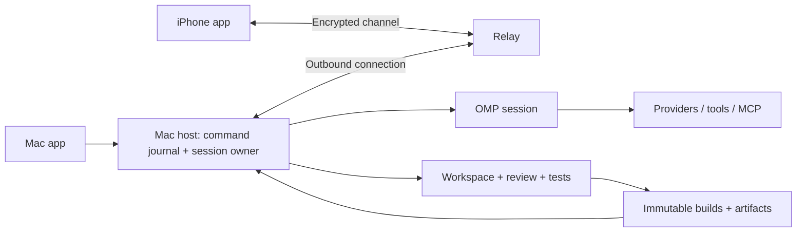

# Caret Mac/iPhone — ข้อเสนอ architecture และ implementation

> Archived 12 September 2026 evidence. Living map: [docs/README.md](../../README.md).
> ข้อเสนอ scope/stack/slices ในเอกสารนี้ถูกแทนโดย [ทิศทางหลัง Grill](../2026-09-14-pre-ssot/CARET-IMPLEMENTATION-DIRECTION-2026-09-12.th.md) และ [product acceptance](../2026-09-14-pre-ssot/CARET-REFERENCE-ACCEPTANCE-2026-09-12.th.md): หลายโปรเจกต์, IDE เต็มรูปแบบ, full OMP core; Mac ใช้ฐาน Code-OSS เดิมและศึกษา Paseo สำหรับ mobile/transport. เก็บ reuse/source findings และ bug probes ด้านล่างเป็นหลักฐาน ไม่ใช้ basic-editor/new-shell choice เดิมเป็นข้อสรุปล่าสุด

วันที่ประเมิน: 2026-09-12 · สถานะ: ข้อเสนอจากการตรวจ source; ยังไม่ใช่ implementation หรือผลทดสอบ end-to-end

## เป้าหมายที่ใช้ตัดสินใจ

อ้างอิง [handoff ล่าสุด](CARET-HANDOFF-2026-09-12.th.md): Caret เป็นแอปส่วนตัวสำหรับวงจรแก้ Aetheria → tests → เล่น preview → ส่ง feedback/ภาพ → แก้ต่อ โดย OMP เป็น harness และ Mac เป็นเจ้าของการรันหนึ่งเดียว เปิด iPhone นอกบ้านแล้วทำงานเดิมต่อได้โดยไม่ตั้ง terminal/link หรือเปิด VPN ใหม่

การประเมินนี้แทนข้อจำกัดเก่าที่ขัดกับเป้าหมายล่าสุดเฉพาะเรื่อง OMP, mobile/relay และการเลือก shell; ไม่ลบ backlog Cursor parity หรืออ้างว่าทำครบ 198 requirements/75 UI families แล้ว ไม่มีการแก้ Aetheria/Cedia, ส่ง prompt ไป provider, สร้างภาพ, deploy หรือ publish ในรอบนี้

## Checkout และ revision ที่ตรวจจริง

ตอนเริ่ม `/Users/pond/caret` มีเฉพาะ docs และไม่ใช่ Git repository จึง clone remote ที่ผู้ใช้ระบุลง `/Users/pond/caret/source` โดยไม่ย้ายหรือทับ handoff เดิม `main` ที่ clone มี working tree สะอาด เอกสารข้อเสนอนี้อยู่ใน planning root นอก checkout และยังไม่ได้ commit

| Source | Revision/สถานะที่ตรวจ | เจ้าของต้นทาง |
|---|---|---|
| Caret control `main` | `a87d9b29ac9e60f5847540d7e6bddbdbfa8ddb49` | Caret docs/backlog |
| `origin/caret-adapter` | `76f859d60f661039ef9bf2de4c95e36c9b163141` | Synara monorepo + Caret daemon patches |
| `origin/caret-native` | `ea1912fd6a05b80a56b2ad9b955075211deea521` | Microsoft Code-OSS + Caret extension/workbench patches; ไม่ใช่แอป Swift/iOS |
| OMP runtime/source | `omp/18.1.18`, tag `v18.1.18` → `00085d4e7dfdcfbf302c122fa2682b410a0f43d1` | `can1357/oh-my-pi`; local binary `/Users/pond/.local/bin/omp`, source อ่านจาก upstream commit นี้ |
| Cedia | HEAD `eedd81987a31eb0f226d4c92c1a75eac9cd35043` + งานค้าง | อ่านเอกสาร local เป็น evidence ประกอบ ไม่ใช่ clean release |
| Aetheria | HEAD `abf98b0433352a576081c6b563f4e738fc50fef9` + งานค้างจำนวนมาก | อ่าน working files จริง ไม่ถือว่าตรง HEAD |

Remote branch heads ยังตรง handoff ณ การตรวจครั้งนี้ `main` ไม่มี merge base กับ implementation branches จึงไม่ใช้ merge ทั้ง branch เพื่อเริ่มแอปใหม่ ต้อง extract modules พร้อม provenance/license manifest. `caret-adapter:LICENSE` เป็น MIT ของ T3 Tools Inc. และ Emanuele Di Pietro; `caret-native:LICENSE.txt` เป็น MIT ของ Microsoft ต้องรักษา notices และตรวจ dependencies ของ modules ที่เลือกอีกครั้งตอน pin

## ข้อเสนอด้านผลิตภัณฑ์และขอบเขต

สร้าง Caret shell ใหม่ที่เน้น session, review, artifacts, playable preview และ basic editor ใช้ native app container บน Mac/iPhone กับ UI ส่วนที่แชร์ได้ แยก Mac host เป็น process/service ที่ไม่ขึ้นกับหน้าต่าง UI ส่วน Code-OSS เดิมเก็บเป็นฐานอ้างอิงและทางเลือกสำหรับงาน IDE หนัก ไม่ใช้เป็น dependency ของ iPhone หรือ Mac host ใหม่

เหตุผลคือ code editor เป็นส่วนหนึ่งของ workflow แต่เป้าหมายหลักไม่ต้องการ extension host และ workbench เต็มชุดบนทุกอุปกรณ์ การแยก shell ไม่ได้แปลว่าทิ้ง review/worktree/artifact ที่มีอยู่ ต้องย้ายเป็น modules พร้อม tests และต้นทาง revision แทนการ copy daemon ทั้งก้อน

เลือก thin AppKit/UIKit containers + WKWebView สำหรับ shared responsive application UI เป็นทิศทางเริ่มต้น; native layer ดูแล Keychain, pairing/network, lifecycle, files/share และ screenshot ส่วน editor เริ่มด้วย CodeMirror 6 spike ตาม [คำอธิบายของ maintainer](https://discuss.codemirror.net/t/codemirror-v6-cross-platform-support/9313) ซึ่งระบุว่าเป็น browser editor และต้องพิสูจน์ webview จริง ไม่อ้าง native editor parity

| ทางเลือก | สิ่งที่ได้ | ภาระ/ข้อจำกัด | ข้อสรุป |
|---|---|---|---|
| ต่อ Code-OSS fork เดิม | Editor/undo/diff/extension host มีฐานเต็ม; Caret composer มี wiring | Caret UI ผูก VS Code APIs; iPhone ต้องสร้างใหม่อยู่ดี; ดูแล upstream fork และ desktop toolchain | เก็บไว้ ไม่ใช้เป็นฐาน slice ใหม่ |
| Shell ใหม่ + extract host modules | Session/preview/review อยู่ใน UI ที่ใช้ร่วมกัน Mac/iPhone; ไม่ผูก host กับ workbench | ต้องทำ basic editor/dirty buffer contract, native packaging และ remote protocol จริง | เลือกสำหรับเป้าหมายนี้ |
| ยก Synara app ทั้งชุด | มี UI/server services จำนวนมาก | นำ orchestration/provider/history owner เก่ามาทับ OMP และ dependency graph ใหญ่ | ไม่ยกทั้งชุด; เลือก modules เท่านั้น |

โครง source ใหม่ที่เสนอใน implementation branch จาก control `main`: `apps/host`, `apps/macos`, `apps/ios`, `packages/protocol`, `packages/omp-adapter`, `packages/workspace`, `packages/artifacts`, `packages/ui`, `tests/fixtures`. แยก dependency ของ upstream ออกจาก public Caret protocol; ไม่สร้าง abstraction รองรับหลาย harness ในรอบแรก

## Reuse matrix จาก implementation

Pointers `A:` หมายถึง `caret-adapter` ที่ SHA ข้างต้น และ `N:` หมายถึง `caret-native` ที่ SHA ข้างต้น อ่านได้โดย `git -C /Users/pond/caret/source show origin/caret-adapter:<path>` หรือเปลี่ยนเป็น `origin/caret-native` ตาม prefix. “ใช้ตรง ๆ” ในตารางหมายถึง logic ที่ยกพร้อม tests ได้ ไม่ใช่การรับรอง release ใหม่ว่าผ่านแล้ว

| ส่วน | ข้อสรุป reuse | Source / เหตุผล / งานที่ยังขาด |
|---|---|---|
| Review state machine | ใช้ตรง ๆ เป็นฐาน pure module | `A:apps/caret-daemon/src/review.ts:1` แยก state/findings ไม่มี model/UI/I/O; ไม่ใช่ diff renderer หรือ apply engine |
| Shell view-state serialization | ใช้ตรง ๆ เฉพาะ schema/normalization | `N:src/vs/workbench/contrib/agentWorkbench/browser/agentShellState.ts:32`, `:77` เป็น DOM-free JSON snapshot/merge; เลือกเฉพาะ fields ที่ UI ใหม่มีจริง ไม่ลาก storage service ของ Code-OSS มาด้วย |
| Path/MIME/artifact classification | ใช้ตรง ๆ เฉพาะ helpers แล้วทดสอบ boundary ใหม่ | `A:apps/caret-daemon/src/artifacts.ts:22` และ `:62` มี kind/viewer/path-under-root; ต้องตรวจ symlink/TOCTOU ณ เวลาเปิดไฟล์จริงด้วย |
| Worktree/review/bring-back | ต้องดัดแปลง | `A:apps/caret-daemon/src/worktree.ts:43`, `:113`, `:171`, `:214` มี detached worktree, realpath, untracked handling, overlap refusal, 3-way apply และ remove guards แต่ผูก Synara GitCore/Effect และเริ่มจาก HEAD ไม่รวม dirty source |
| Untracked text preview | ต้องแก้ก่อน reuse | `A:apps/caret-daemon/src/worktree.ts:107` ใช้ `content.includes("")` ซึ่งเป็น true ทุก string จึงแสดงไฟล์ใหม่เป็น binary/omitted เสมอ; พบจาก source ยังไม่ถือเป็น runtime suite result |
| Session host lifecycle | ใช้ patterns/tests; เปลี่ยน runtime owner | `A:apps/caret-daemon/src/daemon.ts:33`, `:103`, `:114` ผูก CodexAdapter/CheckpointStore และ capability flags ของ Codex; `session-api.ts:109` ใช้ in-memory Map; `:153` ป้องกันสอง live sessions เพราะ event queue เดิมไม่ได้ fan-out; ไม่ใช่ OMP-ready host |
| Process supervision | ต้องดัดแปลง | `A:apps/caret-daemon/src/process-host.ts:64` มี spawn/ready/stop escalation; `serve-tcp.ts:19` มี process-lifetime scope แต่ยังไม่มี bundled LaunchAgent, durable recovery และ OMP ownership lock |
| Approvals | ใช้ UX/event concepts; เปลี่ยน enforcement | `A:apps/caret-daemon/src/daemon.ts:143` รับ `request.opened` ของ adapter เก่า; `session-api.ts` parked promises ไม่คงข้าม restart และไม่พิสูจน์ว่า OMP tools ถูก gate |
| Remote transport | ต้องเขียน boundary ใหม่; เก็บ test cases เป็นฐาน | `A:apps/caret-daemon/src/remote.ts:48` plain TCP/NDJSON, shared token, memory success cache 200 รายการ; `:70` broadcast all sockets; `:130` cache หลัง execution; `:140` socket สมัครก่อน auth. ไม่มี durable dedup, per-device revoke หรือ E2E relay |
| Client transport | ต้องเปลี่ยน | `N:extensions/caret/src/tcp-client.ts:1` ใช้ `node:net`, per-instance counter IDs และ pending requests; ใช้กับ browser/iOS ตรง ๆ ไม่ได้ และหลาย clients ใช้ id ชนกันได้เมื่อแชร์ token |
| Artifact catalog/export | ต้องดัดแปลง | `A:apps/caret-daemon/src/artifacts.ts:110` diff `fromRef..HEAD` อาจพลาด dirty tracked files; `:139` id เป็น run:path และอ้าง mutable file; `export.ts:1` bundle/tail logs มีประโยชน์แต่ไม่ใช่ immutable build store หรือ artifact upload/download |
| MCP | เก็บ conformance tests/fixtures; ให้ OMP เป็น MCP owner ในระบบใหม่ | `A:apps/caret-daemon/src/mcp.ts:78`, `mcp-http.ts:53`, `mcp-server.ts:1` มี stdio/HTTP tools/resources/prompts/elicitation และ bounded test runner; ไม่รัน MCP client สองชุดคู่ OMP; OAuth เดิมยังเป็น auth seam |
| Editor/diff/composer | Reuse behavior/tests และบาง UI logic; port integration | `N:extensions/caret/src/extension.ts:1`, `:137`, `:627`, `:705` ใช้ vscode WebviewViewProvider/openTextDocument/commands; file picker, diff, tabs, undo ต้องเปลี่ยนเป็น host/file/editor contracts ใหม่ |
| “Native Agents” | ยังไม่มี standalone native app ให้ reuse | `N:src/vs/workbench/contrib/agentWorkbench/browser/agentWorkbenchModeService.ts:17` ระบุ presentation-only/shell flag ไม่มี Agents layout; import Code-OSS storage/context-key/lifecycle; ชื่อ branch ไม่ใช่หลักฐาน iOS app |
| Relay/iPhone/pairing/preview bundle | ยังไม่มี implementation ที่ครบ acceptance | Gateway loopback และ shell scaffolds ไม่ได้ให้ native mobile cellular, immutable same-build playback, device-bound keys, signing หรือ APNs |

การดึง daemon ทั้งชุดจะลาก `apps/server/src/...`, `@synara/contracts` และ Effect-smol catalog `8881a9b` มาด้วย (`A:apps/caret-daemon/DEPS.md`, `A:package.json`). ดังนั้นให้ extract pure modules ก่อน และทำ workspace adapter ชัดเจนแทนการนำ Codex/OpenCode coordinator เก่ามาคุม OMP ซ้ำ

`N:extensions/caret/src/extension.ts:179` ยังเก็บ endpoint/token ใน VS Code `globalState` และการสลับ endpoint reset session ใน memory; `:105` ค้น Bun/daemon จาก checkout ภายนอก ไม่ใช่ self-contained app packaging จึงต้องแทนด้วย Keychain + host discovery/pairing + durable session identity ตาม protocol ใหม่

## OMP interface ที่เลือก

**เลือก OMP RPC subprocess สำหรับ slice แรก**: Mac host เปิด OMP และถือ stdin/stdout ตลอด lifetime ของ session หน้าต่าง Mac/iPhone เป็น clients ของ Caret protocol เท่านั้น หนึ่ง active Caret session ใช้หนึ่ง OMP process/session owner; slice แรกเริ่มหนึ่ง session ก่อนและไม่ให้สอง processes เปิด session file เดียวกัน. RPC ทำให้คุม child crash/cancel/version handshake ได้โดยไม่ embed runtime ทั้งชุดใน host

| Interface ที่ตรวจ v18.1.18 | ทำได้จริงตาม source | เหตุผลเลือก/ไม่เลือก |
|---|---|---|
| SDK | `createAgentSession`, SessionManager, typed events, prompt/abort/setModel, `setToolUIContext` และ MCP lifecycle | เหมาะหากต้องการ embed ใน Bun; ต้องดูแล initialization/UI callbacks/lifecycle เอง ไม่จำเป็นสำหรับ slice แรก |
| RPC | NDJSON stdio, ready/protocol negotiation, prompt/events/history, abort, model catalog/switch, session commands, extension UI request/response | เลือก; ใช้ wire boundary ที่มีอยู่และแยก process; Caret ยังต้องเติม durable remote protocol |
| ACP | JSON-RPC stdio, session load/resume/list/fork/close, model config และ request_permission | ดีสำหรับ IDE client ที่ใช้ ACP แต่ Caret ต้องมี own remote/artifact protocol อยู่แล้ว; ไม่ใช้ ACP เป็น network reconnect layer |
| Collab | encrypted WebSocket, host-authoritative snapshot/events, prompt/interrupt และ reconnect | ไม่ใช้เป็น product control plane: เริ่ม sharing ผูก TUI, lifecycle/model/session operations ไม่ครบ dashboard, public relay production source ไม่ได้แจก; ใช้ protocol/tests เป็น evidence ออกแบบ remote |

หลักฐาน: [SDK docs](https://github.com/can1357/oh-my-pi/blob/00085d4e7dfdcfbf302c122fa2682b410a0f43d1/docs/sdk.md), [RPC docs](https://github.com/can1357/oh-my-pi/blob/00085d4e7dfdcfbf302c122fa2682b410a0f43d1/docs/rpc.md), [RPC implementation](https://github.com/can1357/oh-my-pi/blob/00085d4e7dfdcfbf302c122fa2682b410a0f43d1/packages/coding-agent/src/modes/rpc/rpc-mode.ts), [ACP agent](https://github.com/can1357/oh-my-pi/blob/00085d4e7dfdcfbf302c122fa2682b410a0f43d1/packages/coding-agent/src/modes/acp/acp-agent.ts), [Collab contract](https://github.com/can1357/oh-my-pi/blob/00085d4e7dfdcfbf302c122fa2682b410a0f43d1/docs/collab.md)

Mapping ของ adapter:

- Open/load: persist mapping `caretSessionId → OMP session file/id + workspaceId`; เปิด process ที่ชี้ session นั้นอย่าง explicit ห้ามใช้ last-session/continue โดยไม่ตรวจ identity
- Prompt: RPC ACK เป็นเพียงรับคำสั่ง ไม่ใช่จบงาน; consume `prompt_result`/terminal `agent_end` ตาม protocol version จึงตัดสิน turn outcome
- Cancel: ส่ง `abort` ใน process เดิมและรอ terminal/reconcile; kill process เป็น timeout escalation ซึ่งต้องแสดง interrupted/unknown แทน successful cancellation
- History: ใช้ OMP file-backed SessionManager เป็น transcript SSOT; Caret เก็บ normalized events สำหรับ replay/client projection พร้อม OMP identity ไม่แก้ JSONL หรือสร้าง model history แข่ง
- Model: ใช้ `get_available_models` และ `set_model(provider,modelId)` หลังตรวจ busy/version/capability; ตรวจ effective model อีกครั้งและแสดงการเปลี่ยนจริง
- UI/approval: ใช้ **`rpc-ui`** เพื่อให้ `main.ts:2058–2062` ส่ง `setToolUIContext` เข้า RPC runner; plain `rpc` ไม่ส่ง setter นี้. Runner สร้าง `RpcExtensionUIContext` และ initialize extensions (`rpc-mode.ts:1050`); Caret persist UI request mapping และให้ clients ตอบผ่าน host. ต้องทดสอบ interactive tool semantics แยกจาก extension UI protocol
- Lifecycle: stdin EOF ทำให้ RPC dispose session/exit (`rpc-mode.ts:1635`); ดังนั้น host เป็นผู้ถือ pipe ไม่ใช่ app window และ host restart ไม่อ้างว่ารัน tool เดิมต่อจากจุดเดิมได้

Approval source สำคัญ: [`ExtensionToolWrapper`](https://github.com/can1357/oh-my-pi/blob/00085d4e7dfdcfbf302c122fa2682b410a0f43d1/packages/coding-agent/src/extensibility/extensions/wrapper.ts) resolve policy ก่อน execute, รองรับ tool-call blocking และ UI confirmation; ค่า fallback `tools.approvalMode` เป็น `yolo` (`:198`) จึง **ห้ามพึ่ง default**. S0 ต้องตั้ง effective policy แบบ explicit, ตรวจว่า auto-approve/per-tool overrides ไม่ข้าม policy ที่ Caret แสดง และพิสูจน์ tool coverage/abort บน RPC จริงก่อนเปิด mutation ของ Aetheria

ข้อจำกัดที่ต้องแก้ใน S0: RPC ส่ง generic `extension_ui_request` ไม่ได้ส่ง `tool_approval_requested/resolved` เป็น typed protocol frames โดยตรง สอง events หลังเป็น extension callbacks. ห้าม infer tool/arguments/approval state ด้วยการ parse title อย่างเดียว ให้ทำ trusted Caret extension/adapter metadata bridge พร้อม conformance test เพื่อผูก effective args กับ approval ID; ถ้า bridge บน public RPC surfaces ไม่พอ ให้เพิ่ม upstream protocol patch ที่มี schema/test เฉพาะจุดก่อนเปิด write-enabled slice. ตอบ UI request เดิมด้วย request ID ของ process incarnation เดิมเท่านั้น เมื่อ process ตาย approval เดิมหมดสิทธิ์ตอบ

ตาม [hooks contract](https://github.com/can1357/oh-my-pi/blob/00085d4e7dfdcfbf302c122fa2682b410a0f43d1/docs/hooks.md) eval prelude/browser/computer bridge calls อยู่นอก tool-call hooks; จึงเริ่มด้วย tool allowlist ที่พิสูจน์ได้และปิดเส้นทาง bridge ที่ยังไม่ครอบคลุม ไม่อ้างว่า generic hook คือ OS sandbox หรือคุมทุก side effect ใน shell script ได้. SDK เป็นทางเลือกหากต้องการ callback โดยตรง แต่ต้องเรียก `initializeExtensions` เพิ่มนอก `createAgentSession` เพื่อให้ runner UI/hooks ทำงานจริง

ไม่ต้อง patch OMP ล่วงหน้า หาก S0 พบ requirement ที่ RPC ไม่มี ให้พิสูจน์ช่องว่างนั้นก่อนเลือก SDK หรือ patch แบบแยกและ pin revision; ไม่เปลี่ยนไปใช้ Codex/OpenCode coordinator เดิมเป็น harness ที่สอง

## เจ้าของ state และ boundary

| ส่วน | เจ้าของ | ขอบเขต |
|---|---|---|
| Model loop, context, compaction, provider/model integration | OMP session | Caret ไม่สร้าง loop แข่งและไม่เขียน transcript ของ OMP เอง |
| การเปิด/ปิด OMP runtime, mapping ของ Caret session ไป OMP session | Mac host | หนึ่ง live owner ต่อ session; UI และ relay ไม่เปิด runtime เพิ่ม |
| Commands, event cursor, approvals และมุมมอง session | Caret host store | durable journal เพื่อ deduplicate/replay; เป็น transport/application state ไม่ใช่ model context อีกชุด |
| Workspace, patch/review, build snapshot | Caret workspace service | worktree ต่อ task; ตัดสิน snapshot/revert ที่นี่ ปิดหรือหลีกเลี่ยง checkpoint ที่ย้อนซ้ำกับ runtime |
| Files/basic editor | Client buffer + host file API | save มี expected content hash/version; agent ทำงานกับ saved disk; buffer conflict ต้องแสดงก่อนเขียนทับ |
| Artifact และ playable build | Caret artifact/build service | immutable bytes + hash + session/turn/workspace/build identity |
| Provider credentials/tools/MCP processes | Mac/OMP | ไม่ส่ง credentials ให้ iPhone หรือ relay; ใช้ config และสิทธิ์ที่ runtime ตรวจพบจริง |
| Device identity, revoke, connection routing | Pairing/transport | ไม่เป็นเจ้าของการรันหรือไฟล์โปรเจกต์ |
| Draft, tab, scroll และ cached view | Client | cache ระบุ freshness; ไม่ใช้เป็นความจริงของ run status |

Dependency direction: clients → versioned Caret protocol → Mac host → OMP adapter / workspace / artifacts. Relay ขนส่ง authenticated encrypted messages ระหว่าง client กับ host; ไม่มี agent compute บน relay

## สัญญา remote continuity ที่ต้อง implement

### Commands และ replay

- Envelope: `protocolVersion`, `deviceId`, `commandId`, `sessionId`, `expectedVersion`, `method`, `params` พร้อมการตรวจสิทธิ์จาก authenticated device จริง ไม่เชื่อ `deviceId` ที่ client ใส่มาลอย ๆ
- `commandId` ต้องคงเดิมเมื่อ retry; host persist การรับคำสั่งก่อน dispatch และบังคับ uniqueness ต่อ device/session/id รวม payload hash ปฏิเสธ id เดิมที่เนื้อหาต่างกัน
- แยก `accepted`, `running`, `completed`, `failed`, `cancelled`, `outcome_unknown`; response timeout ไม่ได้แปลว่าคำสั่งล้มเหลว
- Event มี `eventId`, `sessionId`, `sequence`, `commandId/turnId`, schema version และ timestamp; persist ก่อนส่งออก UI
- Reconnect ส่ง cursor ล่าสุดแล้ว replay; ถ้า cursor เก่าเกิน retention ให้ snapshot พร้อม watermark แล้วต่อ events หลัง watermark โดยไม่เว้นช่องว่าง
- Client ที่ไม่เห็น ACK ต้อง query/retry ด้วย id เดิม ห้ามส่ง prompt ใหม่โดยสร้าง id ใหม่อัตโนมัติ
- Network reconnect ต้องไม่ทำให้ dispatch ซ้ำ แต่ host crash ระหว่าง side effect กับการบันทึกผลไม่สามารถรับประกัน exactly-once สำหรับ shell/provider ภายนอกทั้งหมดได้: แสดง `outcome_unknown`, reconcile จาก runtime/files/logs และไม่ auto-rerun mutation
- สั่งงานจาก Mac และ iPhone พร้อมกันเข้าคิวเดียวบน host; model switch, review apply และ approval ต้องตรวจ version ปัจจุบันอีกครั้ง

### Cancel, model switch และ approvals

- Cancel ระบุ turn เป้าหมายและ idempotency key; ส่งไป runtime เดิม รับผลสถานะสุดท้ายก่อนแสดง cancelled การปิด socket/UI ไม่เท่ากับ cancel
- Model list/capabilities มาจาก OMP runtime และ auth/config ปัจจุบัน ใช้ provider+model identity; ห้าม hardcode ชื่อจาก handoff หรือ silently fallback ไป billed API
- เปลี่ยน model เมื่อ idle หรือ boundary ที่ adapter พิสูจน์แล้วเท่านั้น; หากกำลังรันให้ reject เป็น busy หรือรอคิวอย่างชัดเจน ไม่สร้าง conversation ใหม่เงียบ ๆ
- Approval ต้อง block ก่อน side effect จริง มี `approvalId`, `turnId`, tool-call identity, normalized arguments hash, workspace revision และ expiry การกดซ้ำไม่ execute ซ้ำ
- Disconnect ไม่ถือเป็น approve; request ยังค้างบน host หรือหมดอายุเป็น deny/cancel ตาม policy ที่ประกาศ Reconnect แสดง approval เดิมที่ยังมีผล
- Policy ต้องใช้กับ built-in tools, shell, custom tools, MCP และ subagent paths ที่เปิดใช้ หาก intercept ไม่ครอบคลุม ให้ปิด capability นั้นใน slice แรกจนมีหลักฐาน ไม่มีการใช้ UI approval หลังเขียนไฟล์แล้ว

### Host lifetime

- Host เปิดเป็น user service แยกจาก app window มี single-instance lock และ session ownership lock; ปิดหน้าต่างแล้วยังทำงานต่อ
- หลัง host restart โหลด session mapping/journal แล้ว reconcile OMP history ก่อนรับ mutation ใหม่; ไม่ replay prompt ที่ไม่ทราบผลโดยอัตโนมัติ
- `UI disconnected`, `host unreachable`, `run interrupted` และ `provider error` เป็นคนละสถานะ iPhone ไม่สามารถสรุปว่า Mac หลับหรือไฟดับจาก socket timeout เพียงอย่างเดียว
- การตั้งให้ Mac awake และ service เริ่มเมื่อ login ต้องมี setup/health check; relay ไม่ปลุก Mac หรือทำให้ agent ทำงานขณะเครื่อง sleep

ใช้ per-user LaunchAgent ผ่าน [SMAppService](https://developer.apple.com/documentation/servicemanagement) และตรวจ status เมื่อ helper ถูกปิดใน System Settings; ยังไม่ต้องใช้ root/system daemon สำหรับเป้าหมาย Mac ที่ login ค้างไว้ ส่วน iPhone ใช้ scene lifecycle เพื่อ reconnect ตอนกลับ foreground ตาม [Apple lifecycle guidance](https://developer.apple.com/documentation/uikit/preparing-your-ui-to-run-in-the-foreground) ไม่พึ่ง background socket. [Background push ไม่รับประกัน delivery](https://developer.apple.com/documentation/usernotifications/pushing-background-updates-to-your-app) จึงเป็นเพียง hint ให้ resync

## Preview และ image workflow ของ Aetheria

### Build identity และ source isolation

Checkout Aetheria มีงานค้างจำนวนมาก จึงห้ามเริ่ม task ด้วย worktree จาก `HEAD` อย่างเดียวแล้วอ้างว่าครบ source ปัจจุบัน ก่อน slice จริงให้สร้าง snapshot ของชุดไฟล์ที่ผู้ใช้ต้องการทดสอบ รวม tracked modifications และ untracked ที่เกี่ยวข้อง พร้อม manifest; ไม่ commit งานทั้งหมดเพื่อความสะดวก และไม่รวม secrets/output caches โดยอัตโนมัติ

Build receipt ต้องมี `baseCommit`, `sourceSnapshotHash`, lockfile hash, build command, test results, `buildId` และ asset manifest/hash แยก source identity ออกจาก HEAD เพราะ working tree อาจ dirty

รัน tests และ build บน source snapshot เดียวกัน; publish build เมื่อสำเร็จครบ gate เท่านั้น Failed build ไม่ทับ last-known-good และ UI ไม่เปลี่ยน preview กลางเกมจนผู้ใช้เลือก build ใหม่ Mac/iPhone ต้องแสดง `buildId` และ manifest hash เดียวกัน ไม่ใช่แค่ branch หรือคำว่า latest

ใช้ web build จริงผ่าน authenticated artifact channel และ isolated game WebView แยกจาก Caret control UI ไม่มี native bridge ที่ game เรียก shell/files ได้ ต้องรองรับ nested assets, module imports, media, MIME, relative/root URLs และ history fallback อย่างมีขอบเขต; ไม่เปิด generic proxy ไปทุก localhost port หรือ arbitrary path

เส้นทางที่เลือกสำหรับ slice: native client ดาวน์โหลด manifest/assets ผ่าน encrypted channel ตรวจ hashes และ cache ให้ครบแบบ atomic แล้วเสิร์ฟ local bundle ผ่าน `WKURLSchemeHandler` ใน game WebView แนวเดียวกับ Aetheria Mac ปัจจุบัน ผูก handler กับ immutable build ที่ viewer เปิดอยู่ ใช้ stable project origin (`caret-preview://<project-id>`) ต่ออุปกรณ์ ไม่ต้องให้ relay ถอดรหัส HTML/JS หรือจัด cookie ของ control API ให้เกม. จำกัด path ตาม manifest และห้าม external navigation/bridge; S0 ต้องพิสูจน์ Vite modules, lazy imports, images/fonts/audio, storage และ screenshot บน iPhone ก่อนยืนยันเส้นทางนี้ หาก custom-scheme compatibility ไม่ผ่านให้บันทึกการเปลี่ยน design เป็น authenticated HTTPS preview อย่างชัดเจน รวม trust/encryption ที่เปลี่ยนไป ไม่ลด E2E เงียบ ๆ. Apple แยก [security origin](https://developer.apple.com/documentation/webkit/wksecurityorigin) และ [website data store](https://developer.apple.com/documentation/webkit/wkwebsitedatastore) จึงต้องทดสอบ isolation ของ custom scheme จริงด้วย

Preview origin/storage policy ต้องคงที่ต่อ project บนอุปกรณ์นั้นและแยก control origin; pin build ต่อ viewer session เพื่อไม่ให้ asset ต่าง revision ปนกัน ขณะนี้ Mac game ใช้ `aetheria://game` และ save แยกจาก browser การเห็น agent session เดียวกันไม่ใช่ game-save sync และไม่สัญญาว่า duel กลางเกมย้ายอุปกรณ์ต่อได้

Feedback เก็บ `sessionId`, `turnId`, `buildId`, screenshot artifact hash และข้อความ เมื่อกลับเข้า session เดิม agent จึงทราบว่าปัญหาจาก build ไหน ส่ง screenshot แบบ resumable/deduplicated และตรวจ MIME/size/hash ที่ host

### ภาพการ์ด

เริ่ม import original image → candidate receipt/hash → visual review → explicit owner approval ก่อนต่อ generation backend แยก `image job` ออกจาก text model session ใช้ original bytes ไม่ regenerate/recompress ภาพที่ approved แล้ว

`scripts/art/generate-cards.mts:93` ปฏิเสธ non-dry-run จึงไม่ใช่ backend พร้อมใช้ ส่วน `record-production-candidate.mts` มี prompt/rules/reference hashes และ approved lock ที่ reuse เป็น contract ได้ แต่ยังผูก queue path และ receipt tool กับ workflow เดิม ต้อง parameterize provenance ให้ตรง backend จริง

การต่อ gpt-image-gen ต้องยืนยัน API/บริการและสิทธิ์ที่ใช้ได้จาก Caret เอง ไม่ถือว่าเครื่องมือ imagegen ของแอปปัจจุบันหรือ subscription ของ text model ย้ายมาได้อัตโนมัติ ข้อนี้ไม่ขวาง slice แก้โค้ด/preview/feedback

## แผน implementation ตาม dependency

| Slice | งานและผลลัพธ์ | เกณฑ์ผ่าน |
|---|---|---|
| S0 — Contract spike | Pin OMP/source licenses; สร้าง host adapter และ fixture tools; พิสูจน์ session open/load/events/cancel/model/approval | ใช้ temporary repo และ mock model: block write ก่อน effect, cancel pending tool, resume session หลัง process restart, capability ที่ไม่รองรับแสดงตรงจริง |
| S1 — Durable host | Service lifecycle, session mapping, command journal, ordered events, snapshot/resync, workspace isolation | ปิด UI แล้ว run ต่อ; สอง clients ส่ง id เดิมพร้อมกัน dispatch ครั้งเดียว; dropped ACK/reconnect ไม่ส่ง prompt ซ้ำ; crash ambiguity ไม่ rerun mutation |
| S2 — Mac workflow | Shell, session composer, basic editor, review, tests/build worker, artifact catalog, isolated preview | แก้ fixture project → test/build receipt → review/preview ตรง snapshot; dirty-buffer/untracked/overlap conflicts ไม่ทำงานหาย |
| S3 — iPhone + remote | Native container, pairing/revoke, encrypted relay transport, artifact transfer, reconnect and offline drafts | ใช้ simulator/local relay ก่อน แล้วเครื่องจริงบน cellular; เปิดแอปกลับเห็น session และ build เดิมโดยไม่สร้าง link ใหม่ |
| S4 — Aetheria acceptance | นำ snapshot ที่เลือกมาใช้; feedback/screenshot เข้ารอบงานเดิม | Mac prompt → tests/build A → iPhone cellular เล่น A → screenshot/feedback → agent แก้ต่อ → build B; ตัดเน็ตก่อน/หลัง ACK แล้วไม่มี duplicate dispatch |
| S5 — Image backend/notifications | เชื่อม image provider ที่ยืนยันสิทธิ์, candidate/approval UI, APNs ตามต้องการ | Original/hash/provenance ถูกต้องและ approved artwork ไม่ถูกทับ; notification ไม่เปิดเผยเนื้อหางานโดยไม่จำเป็น |

S0 เป็นตัวตัดสิน feasibility ก่อนลงทุน UI เต็มชุด; S1/S2 ทำได้ก่อนเลือกผู้ให้บริการ relay จริง S3 บนเครื่องจริงต้องมี signing/provisioning จึงเริ่ม setup เมื่อถึง gate นั้น ไม่เลื่อนไปหลัง acceptance ที่ต้องใช้ iPhone จริง APNs ไม่จำเป็นสำหรับ foreground continuity และไม่ใช่ prerequisite ของ S4

## Validation ที่ต้องมีใน implementation

1. Unit/contract: schema compatibility, command-id conflict, replay ordering/gaps, approval stale/expired/revoked, model busy/unsupported, permission-before-effect, canonical paths และ out-of-root/symlink rejection
2. Host integration: restart, stop UI, exclusive session ownership, cancel/timeout, dropped ACK, concurrent clients, resync after journal retention และ tool outcome uncertainty
3. Workspace: dirty buffers, untracked files, overlapping manual edits, targeted reject/undo, snapshot/build/test identity และ no whole-repo restore
4. Preview: every asset from pinned manifest, failed build retained, separate control/game origin, no control bridge in game, screenshot round-trip และ interrupted artifact download
5. Device acceptance: Wi-Fi→cellular, airplane-mode reconnect, background/foreground, revoke device, host unreachable, Thai input/IME, basic editing, touch/drag/audio และ same-build proof
6. Separate native QA: Aetheria macOS app build/launch/input/audio; embedded preview ไม่แทน native app QA และ simulator ไม่แทน iPhone จริง

ไม่ใช้ historical suite counts เป็นผลทดสอบรอบนี้ และไม่ถือว่า mock/local relay ผ่านแล้วเท่ากับ cellular production path ผ่าน

## Decisions ที่ยังต้องเลือกเมื่อถึง gate

- Relay: deployment target, region, availability และ budget รวม asset traffic; ยังไม่ provision/purchase ในรอบ planning ค่าใช้จ่ายแยกจาก model และ image
- Pairing/encryption: เสนอ QR/invite อายุสั้นที่ยืนยันบน Mac, device-bound key ใน Keychain, explicit revoke และ end-to-end encryption ของคำสั่ง/ผลลัพธ์/artifacts ผ่าน relay; ต้องเลือก audited library/protocol และทดสอบ key rotation/replay ไม่ออกแบบ crypto primitives เอง
- iOS: ตรวจ Developer account/team/device/provisioning จริงก่อน on-device S3; ขอ APNs credentials เฉพาะเมื่อเริ่ม notification ไม่ต้องให้ผู้ใช้ส่ง secrets ในแชต
- Providers: ตรวจ runtime model catalog และ entitlement จริงก่อน live smoke; ความสำเร็จของการ route ผ่านแอปอื่นไม่ใช่ proof ของ OMP provider path

ไม่มีข้อเลือกเหล่านี้ขวางการเริ่ม S0/S1 ใน local fixture แต่การผ่าน acceptance มือถือนอกบ้านต้องมี remote endpoint และเครื่องจริงที่ติดตั้งแอปได้

## ผลตรวจรอบนี้และขอบเขตความมั่นใจ

- อ่าน handoff/control instructions/roadmap และ source ของสอง implementation branches ผ่าน local Git objects โดยไม่ checkout ทับ branch และไม่แก้ production code
- ตรวจ binary version และ pin OMP upstream source; เป็น source/interface audit ยังไม่ได้รัน model/approval smoke ของ OMP ใหม่
- รัน [remote gateway probe](../../maintenance/evidence/remote-gateway-2026-09-12/run-probe.sh) บน exact `remote.ts` จาก SHA ที่ระบุ ด้วย Bun 1.4.2 และ fixture API บน loopback ไม่มี provider calls; root รันซ้ำและได้ [ผลเดียวกัน](../../maintenance/evidence/remote-gateway-2026-09-12/result.txt):
  1. ส่ง same-id สองคำสั่งขณะ handler แรกยังค้าง → handler ถูกเรียก **2 ครั้ง** และตอบ **2 ครั้ง**
  2. Socket ที่ไม่เคย authenticate → ได้ broadcast event
  3. หลัง rotate/revoke token socket เก่ายังได้ broadcast แม้ request ด้วย token เก่าถูกปฏิเสธ `unauthorized`
- คำว่า `assertion=PASS` ใน output หมายถึง reproduce ข้อบกพร่องสำเร็จ ไม่ใช่ gateway ปลอดภัยหรือแก้แล้ว Probe ใช้ fixture `runEffect` ไม่ใช่ Synara/OMP session จริง ไม่ครอบคลุม LAN/cellular/TLS หรือ whole daemon suite
- Independent Astra architecture review ไม่พบ blocker ในแนวทางหลัก; แก้ pointer ของ RPC EOF ตาม review แล้ว ประเด็น approval metadata และ iPhone custom-scheme compatibility ถูกบันทึกเป็น S0 gates ชัดเจน
- ยังไม่ได้ build Caret/รัน full daemon suite/เล่น Aetheria/ทดสอบ iPhone cellular/signing/deploy. หลักฐานเก่า 120 tests หรือ Zed acceptance ใน handoff เป็น historical report เท่านั้น

**จุดเริ่มงานที่ concrete:** สร้าง implementation branch จาก control main แล้วทำ S0 OMP RPC adapter + trusted approval bridge + fixture-only contract tests และ preview compatibility spike ก่อนขยายเป็น durable host/UI. งาน planning จบที่ข้อเสนอและ gates นี้ ไม่มีการเริ่ม implement ทั้ง backlog หรือ deploy ต่อโดยอัตโนมัติ

## ข้อกำหนดเพิ่มเติมจากผู้ใช้ — OMP feature coverage

ผู้ใช้ยืนยันภายหลังการประเมิน: **Caret ต้องมี tools ครบและรองรับทุก feature ของ OMP ที่เป็น core harness ของเรา** ข้อนี้มีผลเหนือข้อเสนอ slice/tool allowlist ข้างต้นในด้านขอบเขตผลิตภัณฑ์สุดท้าย การปิด capability ชั่วคราวระหว่าง feasibility หรือการแบ่ง slice เป็นเพียงลำดับ implementation ไม่ใช่การตัด feature ออกจากเป้าหมาย และห้ามนับความสามารถที่ปิดอยู่เป็นรองรับแล้ว

- OMP เป็นเจ้าของ agent execution และ harness semantics; Caret ต้องให้ผู้ใช้เข้าถึงความสามารถนั้นผ่าน app/host โดยไม่สร้าง harness คู่ขนานหรือเปลี่ยนพฤติกรรมเงียบ ๆ
- ก่อนล็อก SDK/RPC/ACP หรือเลือกต่อยอด Paseo ต้องทำ inventory จาก source/runtime ของ OMP revision ที่ pin จริง ครอบคลุม built-in tools, tool discovery/configuration, sessions/history, streaming, queue/steer/cancel, model/provider/config, context/compaction, approvals/interactions, subagents และ extensibility/MCP/skills/hooks ตลอดจน core capabilities อื่นที่พบจาก inventory รายการนี้เป็นจุดเริ่มตรวจ ไม่ใช่รายการครบที่ยืนยันแล้ว
- สร้าง coverage matrix: feature/tool → source/version → interface ที่เปิดให้ใช้ → Caret UI/host mapping → permissions/side effects → acceptance test → ผลที่สังเกตจริง พร้อมแยกสถานะ implemented ออกจาก verified
- RPC ยังเป็นเพียง interface candidate ของ slice แรก ความสามารถที่ RPC ไม่ expose ต้องประเมิน SDK, trusted extension bridge หรือ upstream patch ที่มี tests และ pin revision; ห้ามลด scope ให้เหลือเท่าที่ RPC ทำได้
- Feature ที่มีเฉพาะ TUI ต้องตรวจว่าต้องย้าย control/UI semantics อย่างไร ไม่ถือว่าการเปิด terminal แล้วให้ผู้ใช้ทำเองเท่ากับ integrated support โดยอัตโนมัติ
- Mac ถือ execution owner; iPhone ต้องเข้าถึงการควบคุมและผลลัพธ์ที่เกี่ยวข้องผ่าน host โดยรักษา semantics ไม่จำเป็นต้องรัน tools/OMP บนโทรศัพท์ ต้องระบุข้อจำกัดจาก OS/provider/credentials จริงพร้อมวิธีทดสอบ ไม่อ้างการรองรับโดยไม่มีหลักฐาน
- การอ้าง full OMP core coverage ต้องผ่าน matrix ของ revision ที่ประกาศรองรับ เมื่ออัปเกรด OMP ให้ตรวจ feature/schema delta และ regression ที่เกี่ยวข้องก่อนเพิ่มเวอร์ชันที่รองรับ ไม่ใช้คำว่า all features เพื่อรับประกัน future versions ที่ยังไม่ได้ตรวจ

ข้อเสนอ stack และการ reuse ในเอกสารนี้ยังต้องประเมินผ่าน coverage gate ดังกล่าว ยังไม่มีหลักฐานว่า Caret เดิม, Paseo หรือ RPC อย่างใดอย่างหนึ่งรองรับเป้าหมายนี้ครบแล้ว
