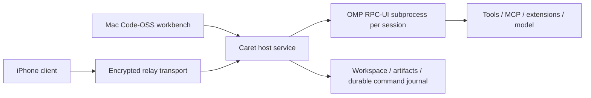

# Caret — ทิศทาง implementation หลัง Grill

วันที่ 2026-09-12 · สถานะ: architecture decision; ต่อจาก G0 มาที่ [G1 UI/host side channels](CARET-G1-IMPLEMENTATION-2026-09-12.th.md). แผนนี้ไม่ใช่ release verification

เอกสารนี้แทนข้อเสนอด้าน scope/stack/slices ใน [แผนรอบแรก](../archive/2026-09-12/CARET-ARCHITECTURE-PLAN-2026-09-12.th.md). หลักฐาน reuse และข้อบกพร่องในแผนเดิมยังใช้ได้. [Product acceptance](CARET-REFERENCE-ACCEPTANCE-2026-09-12.th.md) เป็นขอบเขตล่าสุด: หลายโปรเจกต์ เว็บ เกม audio plugin และโปรแกรมทั่วไป จบ workflow ภายใน Caret; OMP เป็น harness; Mac รันงานและ iPhone คุมงานเดิมจากนอกบ้าน; ไม่มีค่า infrastructure เพิ่มโดยอัตโนมัติ. อัปเดต 13 กันยายน: หน่วยงานและวงจรรีวิวใช้ [task workspace workflow](CARET-WORKSPACE-WORKFLOW-2026-09-13.th.md) — โต๊ะงานบน Mac แบบ Conductor + ความต่อเนื่อง/หลักฐานแบบ Amp; ไม่สร้าง Orb fleet และไม่ห่อหลาย harness. โครงซอร์สใน checkout นี้เป็น repo เดียว: `apps/{host,macos,ios}` และ `packages/{protocol,omp-adapter,relay}`

## ข้อเลือกและเหตุผล

### UI/UX direction ที่ผู้ใช้ยืนยันเพิ่มเติม

การเลือก UI resources เพิ่มเติมอยู่ใน [UI reuse assessment วันที่ 12 กันยายน](../archive/2026-09-12/CARET-UI-REUSE-ASSESSMENT-2026-09-12.th.md): Emil สำหรับ motion guidance, Rune SVG subset, Fluid interaction patterns, Astryx token/contracts reference และ Motion Panels core เป็น G3 spike candidate. งาน UI-R1–UI-R5 ผูกกับ G3/G4 ด้านล่าง; ยังไม่ติดตั้ง packages/skills หรือเปลี่ยน renderer จากการประเมินนี้

ผู้ใช้ระบุว่า **UI/UX ตาม Codex ได้เลย**: ใช้ Codex เป็น reference หลักด้านโครงหน้าจอ ลำดับการทำงาน การจัดการ tasks/composer/tool activity/review และการเปิดดูผลงาน. Code-OSS เป็นฐานความสามารถ IDE ไม่ใช่ข้อบังคับให้หน้าเริ่มต้นและ workflow ของ Caret ต้องเหมือน VS Code. Paseo เป็นฐาน mobile/transport ไม่ใช่ visual direction หลัก

ความพร้อม ณ การวางแผนเดิม: product scope, architecture, source reuse, OMP inventory และ acceptance พร้อมเริ่ม G0. อัปเดต 13 กันยายนมี detailed screen/component/interaction specification และ validation contracts ตามลิงก์ด้านล่างแล้ว แต่ยังไม่มี visual parity verification กับ Codex. ก่อน freeze UI แต่ละส่วนต้องมี reference capture ระบุ version/date และผล screen/state/interaction verification; ไม่เดารายละเอียดหน้าจอจากชื่อ reference และไม่ใช้การเขียนสเปกแทนผล runtime

งาน UI specification ที่ต้องปิดก่อน G3/G4:

รอบขยายรายละเอียด 2026-09-13: ใช้ [Detailed UI/UX design](CARET-UI-DETAILED-DESIGN-2026-09-13.th.md) สำหรับ component/defaults/state/action/motion/mobile, [coverage](CARET-UI-COVERAGE-2026-09-13.th.md) สำหรับ historical families/parents และ OMP mapping, และ [validation](CARET-UI-VALIDATION-2026-09-13.th.md) สำหรับ fixtures/benchmarks/receipts. เพิ่มการกดตรวจ Cursor settings/search/configuration/parameters/environment/filter/automation history และ Caret packaged build; ช่องว่าง CA-01–CA-06 ต้องปิดใน UI-S1–UI-S5. ยังไม่ติดตั้ง dependencies หรือเปลี่ยน UI production; Codex runtime capture และ real-device/performance acceptance ยังไม่ผ่าน

อัปเดต 2026-09-13: เพิ่ม [UI / interaction specification](CARET-UI-INTERACTION-SPEC-2026-09-13.th.md) พร้อม screen map S01–S16, execution states, motion contract และ implementation slices UI-S1–UI-S6 ที่ผูก PE/P/G เดิม. ตรวจ Cursor 3.20.17 ผ่าน Computer Use ได้บาง surfaces รวม Agent↔IDE และ browser entry; Codex ถูก tool ปฏิเสธด้าน safety จึงยัง `reference-blocked` สำหรับ current-runtime capture. ค่าขนาด/motion เป็น proposed Caret values ไม่ใช่ measured reference parity; clickable prototype และ per-feature conformance ยังเป็นงานเปิด. ใช้สเปกนี้วาง behavior ได้ แต่ไม่ถือว่าปิด visual freeze หรือ acceptance gates

1. Screen map และ navigation: projects/tasks, task workspace, files/editor, review, terminal/browser/preview/artifacts, settings และ pairing; กำหนด default layout และการสลับหน้าบน Mac/iPhone
2. Component/visual specification: typography, spacing, colors/themes, dimensions, icons, panels และ responsive behavior จาก reference ที่ตรวจจริง
3. Interaction states: new/empty/loading/running/queued/approval/completed/error/cancelled/offline/reconnecting; กำหนด actions, disabled states, focus, keyboard shortcuts, Thai IME และ touch
4. OMP-specific surfaces: tools/config/models, plan/goals/subagents/MCP และ custom extension UI ที่ Codex reference ไม่ได้กำหนด semantics ให้; ต้องรักษา OMP behavior และเข้าถึงได้ครบ
5. Clickable prototype และ acceptance scenarios: ส่งงาน → ตรวจ tool/approval → review → ดูผล → ต่อจาก iPhone; ตรวจทั้ง happy path และ recovery ก่อนขยาย UI implementation

ใช้การตัดสินใจนี้ได้โดยไม่ต้องถามผู้ใช้เลือก visual direction ซ้ำ. รายละเอียดที่ต้องค้นจาก reference/โค้ดเป็นงานของผู้พัฒนา; ไม่ถือว่าเลือก Codex แล้วแปลว่ามีสเปค pixel/state ครบอัตโนมัติ

**ต่อยอด Code-OSS/Caret เดิมเป็น Mac workbench, สร้าง host ที่คุม OMP ผ่าน RPC-UI และนำส่วน mobile/connection ของ Paseo มาใช้โดยตรวจ contract ก่อนย้าย.** ใช้ TypeScript เป็นภาษาหลักของ integration และ React Native/Expo เป็นฐาน iPhone candidate ตาม Paseo. ไม่จำเป็นต้องให้สอง UI ใช้ renderer เดียวกัน: shared protocol, session state และ domain contracts มีค่ามากกว่าการฝืนใช้ editor เดียวบนทุกหน้าจอ

Code-OSS เป็นฐานที่เหมาะกับ P07–P09: editor, dirty buffers, language/debug/test integration และ extensions. Caret มี extension/workbench integration อยู่แล้ว จึงคุ้มกว่าสร้าง IDE ใหม่จาก basic editor. การเลือกนี้ยังต้องผ่าน build/package spike ของ branch ที่ pin; ไม่ได้ถือว่า branch เดิมพร้อม release หรือใช้ Microsoft Marketplace/services ได้โดยอัตโนมัติ

Paseo มี mobile/daemon/relay separation และ OMP adapter ที่ศึกษาและดัดแปลงได้ แต่คำว่า OMP supported ไม่พิสูจน์ว่า expose ทุก core feature. Desktop ของ Paseo เป็น Electron wrapper และ file editor ใช้ CodeMirror (`packages/desktop/package.json`, `packages/app/src/file-pane/editor/extensions.web.ts`). สิ่งนี้เป็นฐาน session UI ที่มีประโยชน์ แต่ไม่ใช่หลักฐานแทน editor/LSP/debug/extension acceptance ของ Caret

**ยังไม่เลือก Rust+GPUI หรือ rewrite host เป็น Rust.** ภาระที่ต้องแก้ตอนนี้คือ OMP contracts, state durability และ mobile continuity; การเปลี่ยนภาษาไม่ได้ปิดช่องว่างเหล่านั้น และจะเพิ่มภาระย้าย TypeScript integration/editor. Rust ใช้เป็น bounded helper ได้เมื่อมีข้อจำกัด performance/OS ที่วัดได้. Tauri/Swift shell ยังคงเป็นทางเลือกหาก packaging spike ชี้ว่าฐานที่เลือกใช้ไม่ได้ แต่การเปลี่ยนฐานต้องรักษา P07–P09 และ full OMP scope

## เจ้าของข้อมูลและการรัน

- OMP เป็นเจ้าของ agent loop, model context/transcript, tool execution, compaction, subagents และ harness configuration. หนึ่ง session มี OMP execution owner เดียว
- Caret host เป็นเจ้าของ process lifecycle, project/session mapping, device authorization, durable command/event delivery, artifacts และ workspace operations ของ UI. ไม่สร้าง model loop หรือ MCP owner อีกชุด
- Code-OSS เป็นเจ้าของ editor buffers/undo/language UI; disk edits จาก agent ต้อง reconcile กับ buffer version. iPhone ส่ง intent/ดูผลผ่าน host; ไม่ spawn OMP หรือ desktop compiler บน iOS
- หาก reuse Paseo server ให้เลือก modules ภายใต้ host เดียว. ห้ามรัน Caret daemon เดิมกับ Paseo supervisor แล้วให้ทั้งคู่ start/resume OMP session เดียวกัน. Internal OMP subagents ต้องรักษา lineage ไม่แปลงเป็น root sessions ใหม่

OMP baseline: v18.1.18 (`00085d4e7dfdcfbf302c122fa2682b410a0f43d1`). ใช้ `omp --mode rpc-ui` สำหรับ interactive tool UI: `main.ts:1844` ตั้ง hasUI และ `:2058–2062` ส่ง setToolUIContext ให้ RPC runner เฉพาะโหมดนี้. Plain `rpc` มี extension UI protocol แต่ไม่เท่ากับเปิด tool UI context ทั้งหมด. ความสามารถที่ไม่มี wire command ต้องเพิ่ม trusted extension bridge หรือ bounded upstream patch พร้อม tests; SDK เป็น escape hatch ที่ต้องดูแล initialization/lifecycle ครบ ไม่ใช้การขาด RPC command เป็นเหตุลด requirement

ข้อจำกัดที่ต้องปิดใน G1: `main.ts:1545–1547` บังคับ `PI_NO_PTY=1` ใน rpc-ui. Host PTY service แยกช่วย user terminal ได้ แต่ไม่เท่ากับ OMP interactive bash semantics; ต้องพิสูจน์ bridge/patch หรือ SDK path สำหรับส่วนนี้ก่อนอ้าง full core support

## Reuse แบบมีขอบเขต

| ส่วน | การตัดสินใจ | งานก่อนนำใช้ |
|---|---|---|
| Caret Code-OSS branch | ฐาน Mac IDE; รักษา editor/workbench และ behavior ของ Caret extension | Build/package spike, เปลี่ยน TCP/session adapter เป็น host protocol ใหม่, secret storage, stream/diff integration |
| Caret review/path/worktree helpers | Extract เป็น modules ที่มี provenance | แก้ untracked-text bug, dirty snapshots, overlap/3-way tests; ไม่ยก Synara coordinator |
| Caret remote.ts | ใช้ bug reproductions เป็น regression cases | แทน transport/auth/dedup boundary; พบ unauthenticated event broadcast และ duplicate execution จริง |
| Paseo app/client/protocol | ใช้เป็นฐาน mobile/session/connection ที่ต้องดัดแปลง | OMP feature/UI coverage, device lifecycle, schema/version compatibility และ audit security semantics |
| Paseo OMP adapter | ใช้ process/events mapping เป็น starting point | เติม controls ที่ขาดและรักษา raw/typed OMP semantics; ไม่รับ common-denominator API เป็น product scope |
| OMP core tools/MCP/extensions | ใช้ runtime เดิมเป็น execution owner | Inventory pinned version + effective runtime registry + per-feature tests; product tools เพิ่มผ่าน OMP contracts |
| Native artifacts/audio/web preview | Shared artifact receipts/transport; project-defined build/test | Immutable hashes, per-target validator evidence, isolated viewer; ไม่ฝัง Aetheria/limiter ใน core |

Caret branches ไม่มี merge base กับ control main. เริ่ม implementation branch จาก control mainและนำ source ที่เลือกเข้าพร้อม SHA/license manifest; ไม่ merge ประวัติที่ไม่เกี่ยวกันทั้งก้อน. เก็บ checkout/branches/backlog เดิมไว้เสมอ. การนำ Code-OSS มาเป็น source base ต้องบันทึก upstream base/patch series ให้สามารถอัปเดตได้

## Remote และงบ

Mac ที่เปิดอยู่แก้ compute cost ของ host แต่เส้นทาง cellular หลัง NAT ยังต้องมี transport rendezvous/relay ที่ใช้งานได้. ใช้รูปแบบ encrypted outbound relay ตาม Paseo เป็นฐาน; keys อยู่ที่ endpoints. การที่ source เปิดไม่ได้รับประกัน hosted service ของ fork, traffic quota หรือ SLA ตลอดไป

เริ่มทดสอบ local/direct transport และ compatibility กับ relay โดยไม่ provision บริการเสียเงิน. Hosted route ต้องผ่านเงื่อนไขใช้งานและการเชื่อมจาก Caret client จริงก่อนนับ P18 ผ่าน; หากใช้ไม่ได้ให้รายงาน remote gate ยังไม่ผ่าน ไม่ลด requirement เป็น LAN-only และไม่ซื้อ VPS/เปลี่ยนเป็น paid tunnel เงียบ ๆ. ค่า model/image, Apple distribution และเครื่องมือ target เป็นคนละรายการกับ relay ต้องใช้สิทธิ์ที่มีจริง

ผลอ่าน [Paseo connectivity](https://paseo.sh/docs/connectivity) และ [Terms อัปเดต 2026-08-29](https://paseo.sh/terms): hosted relay เป็นทางเลือกเชื่อมโดยไม่ตั้ง VPN/port forwarding และอยู่ภายใต้ fair use/availability limits; ไม่พบสิทธิ custom client แบบ explicit หรือ lifetime free guarantee. เลือกเป็น **candidate แรกสำหรับ zero-added-infrastructure** ตาม protocol สาธารณะ แล้วทำ interop gate; ยังไม่ได้ทดสอบ Caret client กับ hosted relay. รายละเอียด pins/limits อยู่ใน [relay evidence](../archive/2026-09-12/CARET-RELAY-ASSESSMENT-2026-09-12.th.md)

## ลำดับลงมือและ exit gates

| Gate | งาน | หลักฐานจบ |
|---|---|---|
| G0 — Pin/build/contracts | Source/license manifest; Code-OSS build spike; OMP RPC-UI adapter skeleton และ capability registry | Mac baseline build ได้; no-provider fixture แสดง state/history/tools/UI interactions; gaps ทุกแถวมี owner/interface/test |
| G1 — OMP conformance | Wire commands/events ทั้ง inventory, dynamic registry, models/config/skills/MCP, queues/compaction/subagents, trusted approvals bridge | Per-feature fixtures ผ่าน; permission-before-effect, deny/cancel, stale UI response และ unsupported values ตรงจริง; ไม่อ้างครบจาก handshake |
| G2 — Durable host/workspaces | Service, per-session lock, journal, reconnect, source snapshots, artifacts, หน่วย task workspace ตาม PE-10/PE-11 | UI quit งานต่อ; same-id concurrent/retry dispatch ครั้งเดียว; crash ambiguity เป็น outcome_unknown; สอง project/workspace ไม่ปนไฟล์ พอร์ต หรือ preview |
| G3 — Mac workbench | Connect retained editor, streaming/review, PTY, Git, language/debug/test, browser/artifacts และ review package ตาม PE-12 | E1 web และ E3 native fixture ทำได้ภายในแอป; manual dirty buffer ไม่ถูกทับ; binaries/logs/พรีวิวผูก source hash และ workspace |
| G4 — iPhone/relay | Adapt Paseo mobile, pairing/revoke, replay/attachments/approvals, immutable preview, แจ้งเมื่อถึงตาผู้ใช้ตาม PE-13 | Real iPhone cellular → session/workspace เดิม; Wi-Fi transition/background/reconnect; เล่น build hash ตรง Mac; signing/relay gates ผ่าน |
| G5 — Product acceptance/release | E1–E4, Aetheria/limiter target QA, installer/update/migration/a11y | Receipts ตาม platform/DAW ที่ทดสอบจริง; full OMP matrix ของ pinned version ผ่าน; open limitations แสดงชัด |

ทำ G0 local ได้ทันที ไม่ต้อง Grill เรื่องเดิมอีก. G1–G4 แบ่ง incremental UI ได้ แต่ไม่เปลี่ยนความหมายของ all OMP features. Code-OSS build ไม่ผ่านต้องวิเคราะห์และเลือก upstream rebase/extraction ที่เหมาะก่อนลด scope หรือเปลี่ยน editor engine

## งานเพิ่มที่ยืนยันวันที่ 13 กันยายน — Caret product experience

ผู้ใช้ยืนยันให้เพิ่มงาน 9 ส่วนแรก และต่อมาวันที่ 13 กันยายนให้เพิ่มหน่วย workspace/วงจรรีวิวจาก Amp และ Conductor เป็น PE-10–PE-13. **OMP ล็อกเป็น harness และเจ้าของ execution/transcript เดิม**; ไม่เปิดงานเลือก OpenCode, fx หรือ harness ใหม่. Code-OSS ยังเป็นฐาน IDE และ Codex เป็น reference หลักของหน้าจอ. รายการนี้ขยายความงานใน G1–G5 ไม่แทน backlog/acceptance เดิม และไม่ประกาศว่า gate ใดผ่านจากการเพิ่มแผน

ลำดับหลัก: PE-01–PE-04 เป็นชุดแรกของประสบการณ์ใช้งานประจำ โดยปิด dependencies ด้าน OMP/host ไปพร้อมกัน → PE-10/PE-11 ล็อกหน่วย workspace คู่ G2 และ work panel → PE-05/PE-12/PE-13 ปิดวงจร iPhone และแพ็กเกจรีวิว. PE-06/PE-07 เกลาควบคู่ราย surface และ PE-09 เก็บ baseline ตั้งแต่ต้น. PE-08 ตามเมื่อ workflow หลักนิ่ง ไม่เป็น prerequisite ที่ขวาง mobile continuity

| ID / Gate | งานและขอบเขต | เกณฑ์ตรวจรับเพิ่มเติม | Reference / ความสัมพันธ์กับแผนเดิม |
|---|---|---|---|
| PE-01 / G3 | Agent shell เต็มหน้า และสลับ Agent ↔ IDE ภายใน Caret | ไปกลับใน task เดิมแล้ว session, draft, transcript scroll, editor selection/dirty buffer และ layout คงอยู่; สลับสอง tasks แล้ว state ไม่ปน; ไม่สร้าง agent process ใหม่เพราะเปลี่ยนหน้า | Code-OSS เดิม + Codex workflow; P01/P02/P07/P08/P11; webview เปิดได้อย่างเดียวไม่ถือว่าผ่าน |
| PE-02 / G1+G3 | Composer: attachments, model/config, queue/steer/stop, questions และ tool/approval activity | Thai IME ไม่ส่งกลาง composition; file/media ถูกผูกกับ task; UI สะท้อน capabilities จริง; queue เป็น projection ของ OMP/host; Stop/idle/reconnect ไม่ auto-dispatch ซ้ำ; stale approvals ใช้ไม่ได้; error/retry รักษา draft | PI-Desktop และ Fluid เป็น interaction references; ขยาย UI-R2; P03–P06/P15/P16 |
| PE-03 / G2+G3 | Work panel ต่อ task: diff, terminal, browser, playable preview และ artifacts | tab/selection ผูก task/workspace ถูก; review รวม tracked/untracked; log/build/artifact แสดง revision/hash; เปลี่ยน task ไม่ย้าย process หรือ preview ไปผิดงาน; failed build เก็บ last good ตามกติกาเดิม | PI-Desktop work-panel patterns; P10–P15; UI ไม่เป็นเจ้าของ process อีกชุด |
| PE-04 / G2+G3 | Durable work, recovery และ bounded event delivery | UI quit งานยังรัน; duplicate command ID dispatch ครั้งเดียว; reconnect ใช้ replay/snapshot; slow/hidden client ไม่สะสม memory ไม่จำกัดและไม่ทิ้ง critical events เงียบ ๆ; crash ที่ผลข้างเคียงไม่ชัดแสดง outcome_unknown; restart คืน UI projection โดยไม่สร้าง transcript คู่ OMP | fx backpressure/checkpoint และ PI-Desktop streaming recovery เป็นแนวทาง test cases; P18/P19 |
| PE-05 / G4 | iPhone ทำงานต่อบน Mac session เดิม | เครื่องจริงผ่าน cellular: ดูสถานะ/ส่ง prompt/ตอบ approval/แนบภาพหรือ feedback/ดู build hash เดียวกับ Mac; Wi-Fi transition, background, reconnect, revoke และ host offline ถูกต้อง; ไม่ต้องตั้ง link ใหม่ทุก session | Paseo mobile/transport reference; P18/P19 และ E4; signing/relay gates เดิมยังมีผล |
| PE-06 / G3+G4+G5 | Design system ร่วมด้าน typography, spacing, semantic colors, focus และ motion | token/state mapping ผูก VS Code themes บน Mac และ native tokens บนมือถือ; light/dark/high contrast, Thai text, zoom, keyboard/VoiceOver, reduced-motion ผ่านตาม surface; theme/state ไม่แตกเป็นหลายระบบ | Emil motion guidance + Astryx token principles; UI-R1/UI-R5; ไม่บังคับย้าย renderer หรือเพิ่ม React DOM |
| PE-07 / G3+G4 | Panel interactions และ icon consistency | resize/collapse ผ่าน pointer/keyboard/RTL/zoom; focus/scroll ไม่หาย; icon 16/20/24px อ่านชัดและมี accessible naming; Insert คงเป็น app identity; Code-OSS ยังคุม editor sash | Motion Panels เป็น spike ใน webview ตาม UI-R4; Rune SVG subset ตาม UI-R3; ไม่ติดตั้ง Rune wrappers ที่ยังเป็น stub |
| PE-08 / หลัง workflow หลักนิ่ง, G3+G4 validation tooling | Local iOS Simulator preview + agent testing | project-defined build → เลือก/เปิด simulator → ดู/ควบคุม/เก็บ screenshot และผลทดสอบผ่าน OMP tool/extension; receipt ผูก build/revision/device runtime; lifecycle/stop และการสลับ project ไม่ปน; การทดสอบนี้ไม่แทน physical iPhone acceptance | ศึกษา serve-sim/agent-device จาก native-sim; เริ่มบน Mac; GitHub runner/cloud/tunnel ไม่เป็น default และไม่ auto commit/push |
| PE-09 / baseline G3, regression G4+G5 | ความลื่นและทรัพยากร | เก็บ idle CPU, RSS, input latency, frame timing, energy และ event-queue growth: idle สอง projects, streaming+diff, build+preview และ hidden panels; ใช้เครื่อง/revision/workload/window duration เดียวกันและ repeated samples; ตั้ง budget จาก baseline ก่อน promote UI dependency; virtualization/batching/suspend hidden work ตาม bottleneck ที่วัดได้ | Zed เป็น experiential reference; fx เป็น measurement reference; ไม่อ้างว่ากินไฟน้อยกว่าจนมีผลเทียบ และไม่เปลี่ยนฐานจากความรู้สึกอย่างเดียว |
| PE-10 / G2+G3 | หน่วย task workspace: หนึ่งงาน = หนึ่ง branch = หนึ่ง worktree = แชท + diff + เทอร์มินัล + พรีวิว + archive และแถบสถานะงานขนาน | สองงานอิสระไม่แย่งไฟล์/พอร์ต/preview; งานร่วมกันอยู่ workspace เดียว; archive ไม่เลอะ checkout หลัก; สลับงานแล้ว resource ไม่ย้ายผิดที่ | [workspace workflow](CARET-WORKSPACE-WORKFLOW-2026-09-13.th.md); Conductor workspaces เป็น pattern; P11/P17, PE-01/PE-03, S01/S02 |
| PE-11 / G2+G3 | ตั้งต้น workspace: snapshot ที่เลือก, คัดลอก gitignored ที่อนุญาต, setup/run script, ช่วงพอร์ต; คนกับเอเจนต์ใช้ cwd เดียวกัน | ไม่เริ่มจาก `HEAD` อย่างเดียวเมื่อผู้ใช้เลือก snapshot; เซิร์ฟเวอร์สองงานไม่ชนพอร์ต; secrets นอก allowlist ไม่ถูกคัดลอก | Conductor setup/run/`CONDUCTOR_PORT` เป็น pattern; P10/P11/P13, PE-03, S07/S10 |
| PE-12 / G3+G4 | หน่วยรีวิวเป็นแพ็กเกจ: คุย + diff + พรีวิว/บิลด์ + หลักฐาน; เล่น build เดียวกันบน Mac/iPhone; วงหรือส่งฟีดแบ็กกลับ session เดิม | receipt มี `buildId`+hash+workspace/task; failed build ไม่ทับ last-good; มือถือไม่เปิด `localhost` ของ Mac; เปลี่ยน build เมื่อผู้ใช้เลือก | Amp thread/portal เป็น pattern; P13/P15/P18, PE-03/PE-05, S08/S12/S15 |
| PE-13 / G4 | แจ้งเมื่อถึงตาผู้ใช้แล้วเปิด task/request เดิม | แจ้งถึง approval/คำถาม/พร้อมรีวิวของ session เดิม; stale/revoked ใช้ไม่ได้; host เข้าไม่ถึงพูดตรงๆ. ตื่นตาม CI/issue/ตารางเป็นงานหลัง PE-05 | Amp ready-for-you เป็น pattern; P06/P18/P19, PE-05, S05/S14/S15 |

สถานะของ PE-01–PE-13 คือ **planned acceptance work**. โค้ดบางส่วนอาจมีแล้วแต่ต้องตรวจ runtime ของ revision ปัจจุบันก่อนเลื่อนสถานะ; ไม่ใช้สถานะในบทสนทนาเก่าเป็นผลตรวจใหม่. Insert ได้รับเลือกเป็นไอคอนหลักแล้ว งาน PE-07 คือทำ consistency/packaging/device QA ต่อ ไม่ใช่ออกแบบแบรนด์ใหม่. PE-10–PE-13 ไม่ใช่ใบอนุญาตสร้าง cloud agent หรือเปลี่ยน harness

### ขอบเขตการนำ reference มาใช้

- [UI reuse assessment](../archive/2026-09-12/CARET-UI-REUSE-ASSESSMENT-2026-09-12.th.md) ยังคุม UI-R1–UI-R5; PE IDs รวมงานเหล่านั้นโดยไม่สร้าง implementation ซ้ำ
- [PI-Desktop](https://github.com/vastsa/PI-Desktop) ใช้อ้างอิง agent workspace/composer/extensions/work-panel/recovery; source ที่อ่านในบทสนทนาอยู่ที่ `807e5c23d6f0571ea8c29ee82d703d61490fef59`. การ reuse code ต้องตรวจ dependency boundary และ LGPL-3.0 ก่อน ไม่ยก Pi runtime/Rust host มาแทน OMP/Caret host
- [fx SDK](https://github.com/vercel-labs/fx/blob/edbf7264227a5e9efee31ccf58948e30b10833cf/sdk/README.md) ใช้อ้างอิง bounded streams/cancellation/checkpoint contracts; ไม่เพิ่ม fx execution owner
- [native-sim](https://github.com/bidah/native-sim) เป็น discovery reference สำหรับ simulator streaming/control; serve-sim/agent-device ยังเป็น candidates ต้องตรวจ source/version/license/interfaces ก่อนเลือกติดตั้ง. การ build บน cloud และการเผยแพร่ source/binary ต้องมี authorization ที่เกี่ยวข้อง ไม่อาศัยคำว่า preview เป็นสิทธิ์ deploy
- Amp และ Conductor เป็น product-pattern reference ของ PE-10–PE-13 ตาม [workspace workflow](CARET-WORKSPACE-WORKFLOW-2026-09-13.th.md) ไม่ใช่ dependency, SDK, หรือ harness
- รายการ reference ไม่เท่ากับเลือกติดตั้ง packages/skills ทั้งหมด. ก่อนรับ dependency ให้ pin revision/license, ระบุ consumer และช่องว่างที่แก้, ทำ bounded compatibility/performance check แล้วจึง promote. Codex ยังคุมหน้าจอและลำดับคลิก; Amp/Conductor คุมหน่วยงานและวงจรรีวิว; libraries เสริมเฉพาะส่วน

### หลักฐานจบแต่ละงาน

แนบ PE ID → acceptance case → actual revision/runtime → observed result/capture/log. แยก implemented, verified และ externally blocked; UI screenshots ไม่รับรอง host safety และ fixture/simulator ไม่แทน real-device tests. งานเพิ่มแผนเปลี่ยนเฉพาะเอกสาร ไม่ติดตั้ง dependencies หรือเริ่ม implementation ทั้ง PE-01–PE-13 โดยอัตโนมัติ

## Protocol invariants สำหรับ implementation

Command envelope มี `deviceId`, `commandId`, `sessionId`, `incarnation`, payload hash และ result status. บันทึก claim ก่อน dispatch; same ID+same payload join result เดิม, same ID+ต่าง payload ปฏิเสธ. ACK ไม่ใช่ turn completion. Effect ที่เกิดก่อน host crash แต่ไม่มี terminal receipt ต้อง reconcile เป็น unknown ไม่ส่งซ้ำอัตโนมัติ

Event envelope มี ordered sequence ต่อ stream และ cursor/snapshot recovery; event journal เป็น app projection ไม่เป็น transcript คู่ OMP. Revoke ตัดการรับทั้ง requests/events/artifacts ของอุปกรณ์นั้น. Approval ผูก tool/effective args/request/incarnation และ policy version; response เก่าข้าม restart ใช้ไม่ได้. Generic text confirmation ต้องไม่กลายเป็นเครื่องยืนยัน mutation ที่ระบุ tool/args ไม่ได้

Tool-call approval hook ไม่ใช่ OS sandbox. Paths/browser/eval/host tools ต้องมี boundary ตาม capability จริง; แสดง permission policy และ requirements ของ OS ตรงกับสิ่งที่ enforce. งาน native plugin มี target build/test matrix แยกจาก platform ที่ใช้ Caret

## หลักฐานรอบ planning ก่อนเริ่ม G0

- [OMP coverage matrix](CARET-OMP-COVERAGE-2026-09-12.th.md) และ [source inventory](CARET-OMP-SOURCE-INVENTORY-2026-09-12.md): static/dynamic tools, 79 slash commands, RPC/SDK/URI/extensibility และ host/UI/test mapping; ยังไม่ประกาศว่า full core ผ่าน
- [Paseo × OMP source audit](../archive/2026-09-12/CARET-PASEO-OMP-AUDIT-2026-09-12.md): command/event/approval/MCP/subagent/history gaps พร้อม source pointers และ tests ที่ต้องรัน
- [OMP control-plane probe](evidence/omp-rpc-2026-09-12/README.md): root รัน `rpc` และ `rpc-ui` ซ้ำบน binary 18.1.18 พร้อม version/SHA256 receipt; exit 0, 34 frames ต่อโหมด, v2 negotiation และ configuration readback ผ่าน. Isolated registry มี 11 และ 12 tools ตามลำดับ ไม่ใช่จำนวน core tools ทั้งหมด
- [Static inventory](evidence/omp-rpc-2026-09-12/source-inventory.json): source มี 28 built-in names, 3 hidden names, 42 RPC commands; Paseo schema มี 16 commands และมี shared negotiation/raw sends นอก schema. ไม่ใช้ตัวเลขนี้เป็นเปอร์เซ็นต์ full support
- Python OMP protocol/client tests 54 ผ่านตาม tester report; Bun source tests collect ไม่ได้เพราะไม่มี workspace dependencies และ full Python discovery ติด pytest ที่ไม่มี. ไม่ได้ install dependencies หรือถือ suite ที่รันไม่จบว่าผ่าน
- ยังไม่ทดสอบ provider turns/streaming, tool execution ครบชุด, actual approval roundtrip, Caret build, hosted relay interop, iPhone หรือ DAW. ไม่มี production code เปลี่ยน, deploy หรือ paid service provision ในรอบนี้
- Independent Astra review ของ direction/acceptance/relay/audit/coverage ไม่พบ material findings หลังรวมผล. แก้หลักฐาน probe ให้เก็บ version/hash ตามข้อสังเกตแล้ว. Review ไม่แทน implementation tests; PTY/custom UI/dynamic lifecycle/device continuation ยังเป็น open gates

นำ planning snapshot นี้เข้า implementation checkout แล้วบน branch `caret/g0-omp-foundation`; ผล G0 ปัจจุบันอยู่ใน implementation status ด้านบน. หลักฐานในหัวข้อนี้เป็นผลรอบ planning และไม่แทนผลทดสอบโค้ดใหม่
